# *C/C++编译*

C/C++编译特点：分离式编译

编译过程可以成为两个：编译，汇编

而一个c/c++源程序从源文件到运行需要经过：编译、链接

唯一不同的地方就是模板的编译，因为模板的第一次编译是生成

## 编译、链接步骤

.c 源文件 --**预编译处理**--> .i 文件 --**编译**--> .s 汇编文件 --**汇编**--> .o 文件 --**链接**-->可运行文件

### 预编译处理

读源文件，处理源文件中：

1. 宏定义指令：如#define #undef等
2. 条件编译指令：#if #ifdef...
3. 替换头文件内容
4. 处理特殊符号

这时候生成的.i文件还是可以看懂的c文件

对应命令：gcc -E

### 编译

读取.i文件，进行词法检查，语法检查；

所有的语法错误会在编译期间指出，并且编译器将会对代码进行优化，生成优化过后的.s汇编语言文件。

重载函数的选择确定在编译阶段。

对应命令：gcc -S

### 汇编

优化之后生成机器语言.

Linux下是.o文件

对应命令：gcc -c

### 链接

分为静态连接和动态链接，分别使用静态库lib，和动态库dll

静态链接跟随程序，无论程序是否运行。

动态链接在程序运行的时候链接。

对应命令：gcc

# 静态库与动态库的创建和使用-Linux

## 静态库

1. 首先，编写两个库文件：hello1.cpp，hello1.h，调用Print函数，实现打印hellolib
2. 将hello1.cpp 编译成 .o汇编文件: g++ -c hello1.cpp
3. 将.o汇编文件打包成.a静态库文件: ar -crv libhello1.a hello1.o
4. 编写主函数main.调用这个函数，包含这个头文件
5. 编译主函数：g++ main.cpp -L库的路径 -Ilibhello1

## 动态库

首先，编写两个库文件：hello2.cpp，hello2.h，调用Print函数，实现打印hellodll

# *C/C++内存模型*

c/c++的内存模型分为：栈、堆、全局区和静态区、文字常量区、代码段

## 栈

编译器自动分配释放，一般没有空间碎片产生。

栈一般是向下生长。

栈一般很小，只有几M。

底层有栈寄存器提供支持，速度更快。

## 堆

由程序员手动分配释放，由于申请的大小不固定，容易产生大量的空间碎片。

堆是向上生长。

32位机器堆的大小是4GB

## 全局区/静态区

c++将全局变量和静态变量存放在一起

## 文字常量区

存放常量

## 代码区

存放程序代码段，比如函数，包括类成员函数

## 内存对齐

何为内存对齐？

```
// 内存对齐
#include <iostream>
struct st
{
    char a;
    int b;
};

int main()
{
    std::cout << "char: " << sizeof(char) << std::endl;
    std::cout << "int: " << sizeof(int) << std::endl;
    std::cout << "struct st: " << sizeof(struct st) << std::endl;
    system("pause");
    exit(0);
}
```

char: 1
int: 4
struct st: 8

st并不等于char+int，这就是因为内存对齐，虽然程序员使用内存是以字节为单位的，但是cpu处理数据却不一定是以单字节为单位，可能是以双字节，四字节，八字节等等。比如这个，可能就是按照四字节，char不足四字节，就按照四字节算。

而为了能随我们控制内存对齐，或者更好的平台移植，我们可以使用内存对运算符或者函数来控制。

# *命名空间*

每一个命名空间就是一个作用域，用来防止不同库之间的命名冲突。

## 命名空间的定义

```
namespace myspace{
	// 一些声明和定义
	int my_int = a;
}
int main()
{
	int a = myspace::my_int;
}
```

命名空间不需要连续定义：

```
namespace myspace{
	int a;
}
static int b;
namespace myspace{	// 可以继续定义命名空间
	int c;
}
```

## 定义自己的文件

```
---myspace.h---

#include <string>
namespace my_space{
	int my_int;
	double my_doube;
	void Func();
}

---myspcase.cpp----

#include "myspace.h"
namespace my_space{
	void Func()
	{
		my_int = 100;
	}
}

---main.cpp---

#include "myspace.h"
int main()
{
	my_space::Func();
	int a = my_int;
}


```

如果声明在命名空间中，那么定义可以也在命名空间中，或者在全局区，不能在别的不相关的空间中。

## 嵌套命名空间

内层命名空间的名字将隐藏外层命名空间声明的同名成员，在嵌套的命名空间中定义的名字只在内层命名空间中有效，外层命名空间中的代码想要访问它必须在名字前添加限定符。

## 内联命名空间

C++11新标准，一种新的嵌套命名空间。内联命名空间中的名字可以被外层命名空间直接使用，无需在内联命名空间的名字前添加表示该命名空间的前缀。

```
inline namespace mysapce{

}
```

## 未命名的命名空间

```
namespace{
	// 这是一个未命名的命名空间
}
```

未命名的命名空间中定义的变量拥有静态生命周期，它们在第一次使用前创建，并且直到程序结束才销毁，未命名的命名空间仅在特定的文件中有效，作用范围不能跨多个文件。

在C++新标准中，使用未命名的命名空间替代static静态声明，来隔绝文件作用域。

## using与重载

using永远声明一个名字，不是一个函数。

当using一个函数进入当前命名空间的时候，该函数的所有重载版本都会进入。

# *关键字*

## auto

C++11新标准。

auto让编译器通过初始值来推算变量的类型，在后置返回类型和类型名很长的类型来讲，auto很好用。

```
auto a = 1;
vector<int> v;
auto b = v.begin();

template<typename T, typename U>
auto add(T t, U u) -> decltype(t+u)
{
	return t+u;
}

```

## using

C++11新标准。

```
using std::cout
using namespace std;
using PA = int;		// 相当于typdef
```

## static

静态声明。

在 C 语言中，static 关键字不仅可以用来修饰变量，还可以用来修饰函数。在使用 static 关键字修饰变量时，我们称此变量为静态变量。

静态变量的存储方式与全局变量一样，都是静态存储方式。静态变量属于静态存储方式，属于静态存储方式的变量却不一定就是静态变量。例如，全局变量虽然属于静态存储方式，但并不是静态变量，它必须由 static 加以定义后才能成为静态全局变量。

它的主要作用：

1. 隐藏与隔离的作用

全局变量虽然属于静态存储方式，但并不是静态变量。全局变量的作用域是整个源程序，当一个源程序由多个源文件组成时，全局变量在各个源文件中都是有效的。

如果我们希望全局变量仅限于在本源文件中使用，在其他源文件中不能引用，也就是说限制其作用域只在定义该变量的源文件内有效，而在同一源程序的其他源文件中不能使用。这时，就可以通过在全局变量之前加上关键字 static 来实现，使全局变量被定义成为一个静态全局变量。这样就可以避免在其他源文件中引起的错误。也就起到了对其他源文件进行隐藏与隔离错误的作用，有利于模块化程序设计。

2. 保持变量内容的持久性

有时候，我们希望函数中局部变量的值在函数调用结束之后不会消失，而仍然保留其原值。即它所占用的存储单元不释放，在下一次调用该函数时，其局部变量的值仍然存在，也就是上一次函数调用结束时的值。这时候，我们就应该将该局部变量用关键字 static 声明为“静态局部变量”。

当将局部变量声明为静态局部变量的时候，也就改变了局部变量的存储位置，即从原来的栈中存放改为静态存储区存放。这让它看起来很像全局变量，其实静态局部变量与全局变量的主要区别就在于可见性，静态局部变量只在其被声明的代码块中是可见的。

3. 默认初始化为 0。

其实全局变量也具备这一属性，因为全局变量也存储在静态数据区。在静态数据区，内存中所有的字节默认值都是 0x00，某些时候这一特点可以减少程序员的工作量。

函数的使用方式与全局变量类似，在函数的返回类型前加上static，就是静态函数。其特性如下：

静态函数只能在声明它的文件中可见，其他文件不能引用该函数
不同的文件可以使用相同名字的静态函数，互不影响

非静态函数可以在另一个文件中直接引用，甚至不必使用extern声明

在C++11新标准中，使用static隔绝文件的作用已经被取消，相应的使用未命名空间替代。

C++11之后，GCC规定全局变量和静态变量是线程安全的，它们会在初始化的时候阻塞其他线程，在所有线程都退出的时候再执行析构。

## const

常量描述符，表明该量是一个常量，不能被修改。

const可以作为函数重载的依据。

```
    char a = 'a';
    char b = 'b';
    const char *A;      // 指针A指向的是一个常量，指针A不是，A可以改变指向，但不能修改指针指向的值
    char *const B = &b; // 常量指针B，不能改变指向，但是能改变指向的值
    const char *const C = &a;// 既不能改变指向，也不能改变指向内容的值。
    A = &a;             // 正确
    *A = 'aa';          // 错误
    *B = 'bb';          // 正确
```

## volatile

volatile 提醒编译器它后面所定义的变量随时都有可能改变，因此编译后的程序每次需要存储或读取这个变量的时候，都会直接从变量地址中读取数据。如果没有volatile关键字，则编译器可能优化读取和存储，可能暂时使用寄存器中的值，如果这个变量由别的程序更新了的话，将出现不一致的现象

## extern

外部声明。

放在变量或者函数声明之前，让编译器告诉编译器函数的定义在别的文件中，让编译器去别的文件中去寻找，可以拓展函数的作用域

## noexcept

C++11，表示不会抛出异常。

如果我们明确某个函数就是不会抛出异常，就可以用noexcept声明，使得编译器进行优化，提升性能。

```
void Funa(int) noexcept;	// 不会抛出异常
void Funb(int);			// 可能抛出异常

void Func(int) noexcept(true);	// 不会抛出异常
void Fund(int) noexcept(false);	// 可能会抛出异常

void Fune(int) noexcept(Fund());// 和Fund相同的异常处理机制
```

对于一个函数来讲，noexcept要么出现在该函数的所有声明语句和定义语句中，要么一次也不出现。

在成员函数中，noexcept说明符需要跟在const及引用限定符后，而在final、override或虚函数=0之前。

如果表明noexcept却还是抛出异常，将调用terminate。

## inline

内联关键字。

多用在声明在函数之前。

```
inline void Func(void);	// 内联函数
```

因为函数会占用栈空间，而栈空间是很宝贵的，小函数出栈入栈也浪费时间，特别是这个函数如果在循环中，所以我们把他声明为内联的，这样它的函数体就会跟着函数调用的地方，被替换。这样它将占用代码段，而不是栈。

## alignas

alignas关键字用来设置内存中对齐方式，最小是8字节对齐，可以是16，32，64，128等。

```
#include <iostream>
using namespace std;
 
struct  struct_Test1
{
	char c;
	int  i;
	double d;
};
 
struct alignas(8) struct_Test2
{
	char c;
	int  i;
	double d;
};
 
struct alignas(16) struct_Test3
{
	char c;
	int  i;
	double d;
};
 
struct alignas(32) struct_Test4
{
	char c;
	int  i;
	double d;
};
 
int _tmain(int argc, _TCHAR* argv[])
{
	struct_Test1 test1;
	struct_Test2 test2;
	struct_Test3 test3;
	struct_Test4 test4;
 
	cout<<"char size:"<<sizeof(char)<<endl;
	cout<<"int size:"<<sizeof(int)<<endl;
	cout<<"double size:"<<sizeof(double)<<endl;
 
	cout<<"test1 size:"<<sizeof(test1)<<endl;
	cout<<"test2 size:"<<sizeof(test2)<<endl;
	cout<<"test3 size:"<<sizeof(test3)<<endl;
	cout<<"test4 size:"<<sizeof(test4)<<endl;
 
	system("pause");
 
	return 0;
}
```

char size:1
int size:4
double size:8
test1 size:16
test2 size:16
test3 size:16
test4 size:32
请按任意键继续.

内存对齐是为了跨平台，gcc用__attribute__((...))实现

## alignof

```
#include <iostream>
using namespace std;
 
struct struct_Test1
{
	char c;
	int  i;
	double d;
};
 
struct struct_Test2
{
	char c;
	double d;
	int  i;
};
 
int _tmain(int argc, _TCHAR* argv[])
{
	struct_Test1 test1;
	struct_Test2 test2;
 
	cout<<"char alignment:"<<alignof(char)<<endl;
	cout<<"int alignment:"<<alignof(int)<<endl;
	cout<<"double alignment:"<<alignof(double)<<endl;
	cout<<"test1 alignment:"<<alignof(test1)<<endl;
	cout<<"test2 alignment:"<<alignof(test2)<<endl;
	cout<<"test1 size:"<<sizeof(test1)<<endl;
	cout<<"test1 size:"<<sizeof(test2)<<endl;
 
	system("pause");
 
	return 0;
}
```

```
char alignment:1
int alignment:4
double alignment:8
test1 alignment:8
test2 alignment:8
test1 size:16
test1 size:24
```

可以判断某个结构或变量在本机器是多少字节对齐的。

## asm

在C++内部嵌入汇编指令。

```
asm ("Assembler");//Assenmbler指汇编指令
/*
 *你会看到“asm”变成了关键字样式的字体
 *汇编指令由字符串方式填在括号里
 *有的编译器会把嵌入的汇编指令单独放在一个文件里编译
 */
//另外插入多条汇编语句：
asm(
"mov eax,1\n"
"leave\n"
"ret\n"
);
//Intel和AT&T转换。
asm(".intel_syntax\n")//Intel
asm(".att_syntax\n");//AT&T
```

## constexpr

C++11.

先了解常量表达式:

[常量表达式](https://so.csdn.net/so/search?q=%E8%A1%A8%E8%BE%BE%E5%BC%8F&spm=1001.2101.3001.7020)是指值不会改变并且在编译过程就能得到计算结果的表达式。

```
const int a = 20;		// a是常量表达式
const int b = a + 1;		// b是常量表达式
int c = 27;			// c不是常量表达式，因为它不是const
const int d = get_size();	// d不是常量表达式，虽然它是const，但他不能在编译期就得到值
```

constexpr变量：

允许将变量定义为constexpr类型，以便由编译器来验证变量的值是否为一个常量表达式。

```
constexpr int mf = 20;  //20是常量表达式
constexpr int limit = mf + 1; // mf + 1是常量表达式
constexpr int sz = size(); //之后当size是一个constexpr函数时才是一条正确的声明语句
```

一般来说，如果可以认定一个变量就是一个常量表达式，就可以把它声明为constexpr的

字面值类型：

只有字面值类型才能被声明为常量表达式。

算术类型、引用和指针都属于字面值类型，自定义类、IO库、string类型则不属于字面值类型，也就不能被定义为常量表达式。

一个constexpr指针的初始值必须是nullptr或者0，或者是存储某个固定地址中的对象，比如：静态变量，局部静态变量，全局变量。

constexpr指针和const指针一样，既可以指向const，也可以指向非const，只不过之后它的指向不能再改变。

特殊的constexor函数：

constexpr函数是指只能用于constexpr（常量表达式）的函数，函数的返回类型和所有形参必须是字面值类型，而且函数中必须有且只有一条return语句。

constexpr函数被隐式指定为内联函数。

虽然返回类型必须是字面值类型，但不一定是表达式常量。

字面值常量类：

详细见字面值常量类。

## decltype

和auto类似，但是功能没有auto那么牛，和auto一起可以实现后置返回类型的函数。

通过表达式推导类型。

只是推到类型，不会计算表达式的值。、

decltype有一个特点，如果里面是双层括号，那么decltype永远是一个引用，单层括号只有里面是引用，它才是引用。

```
int a;
decltype(a) b = a;
decltype((a)) c = a; // c是a的引用
```

```
template <typename Creator>  
auto processProduct(const Creator& creator) -> decltype(creator.makeObject()) {  
    auto val = creator.makeObject();  
    // do somthing with val  
    return val;
} 
```

decltype是GCC实现的第一个C++ 11新特性

## default

在C+11中，对于defaulted函数，编译器会为其自动生成默认的函数定义体，从而获得更高的代码执行效率，也可免除程序员手动定义该函数的工作量。

## const_cast

C++11转换运算符。

类型转换的语法都相同。

主要是用来去掉const属性，当然也可以加上const属性。主要是用前者，后者很少用.后者涉及到多线程的设计。

const_cast<> 里只能是指针或引用。

```
    const int a = 10;
    int *b = const_cast<int*> (&a);
    *b = 11;
    cout << "a = " << a << ","
         << "*b = " << *b << endl;
    cout << "&a = " << &a << ","
         << "b = " << b << endl;
```

a = 10,*b = 11
&a = 0x61fe14,b = 0x61fe14

为什么要去const？我们真的可以修改const的值吗?

从上述代码可以看出来，我们并没有改变a的值，虽然我们好像修改了b，他们的内存地址都一模一样，这就是C++的机制，无论什么手段，我都不会改变const值。

也可以看出，const_cast的本质并不是要去修改const的值或对象，那它是为了什么？

我们可能调用了一个参数不是const的函数，而我们要传进去的实际参数确实const的，但是我们知道这个函数是不会对参数做修改的。于是我们就需要使用const_cast去除const限定，以便函数能够接受这个实际参数。

## dynamic_cast

它多用在从上向下的类的转型中，危险程度高。

dynamic_cast运算符的使用形式如下所示：

```
dynamic_cast<type*>(e); 
dynamic_cast<type&>(e);
dynamic_cast<type&&>(e);
```

以上表达式中：

1. type：必须是一个类类型，通常情况下该类型应该含有虚函数。
2. e的类型必须符合以下三个条件中的任意一个：e的类型是目标type的公有派生类，e的类型是目标type的公有基类、e的类型就是目标type的类型

如果转换成功，返回对应类型，如果是转换指针类型失败了，返回0，如果是转换引用失败了，报bad_cast异常。

### 指针类型的dynamic_cast

```
// 基类A* ap，它至少含有一个虚函数 , 子类B继承A
B *ap = dynamic_cast<B*>(ap);
```

### 引用类型的dynamic_cast

引用与指针的不同在于，没有空的引用，所以引用出错的策略是报异常。

```
try{

	B &b = dynamic_cast<B&>(p);
}
```

## reinterpret_cast

高度危险的转换，这种转换仅仅是对二进制位的重新解释，不会借助已有的转换规则对数据进行调整，但是可以实现最灵活的 C++ 类型转换。

它可以没有限制的随意转换。

```
#include <iostream>
using namespace std;

class A{
public:
    A(int a = 0, int b = 0): m_a(a), m_b(b){}
private:
    int m_a;
    int m_b;
};

int main(){
    //将 char* 转换为 float*
    char str[]="http://c.biancheng.net";
    float *p1 = reinterpret_cast<float*>(str);
    cout<<*p1<<endl;
    //将 int 转换为 int*
    int *p = reinterpret_cast<int*>(100);
    //将 A* 转换为 int*
    p = reinterpret_cast<int*>(new A(25, 96));
    cout<<*p<<endl;
   
    return 0;
}
```

## static_cast

用于良性转换，一般不会导致意外，风险很低。

一般来讲，原本可以隐式转换的类型可以用静态类型转换。

## explicit

仅含一个参数的构造函数和除了第一个参数外其余参数都有默认值的多参构造函数承担了两个角色。

1. 是个构造函数；2 .是个默认且隐含的类型转换操作符。

explicit是个C++关键字，其作用是指定仅有一个参数或除第一个参数外其它参数均有默认值的类构造函数不能作为类型转化操作符被隐含的使用，防止该类的对象直接被对应内置类型隐式转化后赋值，从而规定这个构造函数必须被明确调用。

详细看类的限定符。

## export

C++11前是外部声明

C++11后保留不再使用

C++20标记为一个声明，一组声明，或另一个模板为当前模板所导出。

为了访问其他编译单元（如另一代码文件）中的变量或对象，对普通类型（包括基本数据类、结构和类），可以利用关键字extern，来使用这些变量或对象时；但是对模板类型，则必须在定义这些模板类对象和模板函数时，使用标准C++新增加的关键字export（导出/出口/输出）。例如：

extern int n;

extern struct Point p;

extern class A a;

export template `<class T>` class Stack `<int>` s;

export template `<class T>` void f (T& t) {……}

## mutable

**mutalbe**的中文意思是“可变的，易变的”，跟constant（既C++中的const）是反义词。

在C++中，**mutable**也是为了突破const的限制而设置的。被**mutable**修饰的变量，将永远处于可变的状态，即使在一个const函数中。

既然是可变的，比volatile更强一些，所以编译器不会对它进行寄存器读取，还是每次访问具体的内存里的数值。

## register

在早期c语言编译器不会对代码进行优化，因此使用register关键字修饰变量是很好的补充，大大提高的速度。

register关键字请求让编译器将变量a直接放入寄存器里面，以提高读取速度，在C语言中register关键字修饰的变量不可以被取地址，但是c++中进行了优化。

c++中依然支持register关键字，但是c++编译器也有自己的优化方式，即某些变量不用register关键字进行修饰，编译器也会将多次连续使用的变量优化放入寄存器中，例如入for循环的循环变量i。

c++中也可以对register修饰的变量取地址，不过c++编译器发现程序中需要取register关键字修饰的变量的地址时，register关键字的声明将变得无效。

## signed

有符号的，默认省略。

unsigned 要显式说明。

## static_assert

C++11，静态断言。

C语言里有一个assert头文件，C++封装有一个cassert头文件。

静态断言的出现，弥补了assert和#error的不足之处。

用来做编译的断言，语法：

```
static_assert(常量表达式,"提示字符串");
// 如果第一个参数常量表达式值为false，会产生一条编译错误，错误位置就是该语句的位置，错误信息就是字符串。
```

使用static_assert，可以在编译期发现更多的错误，用编译器来强制保证一些契约，帮助我们改善编译信息的可读性，尤其是用于模板时。

## thread_local

是C++11为线程安全引进的变量声明符。

被声明thread_local的变量具有线程生命周期。

*thread_local* 关键词只对声明于命名空间作用域的对象、声明于块作用域的对象及静态数据成员允许。它指示对象拥有线程存储期。它能与 static 或 extern 结合，以分别指定内部或外部链接（除了静态数据成员始终拥有外部链接），但 **附加的 static 不影响存储期** 。

 **线程存储期** : 对象的存储在线程开始时分配，而在线程结束时解分配。每个线程拥有其自身的对象实例。唯有声明为 thread_local 的对象拥有此存储期。 thread_local 能与 static 或 extern 一同出现，以调整链接

这里有一个很重要的信息，就是  **`static thread_local` 和 `thread_local` 声明是等价的** ，都是指定变量的周期是在线程内部，并且是静态的。

可以理解为 thread_local 缩小了变量的存储周期。

**全局的 thread_local 变量在每个线程里是分别自加互不干扰的。**

thread_local如果没有修饰extern，就和static很相似，它像是一个只有内部链接或者内部作用域的static，不过它的全局是所有的线程，不管是先开辟的线程，还是之后开辟的线程，都会有一个thread_local变量副本，并且互不影响，所有这个变量不可能用来线程之间通信。而且每一个线程中，只能有一个，类似static不能被重复定义。

```
// 全局变量
#include <iostream>
#incldue <thread>
#include <mutex>
std::mutex cout_mutex;    //方便多线程打印

thread_local int x = 1;

void thread_func(const std::string& thread_name) {
    for (int i = 0; i < 3; ++i) {
        x++;
        std::lock_guard<std::mutex> lock(cout_mutex);
        std::cout << "thread[" << thread_name << "]: x = " << x << std::endl;
    }
    return;
}

int main() {
    std::thread t1(thread_func, "t1");
    std::thread t2(thread_func, "t2");
    t1.join();
    t2.join();
    return 0;
}

----结果---
thread[t2]: x = 2
thread[t2]: x = 3
thread[t2]: x = 4
thread[t1]: x = 2
thread[t1]: x = 3
thread[t1]: x = 4
```

```
// 局部变量
#include <iostream>
#incldue <thread>
#include <mutex>
std::mutex cout_mutex;    //方便多线程打印

void thread_func(const std::string& thread_name) {
    for (int i = 0; i < 3; ++i) {
        thread_local int x = 1;
        x++;
        std::lock_guard<std::mutex> lock(cout_mutex);
        std::cout << "thread[" << thread_name << "]: x = " << x << std::endl;
    }
    return;
}

int main() {
    std::thread t1(thread_func, "t1");
    std::thread t2(thread_func, "t2");
    t1.join();
    t2.join();
    return 0;
}

-----结果----
thread[t2]: x = 2
thread[t2]: x = 3
thread[t2]: x = 4
thread[t1]: x = 2
thread[t1]: x = 3
thread[t1]: x = 4
----如果不加thread_local---
thread[t2]: x = 2
thread[t2]: x = 2
thread[t2]: x = 2
thread[t1]: x = 2
thread[t1]: x = 2
thread[t1]: x = 2

//这里还有一个要注意的地方，就是 thread_local 虽然改变了变量的存储周期，但是并没有改变变量的使用周期或者说作用域，比如上述的局部变量，其使用范围不能超过 for 循环外部，否则编译出错。
```

```
// thread_local 作为类成员变量时必须是 static 的
class B {
public:
    B() {
        std::lock_guard<std::mutex> lock(cout_mutex);
        std::cout << "create B" << std::endl;
    }
    ~B() {}
    thread_local static int b_key;
    //thread_local int b_key;
    int b_value = 24;
    static int b_static;
};
 
thread_local int B::b_key = 12;
int B::b_static = 36;
```

## typeid

他是type_info类的衍生物，typeid是一个运算符，这个类很特殊，不能实例话对象，详细请看type_info类。

用于必须知晓[多态对象](https://www.apiref.com/cpp-zh/cpp/language/object.html#.E5.A4.9A.E6.80.81.E5.AF.B9.E8.B1.A1 "cpp/language/object")的[动态类型](https://www.apiref.com/cpp-zh/cpp/language/incomplete_type.html#.E5.8A.A8.E6.80.81.E7.B1.BB.E5.9E.8B "cpp/language/type")的场合以及静态类型鉴别。

语法：

typeid(类型)

typeid(表达式)

一般用在静态的类型他可以直接判断出类型，

用在类上，它可以判断动态运行时，类的类型。

详细见typeinfo头文件

## typename

"typename"是一个C++程序设计语言中的关键字。当用于泛型编程时是另一术语"class"的同义词。这个关键字用于指出模板声明（或定义）中的非独立名称（dependent names）是类型名，而非变量名。

```
template <typename T>
const T& max(const T& x, const T& y)
{
  if (y < x) {
    return x;
  }
  return y;
}
```

在模板定义语法中关键字 class 与 typename 的作用完全一样。

## assert

C++11静态断言

assert是一种预处理宏，使用一个表达式作为它的条件：

assert(expr);

首先对expr求值，如果表达式为0，assert输出信息并终止程序的执行，如果非0，什么也不做，assert在cassert头文件中。

assert的行为依赖一个名为NDEBUG的预处理变量的状态，如果定义了NDEBUG，则assert什么也不做，默认状态下是没有定义NDEBUG。

如果 #define NDEBUG，assert失效。

assert应该仅用于验证那些确实不可能发生的事情，它会带来各种开销，真正发布的程序不应该有assert。

# *宏的作用*

### 防止头文件重复包含

```
---mytest.h----
#ifndef MYTEST_H_
#define MYTEST_H_
...
#endif
```

### 批量注释

```
#if 0
...
#endif

#if 1
...
#endif
```

### 定义取消宏名

```
#define NEMBER 100
...
#under NEMBER
```

### 带参数的宏

```
#define MAX(x,y) x>y?x:y
```

#define 宏名(形参表) 字符串

在定义带参数的宏时，宏名和形参表之间不能有空格出现，否则，就将宏定义成为无参数形式，而导致程序出错。

### 预编译检查错误

#error

```
#ifndef __cplusplus
#error 亲，您当前使用的不是C++编译器噢！
#endif
```

# 运算符

## 单目运算符

### sizeof

sizeof(Type);

它不被任何头文件包含,它属于运算符级别,使用方法类似函数.

计算变量类型的大小.

sizeof指针 -- 指针的大小(64windows是8字节);

sizeof数组 -- 数组的所有内存空间的大小.

### noexcept

bool = noexcept(表达式);

返回bool类型，判断一个表达式是否会抛出异常；

```
void Func(void) noexcept(true);
bool b = noexcept(Func());	// b = true
bool c = noexcept(e);	// 只有当e调用的所有函数都声明为noexcept且e本身不含throw的时候为true

```

# 同步异步

同步异步 ， 举个例子来说，一家餐厅吧来了5个客人，**同步**的意思就是说，来第一个点菜，点了个鱼，好， 厨师去捉鱼杀鱼，过了半小时鱼好了给第一位客人，开始下位一位客人，就这样一个一个来，按**顺序**来

相同， **异步**呢，异步的意思就是来第一位客人，点什么，点鱼，给它一个牌子，让他去一边等吧，下一位客人接着点菜，点完接着点让厨师做去吧，哪个的菜先好就先端出来，

同步的优点是：同步是按照顺序一个一个来，不会乱掉，更不会出现上面代码没有执行完就执行下面的代码， 缺点：是解析的速度没有异步的快；

异步的优点是：异步是接取一个任务，直接给后台，在接下一个任务，一直一直这样，谁的先读取完先执行谁的， 缺点：没有顺序 ，谁先读取完先执行谁的 ，会出现上面的代码还没出来下面的就已经出来了，会报错；

一般来讲，阻塞是同步，非阻塞是异步

# 函数

## 内联函数

inline关键字声明。

```
inline int MAX(int a, int b)
{
	return a>b?a:b;
}
```

内联函数一般只用在小函数上，他们不再进入函数栈，而是直接占用代码段，在程序中调用函数的地方，替换为函数体，一般函数体比较小，且比较容易重复的函数声明为内联函数，这样可以减少函数出栈入栈的次数，增加程序的性能，但是是不是内联函数，编译器也会自己判断，有的函数即使你没有声明为内联函数，编译器也会把它认为是内联，有的时候相反，编译器认为它不适合当内联函数，即使程序员声明了inline，它也不会是内联的。

## 函数重载

重载需要先确定函数名字，再确定具体是重名函数中的哪一个。

也就是说，名字查找优先于类型检查。

## 回调函数

回调函数就是一个被作为参数传递的函数。在C语言中，回调函数只能使用函数指针实现，在C++、Python、ECMAScript等更现代的编程语言中还可以使用仿函数或匿名函数。

回调函数的使用可以大大提升编程的效率，这使得它在现代编程中被非常多地使用。同时，有一些需求必须要使用回调函数来实现。

最著名的回调函数调用有C/C++标准库stdlib.h/cstdlib中的快速排序函数qsort和二分查找函数bsearch中都会要求的一个与strcmp类似的参数，用于设置数据的比较方法。

async_call(input1, intput2, ..., call_back)

就是用一堆输入参数再加上一个回调函数作为参数，async_call函数调用后立即返回，当异步操作完成时，call_back函数会被调用。

# 谓词

返回bool类型的[仿函数](https://so.csdn.net/so/search?q=%E4%BB%BF%E5%87%BD%E6%95%B0&spm=1001.2101.3001.7020)称为谓词

如果[operator](https://so.csdn.net/so/search?q=operator&spm=1001.2101.3001.7020)()接受一个参数，叫做一元谓词。

如果operator()接受两个参数，叫做二元谓词。

# *引用*

左右值引用可以作为函数重载的依据。

不存在指向引用的指针，但是存在绑定指针的引用。

## 左值引用

左值引用就是我们平时用的最多的引用,主要用于内置类型.

```C++
int i = 11;
int &a = i;	// a是i的引用,a是i的别名

```

引用即别名，操作引用就是操作数据本身。

引用是封装了的指针.

左值引用,只能引用左值,不能引用右值.

但是有一个例外:

```
const int &i = 10;
```

const引用可以绑定到右值.

## 右值引用

C++11标准

右值引用只能绑定右值。

右值引用只能绑定到一个将要销毁的对象(这点很重要,可以实现很牛的功能)

左值持久,右值短暂.

右值引用指向将要被销毁的对象,因此我们可以从绑定到右值引用的对象窃取状态，因为右值引用要被销毁，所以右值引用不能是const

非 const 右值引用只能操作右值，程序执行结果中产生的临时对象（例如函数返回值、lambda 表达式等）既无名称也无法获取其存储地址，所以属于右值.

```
int a = 10;
int &r = a;			// 左值引用
int &&rr = a*19 ;		// 右值引用
int &&rrr = std::move(r);	// 将左值引用强制转换为右值引用.
```

总归,右值引用用于给别的对象赋值,来防止中间临时变量的产生,随后被销毁.

同时应该保证,对象被移动之后,它不准再指向被移动的内存,即移后源不应该再被原用户依赖.

因为右值引用对应的移动操作，所以几乎所有的容器的很多操作都会提供移动版本，都会用到右值。

# 指针

## 空指针

nullptr和NULL

## void*指针

## 函数指针

```
void (*ptr)(int) noexcept;
void Funa(int) noexcept;
void Funb(int);
ptr = Funa;	// 正确
ptr = Funb;	// 错误
```

函数指针及该指针所指的函数必须具有一致的异常说明。

如果某个指针做了不抛出异常的说明，则该指针将只能指向不抛出异常的函数。

## 数组指针

## 二级指针

# *λ表达式*

看函数调用和表达式。

# *重载*

## 函数重载

返回值不作为函数重载的依据。

函数重载的依据：

1. 参数的个数
2. 参数的类型
3. 参数的顺序
4. 参数的const修饰
5. 引用限定符&，&&（如果一个成员函数有引用限定符，则具有相同参数列表的所有版本都必须具有引用限定符）

## 运算符重载

详细见类中运算符重载。

# 错误和异常处理

处理反常行为可能是程序设计的最难的一部分,不要小瞧异常处理,它是设计大型程序必备的手段.

C++传统异常处理机制:

异常处理使用try throw catch 三步走.

C++11异常机制:

1. 允许抛出所有异常
2. 不允许抛出异常

由于异常机制的存在,很多编译器在编译程序的时候会额外做一些工作,比如保存栈回退,C++11允许声明noexcept表示确保不会抛出异常,从而优化程序,提升性能,不过建议不要随意使用noexcept,在移动构造函数和移动赋值函数中建议使用noexcept.

## 传统C/C++处理异常的方法

### try -  catch

异常处理机制分为异常检测和异常处理两部分,一套异常类在throw和catch之间传递异常的具体信息.

```
try {
    语句组
}
catch(异常对象的声明) {
    异常处理代码
}
...
catch(异常对象的声明) {
    异常处理代码
}
```

如果没有找到匹配的catch块,就会转到名为terminate的标准库函数,导致该程序非正常退出.

因为有些异常是系统自动抛出的,所以不需要我们手动throw,一般在我们自定义异常库的时候,什么情况下抛出什么异常,就要靠自己throw.

当执行一个throw时,跟在throw后面的语句将不再被执行.

### 栈展开

一个术语,就是逆向函数链,找catch语句,过程中会随着代码块的回退,释放代码块的内存.有一个特殊的地方,就是析构函数,在栈回退带着异常找catch语句的时候,如果这时有一个析构函数也发生了异常,并且在析构函数里面没有得到处理,被抛出到上层,这是上层将同时得到两个异常.程序会直接终止.

### 使用标准异常类

标准异常类用于catch的时候传递异常信息,不做任何工作.

* exception头文件定义了最通用的异常类exception,它只报告异常的发生,不提供额外的信息.
* stdexcept头文件定义几种常用的异常类.详见stdexcept.
* new头文件定义了bad_alloc异常类型
* type_info头文件定义了bad_cast异常类型

异常类型只定义了 .what成员函数,用来报告错误信息.

使用异常对象的时候,编译器使用异常抛出的表达式对异常类进行拷贝初始化,所以异常类必须具有可访问的拷贝构造函数和析构函数,已经用于读取信息的what函数.

异常对象位于编译器管理的空间中,编译器确保无论最终调用哪个catch子句,都能访问该空间.当异常处理完毕后,异常对象被销毁.

当我们抛出一条表达式时,该表达式的静态编译类型决定了异常对象的类型.

另外,可以使用基类指针,指向任何派生子异常类,从而获得异常信息.

如果catch的参数是基类类型,则我们可以使用其派生类类型的异常对象对其进行初始化,如果catch的参数是非引用类型,则异常对象将被切掉一部分,这与将派生类对象以值传递的方式传给一个普通函数差不多.如果catch的参数是基类的引用,则该参数将以常规的方式绑定到异常对象上.我们通常使用引用类型.

catch语句是顺序匹配的,越专门的越朝前,越通用的越朝后.

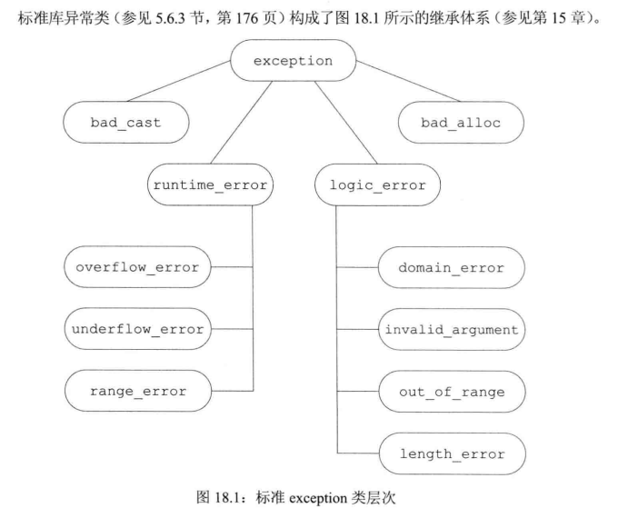

### 重新抛出

有时,一个单独的catch语句不能完整的处理某个异常.在执行了某些矫正工作之后,当前的catch可能会决定由调用链更上一层的函数接着处理异常.一条catch语句通过重新抛出的操作将异常传递给另一个catch语句,这里的catch语句仍然是一条throw语句,只不过不包含任何表达式,而是将当前异常对象向上传递.

```
throw;
```

空的throw只能出现在catch语句或者catch语句间接调用的函数中,如果在处理代码之外的地方遇到了空的throw,将会直接调用terminate.

### 捕获所有异常

想要捕获所有可能的异常是比较困难的,因为不知道异常的类型,虽然可以使用所有异常类型的基类引用或者对象来捕获,但是仍然有不在异常类之内的异常,这时可以使用catch(...)来捕获,它表示捕获所有异常,catch(...)一般和重新抛出语句一起使用.

```
try{
...
}
catch(...){
	throw;
}
```

### 函数try语句块

```
Foo::Foo(int a) try : this.a(a){
	// 函数体
}
catch(bad_alloc &e){
	hadle_out_of_memory(e);'
}
```

通常将try放在函数里面,但是如果在构造函数把赋值操作放在函数体之前的这样的,就需要函数try语句块来捕获.

另外一句,如果参数初始化的时候报了异常,函数try语句块捕获不到,只能由上层捕获.

## stdexcept

| 类名            | 代表含义                                      |
| --------------- | --------------------------------------------- |
| exception       | 最常见的问题                                  |
| runtime_error   | 只有在运行时才能检测出的问题                  |
| range_error     | 运行时错误:生成的结果超出了有意义的值域范围   |
| overflow_error  | 运行时错误:计算上溢                           |
| underflow_error | 运行时错误:计算下溢                           |
| logic_error     | 程序逻辑错误                                  |
| domain_error    | 逻辑错误:参数对应的结果指不存在               |
| invalid_error   | 逻辑错误:无效参数                             |
| length_error    | 逻辑错误:试图创建一个超出该类型最大长度的对象 |
| out_of_range    | 逻辑错误:使用一个超出有效返回的值             |

```
    try
    {
        int a = 1;
        int b = 0;
        int c = 0;
        c = a / b;
    }
    catch(const std::exception& e)	// 使用引用,减少拷贝
    {
        std::cerr << e.what() << '\n';
    }
}
```

## cassert

## exception

### 类

#### exception

该类用作某些表达式和 C++ 标准库所引发的所有异常的基类。

#### bad_exception

该类描述可从 `unexpected_handler` 引发的异常

#### nested_exception

类描述了一个可以捕获和存储的异常，以便以后使用.

## system_error

## 自定义异常类

```

//标准异常类
#include<iostream>
 
//头文件
#include<stdExcept>
using namespace std;
 
/*
标准异常类体系如下： 缩进层次表示继承关系
exception #include <exception>
	runtime_error #include <stdexcept>
		overflow_error
		underflow_error
		range_error
	logic_error #include <stdexcept>
		invalid_argument
		length_error
		out_of_range
		domain_error
	bad_alloc <new>
	bad_exception
	bad_cast <typeinfo>
	bad_typeid <typeinfo>
它们都是类。需要引用的头文件已经标注。没有标的，那么它的头文件就是上一层的头文件。
*/
 
//自定义异常类,继承自exception
class myException :public exception
{
public:
	myException(char* c)
	{
		m_p = c;
	}
	//what()函数返回错误信息
	virtual char* what()
	{
		cout << "异常类型为 myException: "<< m_p << endl;
		return m_p;
	}
private:
	char *m_p;
};
 
void test_func()
{
	throw myException("出错啦！");
	//throw bad_alloc();
}
int main()
{
	try
	{
		test_func();
	}
	catch (myException& e)
	{
		e.what();
	}
	catch (bad_alloc& e)
	{
		e.what();
	}
	catch (...)
	{
		cout << "Unknown Error" << endl;
	}
	system("pause");
	return 0;
}
```

# 正则表达式

## regex

# 时间

## chrono

## ctime

# 字符串和字符数据

## charconv

## string

## string_view

# 算法

C++11强大的算法库，里面定义了大量的算法函数模板。

大部分都在std空间中。

并且，基本上有的算法除了有通用版本之外，还有类的类成员函数版本，当某一个操作既有通用版本，也有类成员函数版本的时候，应该优先选择类成员函数版本，比如 .swap()  和 swap.

## algorithm

### adjacent_find()

搜搜相等或满足指定条件的两个相邻的元素。

四个重载函数。

原型：

```
// 最基础的两部分
template<class ForwardIterator>
ForwardIterator adjacent_find(
    ForwardIterator first,
    ForwardIterator last);

template<class ForwardIterator , class BinaryPredicate>
ForwardIterator adjacent_find(
    ForwardIterator first,
    ForwardIterator last,
    BinaryPredicate pred);

----参数
exec
要使用的执行策略。

first
用于确定要搜索范围中第一个元素的位置的前向迭代器。

last
用于确定要搜索范围中最后元素之后下一个元素的位置的前向迭代器。

pred
给定要搜索范围内相邻元素的值需满足的条件的二元谓词。
```

官方例子：

```
// alg_adj_fnd.cpp
// compile with: /EHsc
#include <list>
#include <algorithm>
#include <iostream>

// Returns whether second element is twice the first
bool twice (int elem1, int elem2 )
{
    return elem1 * 2 == elem2;
}

int main()
{
    using namespace std;
    list<int> L;
    list<int>::iterator Iter;
    list<int>::iterator result1, result2;

    L.push_back( 50 );
    L.push_back( 40 );
    L.push_back( 10 );
    L.push_back( 20 );
    L.push_back( 20 );

    cout << "L = ( " ;
    for ( Iter = L.begin( ) ; Iter != L.end( ) ; Iter++ )
        cout << *Iter << " ";
    cout << ")" << endl;

    result1 = adjacent_find( L.begin( ), L.end( ) );
    if ( result1 == L.end( ) )
        cout << "There are not two adjacent elements that are equal."
            << endl;
    else
        cout << "There are two adjacent elements that are equal.\n"
            << "They have a value of "
            << *( result1 ) << "." << endl;

    result2 = adjacent_find( L.begin( ), L.end( ), twice );
    if ( result2 == L.end( ) )
        cout << "There are not two adjacent elements where the "
            << "second is twice the first." << endl;
    else
    {
        cout << "There are two adjacent elements where "
            << "the second is twice the first.\n"
            << "They have values of " << *(result2++)
            << " & " << *result2 << "." << endl;
    }
}

----结果----
L = ( 50 40 10 20 20 )
There are two adjacent elements that are equal.
They have a value of 20.
There are two adjacent elements where the second is twice the first.
They have values of 10 & 20.
```

### all_of()

当给定范围中的每个元素均满足条件时返回true.

原型:

```
// 所有的原型
template<class InputIterator, class UnaryPredicate>
bool all_of(
    InputIterator first,
    InputIterator last,
    UnaryPredicate pred);

template <class ExecutionPolicy, class ForwardIterator, class UnaryPredicate>
bool all_of(
    ExecutionPolicy&& exec,
    ForwardIterator first,
    ForwardIterator last,
    UnaryPredicate pred);
--- 参数
exec
要使用的执行策略。

first
一种输入迭代器，指示检查条件的起始位置。 该迭代器将标记元素范围的起始位置。

last
一种输入迭代器，指示在元素范围内检查条件的结束位置。

pred
要测试的条件。 这是用户定义的谓词函数对象，定义被检查元素要满足的条件。 一元谓词采用单个参数并返回 true 或 false 。
```

官方例子：

```
// alg_all_of.cpp
// compile with: /EHsc
#include <list>
#include <algorithm>
#include <iostream>

int main()
{
    using namespace std;

    list<int> li { 50, 40, 10, 20, 20 };
    list<int>::iterator iter;

    cout << "li = ( ";
    for (iter = li.begin(); iter != li.end(); iter++)
        cout << *iter << " ";
    cout << ")" << endl;

    // Check if all elements in li are even.
    auto is_even = [](int elem){ return !(elem % 2); };
    if (all_of(li.begin(), li.end(), is_even))
        cout << "All the elements are even numbers.\n";
    else
        cout << "Not all the elements are even numbers.\n";
}
---结果
li = ( 50 40 10 20 20 )
All the elements are even numbers.
```

### any_of()

当指定元素范围中至少有一个元素满足条件时返回true.

原型：

```
template<class InputIterator, class UnaryPredicate>
bool any_of(
    InputIterator first,
    InputIterator last,
    UnaryPredicate pred);

template <class ExecutionPolicy, class ForwardIterator, class UnaryPredicate>
bool any_of(
    ExecutionPolicy&& exec,
    ForwardIterator first,
    ForwardIterator last,
    UnaryPredicate pred);
---
参数
exec
要使用的执行策略。

first
一种输入迭代器，指示在元素范围内检查条件的起始位置。

last
一种输入迭代器，指示在元素范围内检查条件的结束位置。

pred
要测试的条件。 这是由用户定义的谓词函数对象提供的。 谓词定义所测试的元素应满足的条件。 一元谓词采用单个参数并返回 true 或 false 。

返回值
如果在指示范围内至少一次检测到条件，则返回 true，如果从未检测条件，则返回 false。
```

官方例子：

```
// alg_any_of.cpp
// compile with: /EHsc
#include <list>
#include <algorithm>
#include <iostream>

int main()
{
    using namespace std;

    list<int> li { 51, 41, 11, 21, 20 };

    cout << "li = ( ";
    for (auto const& el : li)
        cout << el << " ";
    cout << ")" << endl;

    // Check if there is an even elememt in li.
    auto is_even = [](int const elem){ return !(elem % 2); };
    if (any_of(li.begin(), li.end(), is_even))
        cout << "There's an even element in li.\n";
    else
        cout << "There are no even elements in li.\n";
}
-----
li = ( 51 41 11 21 20 )
There's an even element in li.
```

### binary_search()

测试已排序的范围中是否有等于指定值的元素，或在二元谓词指定的意义上与指定值等效的元素。

原型：

```
template<class ForwardIterator, class Type>
bool binary_search(
    ForwardIterator first,
    ForwardIterator last,
    const Type& value);

template<class ForwardIterator, class Type, class BinaryPredicate>
bool binary_search(
    ForwardIterator first,
    ForwardIterator last,
    const Type& value,
    BinaryPredicate pred);

参数
first
用于确定要搜索范围中第一个元素的位置的前向迭代器。

last
用于确定要搜索范围中最后元素之后下一个元素的位置的前向迭代器。

value
需要与元素的值匹配或者必须满足元素值由二元谓词指定这一条件的值。

pred
用户定义的谓词函数对象，用于定义对一个元素小于另一个元素的理解。 二元谓词采用两个参数，并且在满足时返回 true，未满足时返回 false。

返回值
如果在范围中找到的元素等于或者等效于指定的值，则返回 true；否则，返回 false。
```

官方例子：

```
// alg_bin_srch.cpp
// compile with: /EHsc
#include <list>
#include <vector>
#include <algorithm>
#include <functional>      // greater<int>( )
#include <iostream>

// Return whether modulus of elem1 is less than modulus of elem2
bool mod_lesser( int elem1, int elem2 )
{
    if (elem1 < 0)
        elem1 = - elem1;
    if (elem2 < 0)
        elem2 = - elem2;
    return elem1 < elem2;
}

int main()
{
    using namespace std;

    list<int> List1;

    List1.push_back( 50 );
    List1.push_back( 10 );
    List1.push_back( 30 );
    List1.push_back( 20 );
    List1.push_back( 25 );
    List1.push_back( 5 );

    List1.sort();

    cout << "List1 = ( " ;
    for ( auto Iter : List1 )
        cout << Iter << " ";
    cout << ")" << endl;

    // default binary search for 10
    if ( binary_search(List1.begin(), List1.end(), 10) )
        cout << "There is an element in list List1 with a value equal to 10."
        << endl;
    else
        cout << "There is no element in list List1 with a value equal to 10."
        << endl;

    // a binary_search under the binary predicate greater
    List1.sort(greater<int>());
    if ( binary_search(List1.begin(), List1.end(), 10, greater<int>()) )
        cout << "There is an element in list List1 with a value greater than 10 "
        << "under greater than." << endl;
    else
        cout << "No element in list List1 with a value greater than 10 "
        << "under greater than." << endl;

    // a binary_search under the user-defined binary predicate mod_lesser
    vector<int> v1;

    for ( auto i = -2; i <= 4; ++i )
    {
        v1.push_back(i);
    }

    sort(v1.begin(), v1.end(), mod_lesser);

    cout << "Ordered using mod_lesser, vector v1 = ( " ;
    for ( auto Iter : v1 )
        cout << Iter << " ";
    cout << ")" << endl;

    if ( binary_search(v1.begin(), v1.end(), -3, mod_lesser) )
        cout << "There is an element with a value equivalent to -3 "
        << "under mod_lesser." << endl;
    else
        cout << "There is not an element with a value equivalent to -3 "
        << "under mod_lesser." << endl;
}
----
List1 = ( 5 10 20 25 30 50 )
There is an element in list List1 with a value equal to 10.
There is an element in list List1 with a value greater than 10 under greater than.
Ordered using mod_lesser, vector v1 = ( 0 -1 1 -2 2 3 4 )
There is an element with a value equivalent to -3 under mod_lesser.
```

### clamp()

C++17

将值与上限和下限进行比较，并返回对边界之间的值的引用，如果值高于或低于这些值，则返回对上限或下限的引用。

原型：

```
template<class Type>
constexpr const Type& clamp(
    const Type& value,
    const Type& lower,
    const Type& upper);

template<class Type, class Compare>
constexpr const Type& clamp(
    const Type& value,
    const Type& lower,
    const Type& upper,
    Compare pred);

参数
value
要与和 lower 比较 upper 的值。

lower
要 value 连接到的值的下限。

upper
要 value 连接到的值的上限。

pred
用于与或 upper 进行比较 valuelower 的谓词。 比较谓词采用两个参数，如果第一个参数的意义小于第二个参数，则返回; 否则 false 返回 true 。

返回值
返回对 lower if value < lower 的引用; 如果为，则返回对的 upperupper < value 引用。 否则，它将返回对的引用 value 。
```

### copy()

将一个源范围中的元素值分配到目标范围，循环访问元素的源序列并将它们分配在一个向前方向的新位置。

可用于大批元素的移动。

原型：

```
template<class InputIterator, class OutputIterator>
OutputIterator copy(
    InputIterator first,
    InputIterator last,
    OutputIterator destBeg);

template<class ExecutionPolicy, class ForwardIterator1, class ForwardIterator2>
ForwardIterator2 copy(
    ExecutionPolicy&& exec,
    ForwardIterator1 first,
    ForwardIterator1 last,
    ForwardIterator2 result);

参数
exec
要使用的执行策略。

first
发现源范围内的第一个元素的位置的输入迭代器。

last
一个输入迭代器，用于确定源范围内最后一个元素之后下一个元素的位置。

destBeg
一种输出迭代器，用于定址目标范围内第一个元素的位置。

返回值
一个输出迭代器，用于确定目标范围中最后一个元素之后的位置，即迭代器解决 result + (last - first) 。
```

官方例子：

```
// alg_copy.cpp
// compile with: /EHsc
#include <vector>
#include <algorithm>
#include <iostream>

int main() {
    using namespace std;
    vector<int> v1, v2;
    vector<int>::iterator Iter1, Iter2;

    int i;
    for ( i = 0 ; i <= 5 ; i++ )
        v1.push_back( 10 * i );

    int ii;
    for ( ii = 0 ; ii <= 10 ; ii++ )
        v2.push_back( 3 * ii );

    cout << "v1 = ( " ;
    for ( Iter1 = v1.begin( ) ; Iter1 != v1.end( ) ; Iter1++ )
        cout << *Iter1 << " ";
    cout << ")" << endl;

    cout << "v2 = ( " ;
    for ( Iter2 = v2.begin( ) ; Iter2 != v2.end( ) ; Iter2++ )
        cout << *Iter2 << " ";
    cout << ")" << endl;

    // To copy the first 3 elements of v1 into the middle of v2
    copy( v1.begin( ), v1.begin( ) + 3, v2.begin( ) + 4 );

    cout << "v2 with v1 insert = ( " ;
    for ( Iter2 = v2.begin( ) ; Iter2 != v2.end( ) ; Iter2++ )
        cout << *Iter2 << " ";
    cout << ")" << endl;

    // To shift the elements inserted into v2 two positions
    // to the left
    copy( v2.begin( )+4, v2.begin( ) + 7, v2.begin( ) + 2 );

    cout << "v2 with shifted insert = ( " ;
    for ( Iter2 = v2.begin( ) ; Iter2 != v2.end( ) ; Iter2++ )
        cout << *Iter2 << " ";
    cout << ")" << endl;
}

结果：

v1 = ( 0 10 20 30 40 50 )
v2 = ( 0 3 6 9 12 15 18 21 24 27 30 )
v2 with v1 insert = ( 0 3 6 9 0 10 20 21 24 27 30 )
v2 with shifted insert = ( 0 3 0 10 20 10 20 21 24 27 30 )
```

### copy_backward()

将一个源范围中的元素值分配到目标范围，循环访问元素的源序列并将它们分配在一个向后方向的新位置。

原型：

```
template<class BidirectionalIterator1, class BidirectionalIterator2>
BidirectionalIterator2 copy_backward(
    BidirectionalIterator1 first,
    BidirectionalIterator1 last,
    BidirectionalIterator2 destEnd);
参数
first
一种双向迭代器，用于定址源范围内第一个元素的位置。

last
一种双向迭代器，用于定址源范围内最后元素之后下一个元素的位置。

destEnd
一种双向迭代器，用于定址目标范围内最后元素之后下一个元素的位置。

返回值
一个输出迭代器，用于确定目标范围中最后一个元素之后的位置（即迭代器地址 destEnd - (last - first) ）。
```

官方例子：

```
// alg_copy_bkwd.cpp
// compile with: /EHsc
#include <vector>
#include <algorithm>
#include <iostream>

int main() {
    using namespace std;
    vector<int> v1, v2;
    vector<int>::iterator Iter1, Iter2;

    int i;
    for ( i = 0 ; i <= 5 ; ++i )
        v1.push_back( 10 * i );

    int ii;
    for ( ii = 0 ; ii <= 10 ; ++ii )
        v2.push_back( 3 * ii );

    cout << "v1 = ( " ;
    for ( Iter1 = v1.begin( ) ; Iter1 != v1.end( ) ; ++Iter1 )
        cout << *Iter1 << " ";
    cout << ")" << endl;

    cout << "v2 = ( " ;
    for ( Iter2 = v2.begin( ) ; Iter2 != v2.end( ) ; ++Iter2 )
        cout << *Iter2 << " ";
    cout << ")" << endl;

    // To copy_backward the first 3 elements of v1 into the middle of v2
    copy_backward( v1.begin( ), v1.begin( ) + 3, v2.begin( ) + 7 );

    cout << "v2 with v1 insert = ( " ;
    for ( Iter2 = v2.begin( ) ; Iter2 != v2.end( ) ; ++Iter2 )
        cout << *Iter2 << " ";
    cout << ")" << endl;

    // To shift the elements inserted into v2 two positions
    // to the right
    copy_backward( v2.begin( )+4, v2.begin( ) + 7, v2.begin( ) + 9 );

    cout << "v2 with shifted insert = ( " ;
    for ( Iter2 = v2.begin( ) ; Iter2 != v2.end( ) ; ++Iter2 )
        cout << *Iter2 << " ";
    cout << ")" << endl;
}

---
v1 = ( 0 10 20 30 40 50 )
v2 = ( 0 3 6 9 12 15 18 21 24 27 30 )
v2 with v1 insert = ( 0 3 6 9 0 10 20 21 24 27 30 )
v2 with shifted insert = ( 0 3 6 9 0 10 0 10 20 27 30 )
```

### copy_if()

在元素范围中，复制对于指定条件为 **`true`** 的元素。

### copy_n()

复制指定数量的元素。

### count()

返回范围中其值与指定值匹配的元素的数量。

### count_if()

返回范围中其值与指定条件匹配的元素的数量。

### equal()

逐个元素比较两个范围是否相等或是否在二元谓词指定的意义上等效。

八个重载，涉及C++14.

最好是使用双范围的比较，否则可能导致结果不一样。

官方例子：

```
 	#include <iostream>
#include <vector>
#include <algorithm>

using namespace std;

int main()
{
    vector<int> v1 { 0, 5, 10, 15, 20, 25 };
    vector<int> v2 { 0, 5, 10, 15, 20, 25 };
    vector<int> v3 { 0, 5, 10, 15, 20, 25, 30, 35, 40, 45, 50 };

    // Using range-and-a-half equal:
    bool b = equal(v1.begin(), v1.end(), v2.begin());
    cout << "v1 and v2 are equal: "
       << b << endl; // true, as expected

    b = equal(v1.begin(), v1.end(), v3.begin());
    cout << "v1 and v3 are equal: "
       << b << endl; // true, surprisingly

    // Using dual-range equal:
    b = equal(v1.begin(), v1.end(), v3.begin(), v3.end());
    cout << "v1 and v3 are equal with dual-range overload: "
       << b << endl; // false

    return 0;
}

结果：
v1 and v2 are equal: 1
v1 and v3 are equal: 1  // 结果不对
v1 and v3 are equal with dual-range overload: 0
```

### equal_range()

在排序的范围中查找符合以下条件的位置对：第一个位置小于或等效于指定元素的位置，第二个位置大于此元素位置，等效意义或用于在序列中建立位置的排序可通过二元谓词指定。

它只比较小于的关系，如果需要可以自定义小于的关系，但是如果比较大于，最好是把范围逆序排序，而不是定义一个具有大于含义的小于谓词。

必须是已经排序的范围。

查找是基于二分查找的。

最常用就是找出与value值相等的所有相邻的值的范围迭代器。

原型：

```
template<class ForwardIterator, class Type>
pair<ForwardIterator, ForwardIterator> equal_range(
    ForwardIterator first,
    ForwardIterator last,
    const Type& value);

template<class ForwardIterator, class Type, class Compare>
pair<ForwardIterator, ForwardIterator> equal_range(
    ForwardIterator first,
    ForwardIterator last,
    const Type& value,
    Compare pred);

参数
first
用于确定要搜索范围中第一个元素的位置的前向迭代器。

last
用于确定要搜索范围中最后元素之后下一个元素的位置的前向迭代器。

value
在已排序范围中搜索的值。

pred
用户定义的谓词函数对象，用于定义对一个元素小于另一个元素的理解。 比较谓词采用两个参数，在 true 满足和 false 未满足时返回 。

返回值
一对前向迭代器，指定要搜索的范围中包含的一个子范围，根据所用的二元谓词（即 pred，或者默认情况下为“小于”）的定义，该子范围中的所有元素都等效于 value。

如果范围中没有任何元素 value等效于 ，则返回对中的前向 iterator value 相等，并指定可以在不干扰范围顺序的情况下插入的点。
```

官方例子：

```
// alg_equal_range.cpp
// compile with: /EHsc
#include <vector>
#include <algorithm>
#include <functional>      // greater<int>()
#include <iostream>
#include <string>
using namespace std;

template<class T> void dump_vector( const vector<T>& v, pair<typename vector<T>::iterator, typename vector<T>::iterator> range )
{
    // prints vector v with range delimited by [ and ]

    for ( typename vector<T>::const_iterator i = v.begin(); i != v.end(); ++i )
    {
        if ( i == range.first )
        {
            cout << "[ ";
        }
        if ( i == range.second )
        {
            cout << "] ";
        }

        cout << *i << " ";
    }
    cout << endl;
}

template<class T> void equal_range_demo( const vector<T>& original_vector, T value )
{
    vector<T> v(original_vector);

    sort( v.begin(), v.end() );
    cout << "Vector sorted by the default binary predicate <:" << endl << '\t';
    for ( vector<T>::const_iterator i = v.begin(); i != v.end(); ++i )
    {
        cout << *i << " ";
    }
    cout << endl << endl;

    pair<vector<T>::iterator, vector<T>::iterator> result
        = equal_range( v.begin(), v.end(), value );

    cout << "Result of equal_range with value = " << value << ":" << endl << '\t';
    dump_vector( v, result );
    cout << endl;
}

template<class T, class F> void equal_range_demo( const vector<T>& original_vector, T value, F pred, string predname )
{
    vector<T> v(original_vector);

    sort( v.begin(), v.end(), pred );
    cout << "Vector sorted by the binary predicate " << predname << ":" << endl << '\t';
    for ( typename vector<T>::const_iterator i = v.begin(); i != v.end(); ++i )
    {
        cout << *i << " ";
    }
    cout << endl << endl;

    pair<typename vector<T>::iterator, typename vector<T>::iterator> result
        = equal_range( v.begin(), v.end(), value, pred );

    cout << "Result of equal_range with value = " << value << ":" << endl << '\t';
    dump_vector( v, result );
    cout << endl;
}

// Return whether absolute value of elem1 is less than absolute value of elem2
bool abs_lesser( int elem1, int elem2 )
{
    return abs(elem1) < abs(elem2);
}

// Return whether string l is shorter than string r
bool shorter_than(const string& l, const string& r)
{
    return l.size() < r.size();
}

int main()
{
    vector<int> v1;

    // Constructing vector v1 with default less than ordering
    for ( int i = -1; i <= 4; ++i )
    {
        v1.push_back(i);
    }

    for ( int i =-3; i <= 0; ++i )
    {
        v1.push_back( i );
    }

    equal_range_demo( v1, 3 );
    equal_range_demo( v1, 3, greater<int>(), "greater" );
    equal_range_demo( v1, 3, abs_lesser, "abs_lesser" );

    vector<string> v2;

    v2.push_back("cute");
    v2.push_back("fluffy");
    v2.push_back("kittens");
    v2.push_back("fun");
    v2.push_back("meowmeowmeow");
    v2.push_back("blah");

    equal_range_demo<string>( v2, "fred" );
    equal_range_demo<string>( v2, "fred", shorter_than, "shorter_than" );
}

可能有些问题。

```

### fill()

将相同的新值分配给指定范围中的每个元素。

### fill_n()

将新值分配给以特定元素开始的范围中指定数量的元素。

### find()

在范围中找到具有指定值的元素的第一个匹配项位置。

原型：

```
template<class InputIterator, class Type>
InputIterator find(
    InputIterator first,
    InputIterator last,
    const Type& value);

template<class ExecutionPolicy, class ForwardIterator, class Type>
ForwardIterator find(
    ExecutionPolicy&& exec,
    ForwardIterator first,
    ForwardIterator last,
    const Type& value);

参数
exec
要使用的执行策略。

first
用于确定要在范围中搜索其指定值的第一个元素的位置的输入迭代器。

last
用于确定要在范围中搜索其指定值的最后一个元素之后下一个元素的位置的输入迭代器。

value
要搜索的值。

返回值
用于确定要在范围中搜索的指定值第一次出现的位置的输入迭代器。 如果找不到具有等效值的元素，则返回 last。
```

### find_end()

在范围中查找与指定序列相同的最后一个序列，或在二元谓词指定的意义上等效的最后一个序列。

原型：

```
template<class ForwardIterator1, class ForwardIterator2>
ForwardIterator1 find_end(
    ForwardIterator1 first1,
    ForwardIterator1 last1,
    ForwardIterator2 first2,
    ForwardIterator2 last2);

template<class ForwardIterator1, class ForwardIterator2, class Pred>
ForwardIterator1 find_end(
    ForwardIterator1 first1,
    ForwardIterator1 last1,
    ForwardIterator2 first2,
    ForwardIterator2 last2,
    Pred pred);

template<class ExecutionPolicy, class ForwardIterator1, class ForwardIterator2>
ForwardIterator1
find_end(
    ExecutionPolicy&& exec,
    ForwardIterator1 first1,
    ForwardIterator1 last1,
    ForwardIterator2 first2,
    ForwardIterator2 last2);

template<class ExecutionPolicy, class ForwardIterator1,
class ForwardIterator2, class BinaryPredicate>
ForwardIterator1
find_end(
    ExecutionPolicy&& exec,
    ForwardIterator1 first1,
    ForwardIterator1 last1,
    ForwardIterator2 first2,
    ForwardIterator2 last2,
    BinaryPredicate pred);
参数
first1
用于确定要搜索范围中第一个元素的位置的前向迭代器。

last1
用于确定要搜索范围中最后一个元素之后下一个元素的位置的前向迭代器。

first2
用于确定要搜索范围中第一个元素的位置的前向迭代器。

last2
用于确定要搜索范围中最后一个元素之后下一个元素的位置的前向迭代器。

pred
用于定义两个元素被视为等效时应满足的条件的用户定义谓词函数对象。 二元谓词采用两个参数，并且在满足时返回 true，未满足时返回 false。

返回值
一个向前迭代器，用于寻址 [first1，last1) 中与指定序列 [first2，last2) 匹配的最后一个子序列的第一个元素的位置。
```

例子：

```
// alg_find_end.cpp
// compile with: /EHsc
#include <vector>
#include <list>
#include <algorithm>
#include <iostream>

// Return whether second element is twice the first
bool twice ( int elem1, int elem2 )
{
    return 2 * elem1 == elem2;
}

int main()
{
    using namespace std;
    vector<int> v1, v2;
    list<int> L1;
    vector<int>::iterator Iter1, Iter2;
    list<int>::iterator L1_Iter, L1_inIter;

    int i;
    for ( i = 0 ; i <= 5 ; i++ )
    {
        v1.push_back( 5 * i );
    }
    for ( i = 0 ; i <= 5 ; i++ )
    {
        v1.push_back( 5 * i );
    }

    int ii;
    for ( ii = 1 ; ii <= 4 ; ii++ )
    {
        L1.push_back( 5 * ii );
    }

    int iii;
    for ( iii = 2 ; iii <= 4 ; iii++ )
    {
        v2.push_back( 10 * iii );
    }

    cout << "Vector v1 = ( " ;
    for ( Iter1 = v1.begin( ) ; Iter1 != v1.end( ) ; Iter1++ )
        cout << *Iter1 << " ";
    cout << ")" << endl;

    cout << "List L1 = ( " ;
    for ( L1_Iter = L1.begin( ) ; L1_Iter!= L1.end( ) ; L1_Iter++ )
        cout << *L1_Iter << " ";
    cout << ")" << endl;

    cout << "Vector v2 = ( " ;
    for ( Iter2 = v2.begin( ) ; Iter2 != v2.end( ) ; Iter2++ )
        cout << *Iter2 << " ";
        cout << ")" << endl;

    // Searching v1 for a match to L1 under identity
    vector<int>::iterator result1;
    result1 = find_end ( v1.begin( ), v1.end( ), L1.begin( ), L1.end( ) );

    if ( result1 == v1.end( ) )
        cout << "There is no match of L1 in v1."
            << endl;
    else
        cout << "There is a match of L1 in v1 that begins at "
            << "position "<< result1 - v1.begin( ) << "." << endl;

    // Searching v1 for a match to L1 under the binary predicate twice
    vector<int>::iterator result2;
    result2 = find_end ( v1.begin( ), v1.end( ), v2.begin( ), v2.end( ), twice );

    if ( result2 == v1.end( ) )
        cout << "There is no match of L1 in v1."
            << endl;
    else
        cout << "There is a sequence of elements in v1 that "
            << "are equivalent to those\n in v2 under the binary "
            << "predicate twice and that begins at position "
            << result2 - v1.begin( ) << "." << endl;
}

Vector v1 = ( 0 5 10 15 20 25 0 5 10 15 20 25 )
List L1 = ( 5 10 15 20 )
Vector v2 = ( 20 30 40 )
There is a match of L1 in v1 that begins at position 7.
There is a sequence of elements in v1 that are equivalent to those
in v2 under the binary predicate twice and that begins at position 8.
```

### find_first_of()

在目标范围中搜索若干值中任意值的第一个匹配项，或搜索在二元谓词指定的意义上等效于指定元素集的若干元素中任意元素的第一个匹配项。

### find_if()

在范围中找到满足指定条件的元素的第一个匹配项位置。

如果不自定义谓词，那么效果和find一样。

### find_if_not()

返回指示的范围中不满足条件的第一个元素。

### for_each()

将指定的函数对象按向前顺序应用于范围中的每个元素并返回此函数对象。

算法 `for_each` 非常灵活，允许以用户指定的不同方式修改范围内的每个元素

原型：

```
template<class InputIterator, class Function>
Function for_each(
    InputIterator first,
    InputIterator last,
    Function func);

template<class ExecutionPolicy, class ForwardIterator, class Function>
void for_each(
    ExecutionPolicy&& exec,
    ForwardIterator first,
    ForwardIterator last,
    Function func);
参数
first
一种输入迭代器，用于寻址要操作的范围中第一个元素的位置。

last
一种输入迭代器，用于寻址要操作的范围中最后一个元素之后下一个元素的位置。

func
用户定义的应用于范围内每个元素的函数对象。

返回值
函数对象应用到范围内所有元素后的副本。
```

例子：

```
#include <iostream>
#include <algorithm>
#include <vector>
using namespace std;
int& func (int &a)
{
    a = a + 1;
    return a;
}
int main()
{
    vector<int> v = { 0, 5, 10, 15, 20, 25 };
    for_each(v.begin(),v.end(),func);
    for(auto i:v)
        cout << i << " ";
    system("pause");
}

1 6 11 16 21 26
```

### for_each_n()

同for_each,只作用n个元素。

原型：

```
template<class InputIterator, class Size, class Function>
InputIterator for_each_n(
    InputIterator first,
    Size n,
    Function f);

template<class ExecutionPolicy, class ForwardIterator, class Size, class Function>
ForwardIterator for_each_n(
    ExecutionPolicy&& exec,
    ForwardIterator first,
    Size n,
    Function f);
```

### generate()

将函数对象生成的值分配给范围中的每个元素。

为范围中的每个元素调用函数对象，并且每次调用它时，都无需返回相同的值。 例如，它可能会读取文件或引用和修改本地状态。 生成器的结果类型必须可以转换为范围中转发迭代器的值类型。

原型：

```
template<class ForwardIterator, class Generator>
void generate(
    ForwardIterator first,
    ForwardIterator last,
    Generator gen);

template<class ExecutionPolicy, class ForwardIterator, class Generator>
void generate(
    ExecutionPolicy&& exec,
    ForwardIterator first, ForwardIterator last,
    Generator gen);

参数
first
一种前向迭代器，用于寻址要分配值的范围中第一个元素的位置。

last
一种前向迭代器，用于寻址要分配值的范围中最后一个元素之后下一个元素的位置。

gen
用于生成要分配到范围中的每个元素的值的未使用任何自变量调用的函数对象。
```

例子：

```
generate ( deq1.begin( ), deq1.end( ), rand );
```

### generate_n()

将函数对象生成的值分配给范围中指定数量的元素，并返回到超出最后一个分配值的下一位置。

### includes()

测试一个排序的范围是否包含另一排序范围中的所有元素，其中元素之间的排序或等效条件可通过二元谓词指定。

考虑这种测试的另一种方式是，它确定第二个源范围是否为第一个源范围的子集。

原型：

```
template<class InputIterator1, class InputIterator2>
bool includes(
    InputIterator1 first1,
    InputIterator1 last1,
    InputIterator2 first2,
    InputIterator2 last2);

template<class InputIterator1, class InputIterator2, class Compare>
bool includes(
    InputIterator1 first1,
    InputIterator1 last1,
    InputIterator2 first2,
    InputIterator2 last2,
    Compare pred );

template<class ExecutionPolicy, class ForwardIterator1, class ForwardIterator2>
bool includes(
    ExecutionPolicy&& exec,
    ForwardIterator1 first1,
    ForwardIterator1 last1,
    ForwardIterator2 first2,
    ForwardIterator2 last2);

template<class ExecutionPolicy, class ForwardIterator1, class ForwardIterator2, class Compare>
bool includes(
    ExecutionPolicy&& exec,
    ForwardIterator1 first1,
    ForwardIterator1 last1,
    ForwardIterator2 first2,
    ForwardIterator2 last2,
    Compare pred);

参数
exec
要使用的执行策略。

first1
一种输入迭代器，用于寻址第一个元素在两个已排序源范围的第一个中的位置，以便测试第二个已排序源范围的所有元素是否包含在第一个中。

last1
一种输入迭代器，用于寻址在两个已排序源范围的第一个中最后一个元素之后下一个元素的位置，以便测试第二个已排序源范围中的所有元素是否包含在第一个中。

first2
一种输入迭代器，用于寻址第一个元素在两个连续已排序源范围的第二个中的位置，以便测试第二个已排序源范围中的所有元素是否包含在第一个中。

last2
一种输入迭代器，用于寻址在两个连续已排序源范围的第二个中最后一个元素之后的下一个元素的位置，以便测试第二个已排序源范围中的所有元素是否包含在第一个中。

pred
用户定义的谓词函数对象，用于定义对一个元素小于另一个元素的理解。 比较谓词采用两个参数，并且在满足时返回， false 未满足时返回 true 。

返回值
true 如果第一个已排序范围包含第二个排序范围中的所有元素，则为; 否则为。 false否则为。
```

### inplace_merge()

将两个连续的排序范围中的元素合并为一个排序范围，其中排序条件可通过二元谓词指定。

因为是两个连续的排序范围，所以只需要三个迭代器。左，中，右。

### is_heap()

如果指定范围中的元素形成堆，则返回  **`true`** 。

第三个参数是谓词，应该是用来判断是大顶堆还是小顶堆的，默认是判断大顶堆的。还可以将类类型进行堆排序，只要使用自定义谓词。

原型：

```
template<class RandomAccessIterator>
bool is_heap(
    RandomAccessIterator first,
    RandomAccessIterator last);

template<class RandomAccessIterator, class Compare>
bool is_heap(
    RandomAccessIterator first,
    RandomAccessIterator last,
    Compare pred);

template<class ExecutionPolicy, class RandomAccessIterator>
bool is_heap(
    ExecutionPolicy&& exec,
    RandomAccessIterator first,
    RandomAccessIterator last);

template<class ExecutionPolicy, class RandomAccessIterator, class Compare>
bool is_heap(
    ExecutionPolicy&& exec,
    RandomAccessIterator first,
    RandomAccessIterator last,
    Compare pred);

exec
要使用的执行策略。

first
一种随机访问迭代器，指示在一个范围内检查堆的开始位置。

last
一种随机访问迭代器，指示一个范围内的结束位置。

pred
要测试或者排序元素的条件。 比较谓词采用两个参数并返回 true 或 false 。

返回值
如果指定范围中的元素形成堆，则返回 true；否则，返回 false。
```

### is_heap_until()

返回一个迭代器，它位于范围 [`first`,`last`) 中不满足堆排序条件的第一个元素处；如果范围形成一个堆，则返回  *`end`* 。

### make_heap()

将指定范围中的元素转换到第一个元素是最大元素的堆中，其中排序条件可通过二元谓词指定。默认构建大顶堆。

堆有两个属性：

* 第一个元素始终最大。
* 可以在对数时间内添加或删除元素。

堆是实施优先级队列的理想方式，用于实施 C++ 标准库容器适配器 [priority_queue 类](https://docs.microsoft.com/zh-cn/cpp/standard-library/priority-queue-class?view=msvc-160)。

复杂性是线性的，需要进行 `3 * (last - first)` 比较。

原型：

```
template<class RandomAccessIterator>
void make_heap(
    RandomAccessIterator first,
    RandomAccessIterator last );

template<class RandomAccessIterator, class BinaryPredicate>
void make_heap(
    RandomAccessIterator first,
    RandomAccessIterator last,
    BinaryPredicate pred );

first
一种随机访问迭代器，用于寻址要转换为堆的范围中第一个元素的位置。

last
一种随机访问迭代器，用于寻址要转换为堆的范围中最后一个元素之后下一个元素的位置。

pred
用户定义的谓词函数对象，用于定义对一个元素小于另一个元素的理解。 二元谓词采用两个参数，并且在满足时返回 true，未满足时返回 false。
```

### push_heap()

将范围末尾的元素添加到包括范围中前面元素的现有堆中。

元素必须先推送回现有堆的末尾，然后使用该算法将此元素添加到现有堆。

排除末尾新添加元素的范围必须是一个堆。

原型:

```
template<class RandomAccessIterator>
void push_heap(
    RandomAccessIterator first,
    RandomAccessIterator last );

template<class RandomAccessIterator, class BinaryPredicate>
void push_heap(
    RandomAccessIterator first,
    RandomAccessIterator last,
    BinaryPredicate pred);

参数
first
一种随机访问迭代器，用于寻址堆中第一个元素的位置。

last
一种随机访问迭代器，用于寻址要转换为堆的范围中最后一个元素之后下一个元素的位置。

pred
用户定义的谓词函数对象，用于定义对一个元素小于另一个元素的理解。 二元谓词采用两个参数，并且在满足时返回 true，未满足时返回 false。
```

### pop_heap()

移除从堆顶到范围中倒数第二个位置之间的最大元素，然后将剩余元素形成新堆。

也就是说把堆顶的最大元素交换到区间尾，然后把除了尾部的元素的剩余区间重新调整成堆。然后我们人工取出区间尾部的元素，就是原先堆顶的元素。

原型：

```
template<class RandomAccessIterator>
void pop_heap(
    RandomAccessIterator first,
    RandomAccessIterator last);

template<class RandomAccessIterator, class BinaryPredicate>
void pop_heap(
    RandomAccessIterator first,
    RandomAccessIterator last,
    BinaryPredicate pred);
参数
first
一种随机访问迭代器，用于寻址堆中第一个元素的位置。

last
一种随机访问迭代器，用于寻址堆中最后一个元素之后下一个元素的位置。

pred
用户定义的谓词函数对象，用于定义对一个元素小于另一个元素的理解。 二元谓词采用两个参数，并且在满足时返回 true，未满足时返回 false。
```

### sort_heap()

将堆转换为排序的范围。sort_heap即经典的堆排序算法，通过每次弹出堆顶直到堆为空，依次被弹出的元素就组成了有序的序列了。STL中的priority_queue即使用heap的这个特性来实现。

这种排序算法不稳定，因为不一定保留等效元素的相对顺序。

堆是实现优先级队列的理想方法。

原型：

```
template<class RandomAccessIterator>
void sort_heap(
    RandomAccessIterator first,
    RandomAccessIterator last);

template<class RandomAccessIterator, class Compare>
void sort_heap(
    RandomAccessIterator first,
    RandomAccessIterator last,
    Compare pred);
参数
first
一种随机访问迭代器，用于寻址目标堆中第一个元素的位置。

last
一种随机访问迭代器，用于寻址目标堆中最后一个元素之后下一个元素的位置。

pred
用户定义的谓词函数对象，用于定义对一个元素小于另一个元素的理解。 比较谓词采用两个参数，在 true 满足和 false 未满足时返回 。
```

### is_partitioned()

C ++函数 **std::algorithm::is_partitioned()** 测试范围是否已分区。 对于空范围，此函数返回true。如果不理解先看partition

### partition()

将范围中的元素分为两个不相交的集，满足一元谓词的元素在不满足一元谓词的元素之前。

原型：

```
template<class BidirectionalIterator, class UnaryPredicate>
BidirectionalIterator partition(
    BidirectionalIterator first,
    BidirectionalIterator last,
    UnaryPredicate pred);

template<class ExecutionPolicy, class ForwardIterator, class UnaryPredicate>
ForwardIterator partition(
    ExecutionPolicy&& exec,
    ForwardIterator first,
    ForwardIterator last,
    UnaryPredicate pred);

参数
exec
要使用的执行策略。

first
一种双向迭代器，用于寻址要分区的范围中第一个元素的位置。

last
一种双向迭代器，用于寻址要分区的范围中最后一个元素之后下一个元素的位置。

pred
用户定义的谓词函数对象，用于定义如果元素要分类时应满足的条件。 一元谓词采用单个参数并返回 true 或 false 。

返回值
一种双向迭代器，用于寻址范围中不满足谓词条件的第一个元素的位置。
```

### partition_copy()

将条件为 **`true`** 的元素复制到一个目标，将条件为 **`false`** 的元素复制到另一目标。 元素必须来自于指定范围。

原型：

```
template<class InputIterator, class OutputIterator1, class OutputIterator2, class UnaryPredicate>
pair<OutputIterator1, OutputIterator2> partition_copy(
    InputIterator first,
    InputIterator last,
    OutputIterator1 dest1,
    OutputIterator2 dest2,
    UnaryPredicate pred);

template <class ExecutionPolicy, class ForwardIterator, class ForwardIterator1, class ForwardIterator2, class UnaryPredicate>
pair<ForwardIterator1, ForwardIterator2> partition_copy(
    ExecutionPolicy&& exec,
    ForwardIterator first,
    ForwardIterator last,
    ForwardIterator1 out_true,
    ForwardIterator2 out_false,
    UnaryPredicate pred);
参数
exec
要使用的执行策略。

first
一种输入迭代器，指示在一个范围中开始检查条件的位置。

last
一种输入迭代器，指示范围的结束位置。

dest1
一种输出迭代器，用于复制针对使用 pred 测试的条件返回 true 的元素。

dest2
一种输出迭代器，用于复制针对使用 pred 测试的条件返回 false 的元素。

pred
要测试的条件。 由定义要测试条件的用户定义谓词函数对象提供。 一元谓词采用单个参数并返回 true 或 false 。

注解
如果 pred(X) 为 true，则模板函数将中 [first,last) 的每个元素 X 复制到 *dest1++ ; 否则为 *dest2++ 。 它将返回 pair<OutputIterator1, OutputIterator2>(dest1, dest2)。
```

### partition_point()

返回给定范围中不满足条件的第一个元素。 元素经过排序，满足条件的元素在不满足条件的元素之前。

### stable_partition()

将范围中的元素分为两个不相交的集，满足一元谓词的元素在不满足一元谓词的元素之前，并保留等效元素的相对顺序。

### is_permutation()

如果这两个范围包含相同元素（无论元素是否处于相同顺序），则返回 true。 在 C++14 代码中使用双范围重载，因为对第二个范围仅采用单个迭代器的重载在第二个范围长于第一个范围时不会检测到差异，并且会在第二个范围短于第一个范围时导致未定义的行为。

判断两个范围是否在二元谓词上有完全相同的元素，不考虑顺序。

原型：

```
template<class ForwardIterator1, class ForwardIterator2>
bool is_permutation(
    ForwardIterator1 first1,
    ForwardIterator1 last1,
    ForwardIterator2 first2);

template<class ForwardIterator1, class ForwardIterator2, class BinaryPredicate>
bool is_permutation(
    ForwardIterator1 first1,
    ForwardIterator1 last1,
    ForwardIterator2 first2,
    BinaryPredicate Pred);

// C++14
template<class ForwardIterator1, class ForwardIterator2>
bool is_permutation(
    ForwardIterator1 first1,
    ForwardIterator1 last1,
    ForwardIterator2 first2,
    ForwardIterator2 last2);

template<class ForwardIterator1, class ForwardIterator2, class BinaryPredicate>
bool is_permutation(
    ForwardIterator1 first1,
    ForwardIterator1 last1,
    ForwardIterator2 first2,
    ForwardIterator2 last2,
    BinaryPredicate pred);
参数
first1
引用范围的第一个元素的向前迭代器。

last1
引用范围最后一个元素过去一个元素的向前迭代器。

first2
引用第二个范围的第一个元素的向前迭代器（用于比较）。

last2
引用第二个范围最后一个元素过去一个元素的向前迭代器（用于比较）。

pred
针对等效性进行测试并返回 bool 的谓词。

返回值
当范围可以重新排列以便根据比较运算符谓词相同时为 true；否则为 false。

注解
is_permutation 在最坏情况下具有二次复杂性。

第一个模板函数假定范围中从 first2 开始的元素数与 指定的范围中的元素数一样多 。 如果第二个范围中存在更多元素，则忽略它们；如果元素更少，则会发生未定义的行为。 第三个模板函数（C++14 及更高版本）不会进行此假设。 只有当指定的 true 范围中每个元素 X [first1, last1) 的元素 Y 与从 或 开始的范围中的元素 Y 相同时，才返回 X = = Y first2[first2, last2)。 此处， operator== 必须在其操作数之间执行成对比较。

第二个和第四个模板函数的行为相同，只不过它们会将 operator==(X, Y) 替换为 Pred(X, Y)。 若要正确运行，谓词必须是对称、自反且可传递的。
```

### prev_permutation()

全排列函数。

重新排序范围中的元素，以便按字典顺序的前一个更大排列（如果有）替换原有排序，其中“前一个”的意义可通过二元谓词指定。

按照字典或者自定义的谓词顺序，重新排列元素，新排列是比原排列小的最大的排列。

会改变原有排列。

原型：

```
template<class BidirectionalIterator>
bool prev_permutation(
    BidirectionalIterator first,
    BidirectionalIterator last);

template<class BidirectionalIterator, class BinaryPredicate>
bool prev_permutation(
    BidirectionalIterator first,
    BidirectionalIterator last,
    BinaryPredicate pred);
参数
first
一种双向迭代器，指向要重新排序的范围内第一个元素的位置。

last
一种双向迭代器，指向要重新排序的范围内最后一个元素之后下一个元素的位置。

pred
用户定义的谓词函数对象，定义排序中连续元素要满足的比较条件。 二元谓词采用两个参数，并且在满足时返回 true，未满足时返回 false。

返回值
如果按字典顺序前一个排列存在并且已替换范围的原始顺序，则返回 true；否则，返回 false。这种情况下，顺序转换为按字典顺序最大的排列。

理解：
Vector v1 is ( -3 -2 -1 0 1 2 3 ).
After the first prev_permutation, vector v1 is:
v1 = ( -3 -2 0 3 2 1 -1 ).
After another prev_permutation of vector v1,
v1 =   ( -3 -2 0 3 -1 2 1 ).
After another prev_permutation of vector v1,
v1 =   ( -3 -2 0 3 -1 1 2 ).
After another prev_permutation of vector v1,
v1 =   ( -3 -2 0 2 3 1 -1 ).
After another prev_permutation of vector v1,
v1 =   ( -3 -2 0 2 -1 3 1 ).
After another prev_permutation of vector v1,
v1 =   ( -3 -2 0 2 -1 1 3 ).
```

### next_permutation()

全排列函数。跟prev_premutation类似。

按照字典顺序或者谓词顺序，重新排列元素，新排列是比原排列大的最小排列。

### is_sorted()

如果指定范围中的元素按顺序排序，则返回  **`true`** 。

原型：

```
template<class ForwardIterator>
bool is_sorted(
    ForwardIterator first,
    ForwardIterator last);

template<class ForwardIterator, class Compare>
bool is_sorted(
    ForwardIterator first,
    ForwardIterator last,
    Compare pred);

template<class ExecutionPolicy, class ForwardIterator>
bool is_sorted(
    ExecutionPolicy&& exec,
    ForwardIterator first,
    ForwardIterator last);

template<class ExecutionPolicy, class ForwardIterator, class Compare>
bool is_sorted(
    ExecutionPolicy&& exec,
    ForwardIterator first,
    ForwardIterator last,
    Compare pred);
```

### is_sorted_until()

返回一个 `ForwardIterator`，设置为指定范围中按顺序排序的最后一个元素。

原型：

```
template<class ForwardIterator>
ForwardIterator is_sorted_until(
    ForwardIterator first,
    ForwardIterator last);

template<class ForwardIterator, class Compare>
ForwardIterator is_sorted_until(
    ForwardIterator first,
    ForwardIterator last,
    Compare pred);

template<class ExecutionPolicy, class ForwardIterator>
ForwardIterator is_sorted_until(
    ExecutionPolicy&& exec,
    ForwardIterator first,
    ForwardIterator last);

template<class ExecutionPolicy, class ForwardIterator, class Compare>
ForwardIterator is_sorted_until(
    ExecutionPolicy&& exec,
    ForwardIterator first,
    ForwardIterator last,
    Compare pred);
```

### sort()

将指定范围中的元素按非降序顺序排列，或根据二元谓词指定的排序条件排列。

排序复杂性的平均值为 `O( N log N )`，其中 `O( N log N )` = *`last`* -  *`first`* 。

sort的底层实现并不是一种排序算法，在数据量不大的时候， 几乎所有的排序都可以使用希尔排序，当数据量大的时候，采用快速排序，分段递归排序。

### stable_sort()

将指定范围中的元素按非降序顺序排列，或根据二元谓词指定的排序条件排列，并保留等效元素的相对顺序。

### iter_swap()

交换由一对指定迭代器引用的两个值。

### swap()

第一次重写交换两个对象的值。 第二次重写交换两个对象数组之间的值。

原型:

```
template<class Type>
void swap(
    Type& left,
    Type& right);
template<class Type, size_t N>
void swap(
    Type (& left)[N],
    Type (& right)[N]);

参数
left
对于第一次重写，为交换其内容的第一个对象。 对于第二次重写，为交换其内容的第一个对象数组。

right
对于第一次重写，为交换其内容的第二个对象。 对于第二次重写，为交换其内容的第二个对象数组。

注解
第一次重载设计用于对各个对象进行操作。 第二次重载交换两个数组之间对象的内容。
```

官方例子：

```
// alg_swap.cpp
// compile with: /EHsc
#include <vector>
#include <algorithm>
#include <iostream>

int main()
{
    using namespace std;
    vector<int> v1, v2;
    vector<int>::iterator Iter1, Iter2, result;

    for ( int i = 0 ; i <= 10 ; i++ )
    {
        v1.push_back( i );
    }

    for ( int ii = 0 ; ii <= 4 ; ii++ )
    {
        v2.push_back( 5 );
    }

    cout << "Vector v1 is ( " ;
    for ( Iter1 = v1.begin( ) ; Iter1 != v1.end( ) ; Iter1++ )
        cout << *Iter1 << " ";
    cout << ")." << endl;

    cout << "Vector v2 is ( " ;
    for ( Iter2 = v2.begin( ) ; Iter2 != v2.end( ) ; Iter2++ )
        cout << *Iter2 << " ";
    cout << ")." << endl;

    swap( v1, v2 );

    cout << "Vector v1 is ( " ;
    for ( Iter1 = v1.begin( ) ; Iter1 != v1.end( ) ; Iter1++ )
        cout << *Iter1 << " ";
    cout << ")." << endl;

    cout << "Vector v2 is ( " ;
    for ( Iter2 = v2.begin( ) ; Iter2 != v2.end( ) ; Iter2++ )
        cout << *Iter2 << " ";
    cout << ")." << endl;
}

Vector v1 is ( 0 1 2 3 4 5 6 7 8 9 10 ).
Vector v2 is ( 5 5 5 5 5 ).
Vector v1 is ( 5 5 5 5 5 ).
Vector v2 is ( 0 1 2 3 4 5 6 7 8 9 10 ).
```

跟swap_ranges没有不同。

### swap_ranges()

将一个范围中的元素与另一大小相等的范围中的元素交换。

原型：

```
template<class ForwardIterator1, class ForwardIterator2>
ForwardIterator2 swap_ranges(
   ForwardIterator1 first1,
   ForwardIterator1 last1,
   ForwardIterator2 first2 );

template<class ExecutionPolicy, class ForwardIterator1, class ForwardIterator2>
ForwardIterator2 swap_ranges(
    ExecutionPolicy&& exec,
    ForwardIterator1 first1,
    ForwardIterator1 last1,
    ForwardIterator2 first2);
参数
exec
使用的执行策略。

first1
一种前向迭代器，指向其元素将要进行交换的第一个范围的第一个位置。

last1
一种前向迭代器，指向其元素将要进行交换的第一个范围的最后一个位置之后的位置。

first2
一种前向迭代器，指向其元素将要进行交换的第二个范围的第一个位置。

返回值
一种前向迭代器，指向其元素将要进行交换的第二个范围的最后一个位置之后的位置。
```

官方例子：

```
// alg_swap_ranges.cpp
// compile with: /EHsc
#include <vector>
#include <deque>
#include <algorithm>
#include <iostream>

int main()
{
    using namespace std;
    vector<int> v1;
    deque<int> d1;
    vector<int>::iterator v1Iter1;
    deque<int>::iterator d1Iter1;

    int i;
    for ( i = 0 ; i <= 5 ; i++ )
    {
        v1.push_back( i );
    }

    int ii;
    for ( ii =4 ; ii <= 9 ; ii++ )
    {
        d1.push_back( 6 );
    }

    cout << "Vector v1 is ( " ;
    for ( v1Iter1 = v1.begin( ) ; v1Iter1 != v1.end( ) ;v1Iter1 ++ )
        cout << *v1Iter1 << " ";
    cout << ")." << endl;

    cout << "Deque d1 is  ( " ;
    for ( d1Iter1 = d1.begin( ) ; d1Iter1 != d1.end( ) ;d1Iter1 ++ )
        cout << *d1Iter1 << " ";
    cout << ")." << endl;

    swap_ranges ( v1.begin( ), v1.end( ), d1.begin( ) );

    cout << "After the swap_range, vector v1 is ( " ;
    for ( v1Iter1 = v1.begin( ) ; v1Iter1 != v1.end( ) ;v1Iter1 ++ )
        cout << *v1Iter1 << " ";
    cout << ")." << endl;

    cout << "After the swap_range deque d1 is   ( " ;
    for ( d1Iter1 = d1.begin( ) ; d1Iter1 != d1.end( ) ;d1Iter1 ++ )
        cout << *d1Iter1 << " ";
    cout << ")." << endl;
}

Vector v1 is ( 0 1 2 3 4 5 ).
Deque d1 is  ( 6 6 6 6 6 6 ).
After the swap_range, vector v1 is ( 6 6 6 6 6 6 ).
After the swap_range deque d1 is   ( 0 1 2 3 4 5 ).
```

### lexicographical_compare()

逐个元素比较两个序列以确定其中的较小序列。

按照字典顺序或者按照谓词顺序。

原型：

```
template<class InputIterator1, class InputIterator2>
bool lexicographical_compare(
    InputIterator1 first1,
    InputIterator1 last1,
    InputIterator2 first2,
    InputIterator2 last2 );

template<class InputIterator1, class InputIterator2, class Compare>
bool lexicographical_compare(
    InputIterator1 first1,
    InputIterator1 last1,
    InputIterator2 first2,
    InputIterator2 last2,
    Compare pred );

template<class ExecutionPolicy, class ForwardIterator1, class ForwardIterator2>
bool lexicographical_compare(
    ExecutionPolicy&& exec,
    ForwardIterator1 first1,
    ForwardIterator1 last1,
    ForwardIterator2 first2,
    ForwardIterator2 last2);

template<class ExecutionPolicy, class ForwardIterator1, class ForwardIterator2, class Compare>
bool lexicographical_compare(
    ExecutionPolicy&& exec,
    ForwardIterator1 first1,
    ForwardIterator1 last1,
    ForwardIterator2 first2,
    ForwardIterator2 last2,
    Compare pred);
参数
exec
使用的执行策略。

first1
一种输入迭代器，用于寻址要比较的第一个范围中第一个元素的位置。

last1
一种输入迭代器，用于寻址要比较的第一个范围中最后一个元素之后下一个元素的位置。

first2
一种输入迭代器，用于寻址要比较的第二个范围中第一个元素的位置。

last2
一种输入迭代器，用于寻址要比较的第二个范围中最后一个元素之后下一个元素的位置。

pred
用户定义的谓词函数对象，用于定义对一个元素小于另一个元素的理解。 比较谓词采用两个参数，在 true 满足和 false 未满足时返回 。

返回值
true 如果第一个范围按字典方式小于第二个范围，为 ;否则 false为 。
```

### lower_bound()

在排序的范围中查找其值大于或等效于指定值的第一个元素的位置，其中排序条件可通过二元谓词指定。

lower_bound和upper_bound都是利用二分查找的方法在一个排好序的数组中进行查找的。

原型:

```
template<class ForwardIterator, class Type>
ForwardIterator lower_bound(
    ForwardIterator first,
    ForwardIterator last,
    const Type& value );

template<class ForwardIterator, class Type, class BinaryPredicate>
ForwardIterator lower_bound(
    ForwardIterator first,
    ForwardIterator last,
    const Type& value,
    BinaryPredicate pred );

参数
first
用于确定要搜索范围中第一个元素的位置的前向迭代器。

last
用于确定要搜索范围中最后元素之后下一个元素的位置的前向迭代器。

value
正在已排序范围中搜索其第一个位置或可能的第一个位置的值。

pred
用户定义的谓词函数对象，用于定义对一个元素小于另一个元素的理解。 二元谓词采用两个参数，并且在满足时返回 true，未满足时返回 false。

返回值
已排序范围中其值大于或等效于指定值的第一个元素位置处的前向迭代器，其中等效性通过二元谓词指定。
```

### upper_bound()

在排序的范围中查找其值大于指定值的第一个元素的位置，其中排序条件可通过二元谓词指定。

### max()

比较两个对象并返回较大对象，其中排序条件可通过二元谓词指定。

原型：

```
template<class Type>
constexpr Type& max(
    const Type& left,
    const Type& right);
template<class Type, class Pr>
constexpr Type& max(
    const Type& left,
    const Type& right,
    BinaryPredicate pred);
template<class Type>
constexpr Type& max (
    initializer_list<Type> ilist);
template<class Type, class Pr>
constexpr Type& max(
    initializer_list<Type> ilist,
    BinaryPredicate pred);

参数
left
要比较的两个对象中的第一个对象。

right
要比较的两个对象中的第二个对象。

pred
用于比较两个对象的二元谓词。

inlist
包含要比较的对象的初始值设定项列表。

返回值
两个对象中的较大者，除非两个对象都不大；在此情况下，它将返回两个对象中的第一个对象。 对于 ，它将 initializer_list返回列表中最大的 对象。

注解
max 算法很少将对象作为参数传递。 大多数 C++ 标准库算法对一系列其位置由作为参数传递的迭代器指定的元素进行操作。 如果需要对一系列元素进行操作的函数，请改为 max_element 使用 。 Visual Studio 2017 对constexpr接受 的重载启用 initializer_list。
```

### max_element()

在指定范围中查找最大元素的第一个匹配项，其中排序条件可通过二元谓词指定.

### merge()

将两个排序的源范围中的所有元素合并为一个排序的目标范围，其中排序条件可通过二元谓词指定。

### min()

比较两个对象并返回较小对象，其中排序条件可通过二元谓词指定。

### min_element()

在指定范围中查找最小元素的第一个匹配项，其中排序条件可通过二元谓词指定。

### minmax()

比较两个输入参数，并按最小到最大的顺序将它们作为参数对返回。

返回pair对。

### minmax_element()

在一次调用中执行由 [`min_element`](https://docs.microsoft.com/zh-cn/cpp/standard-library/algorithm-functions?view=msvc-160#min_element) 和 [`max_element`](https://docs.microsoft.com/zh-cn/cpp/standard-library/algorithm-functions?view=msvc-160#max_element) 执行的操作。

返回值：

`pair<ForwardIterator, ForwardIterator>( min_element(first, last), max_element(first, last))`.

### mismatch()

逐个元素对比两个范围，并找到出现不同的第一个位置。

在 C++14 代码中使用双范围重载，因为对第二个范围仅采用单个迭代器的重载在第二个范围长于第一个范围时不会检测到差异，并且会在第二个范围短于第一个范围时导致未定义的行为。

返回值：

一对迭代器，用于确定两个范围中不匹配的位置，第一个组件迭代器指向第一个范围中的位置，第二个组件迭代器指向第二个范围中的位置。 如果比较的范围内的元素之间没有区别，或者两个范围内的所有元素对都满足第二个版本中的二进制谓词的两个范围，那么第一个组件迭代器会指向第一个范围中最后元素之后下一个元素的位置，第二个组件迭代器会指向第二个范围中测试的最后元素之后的下一个元素的位置。

### alg-- move()

移动与指定范围关联的元素。注意移动不涉及拷贝，不会产生中间变量，移动依赖右值引用。C++11新标准。

使用很简单，但是move的内部构造其实比较复杂，源码没有公开。

原型：

```
template<class InputIterator, class OutputIterator>
OutputIterator move(
    InputIterator first,
    InputIterator last,
    OutputIterator dest);

template<class ExecutionPolicy, class ForwardIterator1, class ForwardIterator2>
ForwardIterator2 move(
    ExecutionPolicy&& exec,
    ForwardIterator1 first,
    ForwardIterator1 last,
    ForwardIterator2 result);
参数
exec
使用的执行策略。

first
一个输入迭代器，指示在范围内移动元素的起始位置。

last
一个输入迭代器，指示在范围内移动元素的结束位置。

dest
将包含已移动元素的输出迭代器。

注解
该模板函数针对范围 中的每个 进行一次 *(dest + N) = move(*(first + N))N[0, last - first) 求值，从而从最低值开始严格递增 N 的值。 然后返回 dest + N。 如果 dest 和 first 指定存储区域， dest 则 不得在 范围内 [first, last)。
```

注意第三个参数是输出迭代器。

例子：

```
#include <iostream>
#include <algorithm>
#include <vector>
using namespace std;
int main()
{
    vector<int> v = { 0, 5, 10, 15, 20, 25 };
    vector<int> v1;
    cout << &v << endl;
    cout << &v1 << endl;
    for_each(v.begin(), v.end(), [](int &a) {cout << a<< " "; });
    move(v.begin(), v.end(), back_inserter(v1));
    cout << endl;
    for_each(v1.begin(), v1.end(), [](int &a) {cout << a<< " "; });
    system("pause");
    exit(0);
}
```

### move_backward()

将一个迭代器的元素移动到另一迭代器。 移动从指定范围的最后一个元素开始，并在此范围的第一个元素结束。

原型：

```
template<class BidirectionalIterator1, class BidirectionalIterator2>
BidirectionalIterator2 move_backward(
    BidirectionalIterator1 first,
    BidirectionalIterator1 last,
    BidirectionalIterator2 destEnd);

参数
first
指示范围内移动元素的开始位置的迭代器。

last
指示在范围内移动元素的结束位置的迭代器。 此元素未移动。

destEnd
一种双向迭代器，用于定址目标范围内最后元素之后下一个元素的位置。
```

### none_of()

当给定范围中没有元素满足条件时返回  **`true`** 。

### nth_element()

nth_element实际上就是快速选择算法的实现。重新排列range `[first,last)`中的元素，使第n个位置的元素是按排序顺序在该位置的元素。
其他元素没有任何特定的顺序，只是第n个元素之前的元素都不大于该元素，而第n个元素后面的元素均不小于该元素。

它就完成快速排序的第一步。

原型:

```
template<class RandomAccessIterator>
void nth_element(
    RandomAccessIterator first,
    RandomAccessIterator nth,
    RandomAccessIterator last);

template<class RandomAccessIterator, class Compare>
void nth_element(
    RandomAccessIterator first,
    RandomAccessIterator nth,
    RandomAccessIterator last,
    Compare pred);

template<class ExecutionPolicy, class RandomAccessIterator>
void nth_element(
    ExecutionPolicy&& exec,
    RandomAccessIterator first,
    RandomAccessIterator nth,
    RandomAccessIterator last);

template<class ExecutionPolicy, class RandomAccessIterator, class Compare>
void nth_element(
    ExecutionPolicy&& exec,
    RandomAccessIterator first,
    RandomAccessIterator nth,
    RandomAccessIterator last,
    Compare pred);

参数
exec
使用的执行策略。

first
一种随机访问迭代器，用于寻址要分区的范围中第一个元素的位置。

nth
一种随机访问迭代器，用于寻址要在分区边界上进行正确排序的元素的位置。

last
一种随机访问迭代器，用于寻址要分区的范围中最后一个元素之后下一个元素的位置。

pred
用户定义的谓词函数对象，定义排序中连续元素要满足的比较条件。 比较谓词采用两个参数，在 true 满足和 false 未满足时返回 。
```

### partial_sort()

将范围中指定数量的较小元素按非降序顺序排列，或根据二元谓词指定的排序条件排列。

通过示例很容易理解什么是部分排序。假设有一个容器，它保存了 100 万个数值，但我们只对其中最小的 100 个感兴趣。可以对容器的全部内容排序，然后选择前 100 个元素，但这可能有点消耗时间。这时候需要使用部分排序，只需要这些数中的前100个是有序放置的。

对于部分排序，有一个特殊的算法 partial_sort()，它需要 3 个随机访问迭代器作为参数。如果这个函数的参数是 first、second 和 last，那么这个算法会被应用到 [first，last) 这个范围内的元素上。执行这个算法后，[first，second) 会包含降序序列 [first，last) 中最小的 second-first 个元素。

就是把first和end之间的元素的 second-first个 最小的元素按照升序排序，其他的元素不管。

这个算法是不稳定的。

原型：

```
template<class RandomAccessIterator>
void partial_sort(
    RandomAccessIterator first,
    RandomAccessIterator sortEnd,
    RandomAccessIterator last);

template<class RandomAccessIterator, class Compare>
void partial_sort(
    RandomAccessIterator first,
    RandomAccessIterator sortEnd,
    RandomAccessIterator last
    Compare pred);

template<class ExecutionPolicy, class RandomAccessIterator>
void partial_sort(
    ExecutionPolicy&& exec,
    RandomAccessIterator first,
    RandomAccessIterator middle,
    RandomAccessIterator last);

template<class ExecutionPolicy, class RandomAccessIterator, class Compare>
void partial_sort(
    ExecutionPolicy&& exec,
    RandomAccessIterator first,
    RandomAccessIterator middle,
    RandomAccessIterator last,
    Compare pred);
参数
exec
要使用的执行策略。

first
一种随机访问迭代器，用于寻址要排序的范围中第一个元素的位置。

sortEnd
一种随机访问迭代器，用于寻址要排序的子范围中最后元素之后下一个元素的位置。

last
一种随机访问迭代器，用于寻址要部分排序的子范围中最后元素之后下一个元素的位置。

pred
用户定义的谓词函数对象，定义排序中连续元素要满足的比较条件。 二元谓词采用两个参数，并且在满足时返回 true，未满足时返回 false。
```

### partial_sort_copy()

将源范围中的元素复制到目标范围，其中源元素按降序或二元谓词指定的其他顺序排序。

和partial_sort类似，只不过这个是需要复制到另一个地方。

例子：

```
#include <iostream>
#include <algorithm>
#include <vector>
using namespace std;
int main()
{
    vector<int> a = {1, 234, 34, 32, 11, 43, 7, 3, 34, 5};
    vector<int> b(5);
    partial_sort_copy(a.begin(), a.end(), b.begin(), b.end());
    for(auto i:a)
        cout << i << " ";
    cout << endl;

    for(auto i:b)
        cout << i << " ";

    system("pause");
}

1 234 34 32 11 43 7 3 34 5
1 3 5 7 11 请按任意键继续. . .
```

### random_shuffle()

弃用，使用shuffle替换。在random头文件。

### remove()

从给定范围中消除指定值，而不影响剩余元素的顺序，并返回不包含指定值的新范围的末尾。

### remove_copy()

将源范围中的元素复制到目标范围（不复制具有指定值的元素），而不影响剩余元素的顺序，并返回新目标范围的末尾。

### remove_copy_if()

将源范围中的元素复制到目标范围，但满足谓词的元素除外。 复制元素而不影响剩余元素的顺序。 返回新目标范围的末尾。

### remove_if()

从给定范围中消除满足谓词的元素，而不影响剩余元素的顺序，并返回不包含指定值的新范围的末尾。

### replace()

检查范围中的每个元素，并替换与指定值匹配的元素。

原型：

```
template<class ForwardIterator, class Type>
void replace(
    ForwardIterator first,
    ForwardIterator last,
    const Type& oldVal,
    const Type& newVal);

template<class ExecutionPolicy, class ForwardIterator, class Type>
void replace(
    ExecutionPolicy&& exec,
    ForwardIterator first,
    ForwardIterator last,
    const Type& oldVal,
    const Type& newVal);
```

### replace_copy()

查源范围中的每个元素，并替换与指定值匹配的元素，同时将结果复制到新的目标范围。

### replace_copy_if()

检查源范围中的每个元素，并替换满足指定谓词的元素，同时将结果复制到新的目标范围。

### replace_if()

检查范围中的每个元素，并替换满足指定谓词的元素。

### reverse()

反转范围中元素的顺序。

### reverse_copy()

反转源范围中元素的顺序，同时将这些元素复制到目标范围

### rotate()

交换两个相邻范围中的元素。

由三个迭代器确定两个范围，并交换两个范围。

原型：

```
template<class ForwardIterator>
void rotate(
    ForwardIterator first,
    ForwardIterator middle,
    ForwardIterator last);

template<class ExecutionPolicy, class ForwardIterator>
ForwardIterator rotate(
    ExecutionPolicy&& exec,
    ForwardIterator first,
    ForwardIterator middle,
    ForwardIterator last);
```

### rotate_copy()

交换源范围中两个相邻范围内的元素，并将结果复制到目标范围。

### search()

在目标范围中搜索其元素与给定序列中的元素相等或在二元谓词指定的意义上等效于给定序列中的元素的序列的第一个匹配项。

原型：

```
template<class ForwardIterator1, class ForwardIterator2>
ForwardIterator1 search(
    ForwardIterator1 first1,
    ForwardIterator1 last1,
    ForwardIterator2 first2,
    ForwardIterator2 last2);

template<class ForwardIterator1, class ForwardIterator2, class BinaryPredicate>
ForwardIterator1 search(
    ForwardIterator1 first1,
    ForwardIterator1 last1,
    ForwardIterator2 first2,
    ForwardIterator2 last2
    BinaryPredicate pred);

template<class ExecutionPolicy, class ForwardIterator1, class ForwardIterator2>
ForwardIterator1 search(
    ExecutionPolicy&& exec,
    ForwardIterator1 first1,
    ForwardIterator1 last1,
    ForwardIterator2 first2,
    ForwardIterator2 last2);

template<class ExecutionPolicy, class ForwardIterator1, class ForwardIterator2, class BinaryPredicate>
ForwardIterator1 search(
    ExecutionPolicy&& exec,
    ForwardIterator1 first1,
    ForwardIterator1 last1,
    ForwardIterator2 first2,
    ForwardIterator2 last2,
    BinaryPredicate pred);

template <class ForwardIterator, class Searcher>
ForwardIterator search(
    ForwardIterator first,
    ForwardIterator last,
    const Searcher& searcher);

参数
exec
使用的执行策略。

first1
用于确定要搜索范围中第一个元素的位置的前向迭代器。

last1
用于确定要搜索范围中最后元素之后下一个元素的位置的前向迭代器。

first2
用于确定要匹配范围中的第一个元素的位置的前向迭代器。

last2
用于确定要匹配范围中的最后元素之后的位置的前向迭代器。

pred
用于定义两个元素被视为等效时应满足的条件的用户定义谓词函数对象。 二元谓词采用两个参数，并且在满足时返回 true，未满足时返回 false。

searcher
封装要查找的模式和使用的搜索算法的搜索器。 有关搜索器详细信息，请参阅类、类和类。

返回值
用于确定第一个子序列的第一个元素的位置的前向迭代器，这个子序列与指定序列匹配或在二元谓词所指定的某个条件下等效。
```

### search_n()

在范围中搜索具有特定值或按二元谓词的指定与此值相关的指定数量的元素。

### set_difference()

集合操作，求差集。

将属于一个排序的源范围、但不属于另一排序的源范围的所有元素相并到一个排序的目标范围，其中排序条件可通过二元谓词指定。

用于求两个集合的差集，[结果集](https://baike.baidu.com/item/%E7%BB%93%E6%9E%9C%E9%9B%86)合中包含所有属于第一个集合但不属于第二个集合的元素。两个区间必须是有序的。

原型：

```
template<class InputIterator1, class InputIterator2, class OutputIterator>
OutputIterator set_difference(
    InputIterator1 first1,
    InputIterator1 last1,
    InputIterator2 first2,
    InputIterator2 last2,
    OutputIterator result );

template<class InputIterator1, class InputIterator2, class OutputIterator, class Compare>
OutputIterator set_difference(
    InputIterator1 first1,
    InputIterator1 last1,
    InputIterator2 first2,
    InputIterator2 last2,
    OutputIterator result,
    Compare pred );

template<class ExecutionPolicy, class ForwardIterator1, class ForwardIterator2, class ForwardIterator>
ForwardIterator set_difference(
    ExecutionPolicy&& exec,
    ForwardIterator1 first1,
    ForwardIterator1 last1,
    ForwardIterator2 first2,
    ForwardIterator2 last2,
    ForwardIterator result);

template<class ExecutionPolicy, class ForwardIterator1, class ForwardIterator2, class ForwardIterator, class Compare>
ForwardIterator set_difference(
    ExecutionPolicy&& exec,
    ForwardIterator1 first1,
    ForwardIterator1 last1,
    ForwardIterator2 first2,
    ForwardIterator2 last2,
    ForwardIterator result,
    Compare pred);
```

### set_intersection()

求两个有序集合的并集。

将属于两个排序的源范围的所有元素相并为一个排序的目标范围，其中排序条件可通过二元谓词指定。

### set_symmetric_difference()

将属于一个而不是两个排序的源范围的所有元素相并为一个排序的目标范围，其中排序条件可通过二元谓词指定。

可以求两个排序的容器中不同的所有元素。

### set_union()

求两个有序集合的并集。

将至少属于两个排序的源范围之一的所有元素相并为一个排序的目标范围，其中排序条件可通过二元谓词指定。

### shuffle()

通过使用随机数生成器重新排列给定范围中的元素。

可以做到对数据随机打乱。

原型:

```
template<class RandomAccessIterator, class UniformRandomNumberGenerator>
void shuffle(
    RandomAccessIterator first,
    RandomAccessIterator last,
    UniformRandomNumberGenerator&& gen);
参数
first
指向范围中要重新排序的第一个元素的迭代器（包含第一个元素）。 必须满足 RandomAccessIterator 和 ValueSwappable 的要求。

last
指向范围中要重新排序的最后一个元素的迭代器（不包含最后一个元素）。 必须满足 RandomAccessIterator 和 ValueSwappable 的要求。

gen
shuffle() 函数将用于运算的随机数生成器。 必须满足 UniformRandomNumberGenerator 的要求。

注解
有关详细信息以及使用 的代码示例， shuffle()请参阅 <random>。
```

### transform()

将指定的函数对象应用于源范围中的每个元素或两个源范围中的元素对，并将函数对象的返回值复制到目标范围。

### unique()

移除指定范围中彼此相邻的重复元素。

### unique_copy()

将源范围中的元素复制到目标范围，彼此相邻的重复元素除外。

## cstdlib

命名空间std

### 启动和终止函数

| 函数                                                                                                    | 说明                                       |
| ------------------------------------------------------------------------------------------------------- | ------------------------------------------ |
| [_Exit](https://docs.microsoft.com/zh-cn/cpp/standard-library/cstdlib?view=msvc-160#_exit)                 | 终止程序而不使用析构函数或已注册的函数。   |
| abort                                                                                                   | 终止程序而不使用析构函数。                 |
| [atexit](https://docs.microsoft.com/zh-cn/cpp/standard-library/cstdlib?view=msvc-160#atexit)               | 注册程序终止的函数。                       |
| [exit](https://docs.microsoft.com/zh-cn/cpp/standard-library/cstdlib?view=msvc-160#exit)                   | 使用线程和静态存储销毁对象，然后返回控件。 |
| [at_quick_exit](https://docs.microsoft.com/zh-cn/cpp/standard-library/cstdlib?view=msvc-160#at_quick_exit) | 为程序终止注册不带参数的函数。             |
| [quick_exit](https://docs.microsoft.com/zh-cn/cpp/standard-library/cstdlib?view=msvc-160#quick_exit)       | 使用保留的对象注册函数以终止程序。         |
| [getenv](https://docs.microsoft.com/zh-cn/cpp/standard-library/cstdlib?view=msvc-160#getenv)               | 请参阅 C 标准库参考。                      |
| system                                                                                                  | 请参阅 C 标准库参考。                      |

#### _Exit()

```
[[noreturn]] void _Exit(int status) noexcept;
```

程序将终止，而不会对自动、线程或静态存储持续时间的对象执行析构函数，并且不会调用传递给atexit()的函数 。 函数 `_Exit` 是信号安全的。

#### abort()

```
[[noreturn]] void abort() noexcept;
```

程序将终止，而不会对自动、线程或静态存储持续时间的对象执行析构函数，并且不会调用传递给 的函数 `atexit()` 。 函数 `abort` 是信号安全的。

#### at_quick_exit()

```
extern "C" using c-atexit-handler = void();
extern "C++" using atexit-handler = void();
extern "C" using c-compare-pred = int(const void*, const void*);
extern "C++" using compare-pred = int(const void*, const void*);
```

```
int at_quick_exit(void * func) noexcept;
int at_quick_exit(void * func) noexcept;
```

如果注册成功，则为零;如果注册失败，则为非零。

#### atexit()

```
int atexit(c-atexit-handler * func) noexcept;
int atexit(atexit-handler * func) noexcept;
```

如果注册成功，则返回零;如果注册失败，则返回非零。

#### exit()

首先，销毁具有线程存储持续时间且与当前线程关联的对象。

接下来，销毁具有静态存储持续时间的对象，并调用通过调用 注册 `atexit` 的函数。 调用 时，不会销毁 `exit()` 自动对象。 如果控件因函数未为引发的异常提供处理程序而离开调用的已注册 `exit` 函数，则 `std::terminate()` 调用 。 每次注册函数时，都会调用一次函数。 具有自动存储持续时间的对象均在函数不包含自动对象的程序中销毁 `main` ，并执行对 的调用 `exit()` 。 可以通过引发 在 中捕获的异常 `main` ，将控件直接传输到此类函数 `main` 。

接下来，刷新 cstdio) 中声明的函数签名所协调的所有打开 C 流，并刷新所有打开的 (C 流，关闭所有打开的 C 流，并删除通过调用 创建的所有 <>`tmpfile()` 文件。

最后，控制权返回到主机环境。 如果 *状态* 为零EXIT_SUCCESS，则返回状态成功终止的实现定义形式。 MSVC返回零值。 如果*状态*为 EXIT_FAILURE，MSVC返回值 3。 否则，MSVC返回*状态*参数值。

一般都是使用atexit挂钩子函数，用exit退出程序，自动调用钩子函数做清理工作。

#### getenv()

```
char* getenv(const char* name);
```

#### quick_exit()

```
[[noreturn]] void quick_exit(int status) noexcept;
```

通常，通过调用 注册的函数 `at_quick_exit` 将按其注册的相反顺序调用。 此顺序不适用于已调用其他已注册函数后注册的函数。 调用 时不会销毁 `quick_exit` 任何对象。 如果控件因函数未为引发的异常提供处理程序而离开调用的已注册 `quick_exit` 函数，则 `std::terminate()` 调用 。 通过 注册的函数由调用 的线程调用，该线程可以是与注册它的 `at_quick_exit``quick_exit` 线程不同的线程。 这意味着，已注册的函数不应依赖于具有线程存储持续时间的对象的标识。 调用已注册的函数后， `quick_exit` 调用 `_Exit(status)` 。 不会刷新标准文件缓冲区。 注册 `quick_exit` 到 的函数为 时，函数是信号 `at_quick_exit` 安全的。

这句话就是说quick_exit会调用at_quick_exit注册的函数，调用钩子函数的顺序和注册的顺序相反，但是注册函数不一定是哪个线程，所以这些钩子函数不允许依赖线程中的标识，调用完钩子函数之后，quick_exit调用_Exit退出。

#### system()

```
int system(const char* string);
```

执行系统调用。

### 内存分配函数

```
// void* aligned_alloc(size_t alignment, size_t size); // Unsupported in MSVC
void* calloc(size_t nmemb, size_t size);
void free(void* ptr);
void* malloc(size_t size);
void* realloc(void* ptr, size_t size);
```

#### calloc()

#### free()

#### malloc()

#### realloc()

### 数值字符转换

```
double atof(const char* nptr);
int atoi(const char* nptr);
long int atol(const char* nptr);
long long int atoll(const char* nptr);
double strtod(const char* nptr, char** endptr);
float strtof(const char* nptr, char** endptr);
long double strtold(const char* nptr, char** endptr);
long int strtol(const char* nptr, char** endptr, int base);
long long int strtoll(const char* nptr, char** endptr, int base);
unsigned long int strtoul(const char* nptr, char** endptr, int base);
unsigned long long int strtoull(const char* nptr, char** endptr, int base);
```

### 多字节/宽字符串的字符转换函数

```
int mblen(const char* s, size_t n);
int mbtowc(wchar_t* pwc, const char* s, size_t n);
int wctomb(char* s, wchar_t wchar);
size_t mbstowcs(wchar_t* pwcs, const char* s, size_t n);
size_t wcstombs(char* s, const wchar_t* pwcs, size_t n);
```

### 算法函数

### 低质量随机数生成函数

```
int rand();
void srand(unsigned int seed);
```

### 绝对值

```
int abs(int j);
long int abs(long int j);
long long int abs(long long int j);
float abs(float j);
double abs(double j);
long double abs(long double j);
long int labs(long int j);
long long int llabs(long long int j);
```

### 整数除法

```
div_t div(int numer, int denom);
ldiv_t div(long int numer, long int denom);
lldiv_t div(long long int numer, long long int denom);
ldiv_t ldiv(long int numer, long int denom);
lldiv_t lldiv(long long int numer, long long int denom);
```

## numeric

### accumula()

通过计算连续的部分和来计算指定范围内的所有元素的总和（包括一些初始值）。 或者，计算指定二元运算的连续部分结果的结果。

作用有两个，一个是累加求和，另一个是自定义类型数据的处理

例子:

```
int sum = accumulate(vec.begin() , vec.end() , 42);
accumulate带有三个形参：头两个形参指定要累加的元素范围，第三个形参则是累加的初值。
accumulate函数将它的一个内部变量设置为指定的初始值，然后在此初值上累加输入范围内所有元素的值。accumulate算法返回累加的结果，其返回类型就是其第三个实参的类型。

可以使用accumulate把string型的vector容器中的元素连接起来：
string sum = accumulate(v.begin() , v.end() , string(" "));
这个函数调用的效果是：从空字符串开始，把vec里的每个元素连接成一个字符串。


// 自定义回调函数
#include <vector>
#include <string>
using namespace std;
 
struct Grade
{
	string name;
	int grade;
};
 
int main()
{
	Grade subject[3] = {
		{ "English", 80 },
		{ "Biology", 70 },
		{ "History", 90 }
	};
 
	int sum = accumulate(subject, subject + 3, 0, [](int a, Grade b){return a + b.grade; });
	cout << sum << endl;
 
	system("pause");
	return 0;
}

```

### adjacent_difference

计算输入范围中每个元素与其前一元素之间的连续差异。 将结果输出到目标范围。 或者，计算通用化过程的结果，其中差异运算替换为其他指定的二元运算。

adjacent_difference : 对于给定的序列x0,x1,...,x(n-1)，计算序列中相邻两个元素的差序列x1-x0,x2-x1,...,x(n-1)-x(n-2)。该算法可以把结果序列保存在原序列中，也可以保存在另一个区间中。

1:除了比较出差值，还可以作给定的交互。

2:第一个元素是不变的放入结果中的。

原型:

```
template <class InputIterator, class OutIterator>
OutputIterator adjacent_difference(
    InputIterator first,
    InputIterator last,
    OutputIterator result);

template <class InputIterator, class OutIterator, class BinaryOperation>
OutputIterator adjacent_difference(
    InputIterator first,
    InputIterator last,
    OutputIterator result,
    BinaryOperation binary_op);

template <class ExecutionPolicy, class ForwardIterator1, class ForwardIterator2>
ForwardIterator2 adjacent_difference(
    ExecutionPolicy&& exec,
    ForwardIterator1 first,
    ForwardIterator1 last,
    ForwardIterator2 result);

template <class ExecutionPolicy, class ForwardIterator1, class ForwardIterator2,
class BinaryOperation>
ForwardIterator2 adjacent_difference(
    ExecutionPolicy&& exec,
    ForwardIterator1 first,
    ForwardIterator1 last,
    ForwardIterator2 result,
    BinaryOperation binary_op);

参数
exec
执行策略。

first
输入迭代器，此迭代器在其中元素与各自前一元素不同的输入范围内或从中通过其他指定二元运算来操作值对的输入范围内发现第一个元素。

last
输入迭代器，此迭代器在其中元素与各自前一元素不同的输入范围内或从中通过其他指定二元运算来操作值对的输入范围内发现最后一个元素。

result
输出迭代器，此迭代器在存储一系列差值或指定运算结果的目标范围内发现第一个元素。

binary_op
要在通用化操作中应用的二元运算，替换差分过程中减法运算。

返回值
用于寻址目标范围末尾的输出迭代器： result + (last - first) 。
```

### exclusive_scan()

### inclusive_scan()

### transform_inclusive_scan()

### transform_exclusive_scan()

### reduce()

通过以任意且可能排列的顺序计算和，减少指定范围内的所有元素，可能包括一些初始值。或者，通过计算指定二进制操作的结果来减少。包含执行策略参数的重载将根据指定的策略执行。

### transform_reduce()

### partial_sum()

计算输入范围中从第一个元素到第 *n*个元素的一系列求和，将每个此类求和的结果存储在目标范围的第 *n*个元素中。 或者，计算通用过程的结果，其中总和运算被另一个指定的二元运算替换。

比如 1，2，3，4，5

那么结果结合的就是 1，1+2，1+2+3，1+2+3+4，1+2+3+4+5

原型：

```
template <class InputIterator, class OutIt>
OutputIterator partial_sum(
    InputIterator first,
    InputIterator last,
    OutputIterator result);

template <class InputIterator, class OutIt, class Fn2>
OutputIterator partial_sum(
    InputIterator first,
    InputIterator last,
    OutputIterator result,
    BinaryOperation binary_op);

参数
first
输入迭代器，此迭代器在要部分求和或根据指定二元运算合并的范围内发现第一个元素。

last
输入迭代器，此迭代器在要部分求和或根据指定二元运算合并的范围内发现最后一个元素，即迭代累计中实际包含的最后一个元素之外的一个位置。

result
一个输出 iterator，用于寻址目标范围的第一个元素，用于存储一系列部分总和或指定二元运算的连续结果。

binary_op
要应用于通用运算中的二元运算，替换部分求和过程中的总和运算。

返回值
一个输出 iterator，它寻址目标范围的末尾：result + (lastfirst) 。
```

官方例子：

```
// numeric_partial_sum.cpp
// compile with: /EHsc
#include <vector>
#include <list>
#include <numeric>
#include <functional>
#include <iostream>

int main( )
{
   using namespace std;
   vector<int> V1( 10 ), V2( 10 );
   vector<int>::iterator VIter1, VIter2, VIterend, VIterend2;

   list <int> L1;
   list <int>::iterator LIter1, LIterend;

   int t;
   for ( t = 1 ; t <= 10 ; t++ )
   {
      L1.push_back( t );
   }

   cout << "The input list L1 is:\n ( " ;
   for ( LIter1 = L1.begin( ) ; LIter1 != L1.end( ) ; LIter1++ )
      cout << *LIter1 << " ";
   cout << ")." << endl;

   // The first member function for the partial sums of
   // elements in a list output to a vector
   VIterend = partial_sum ( L1.begin ( ) , L1.end ( ) ,
      V1.begin ( ) );

   cout << "The output vector containing the partial sums is:\n ( " ;
   for ( VIter1 = V1.begin( ) ; VIter1 != VIterend ; VIter1++ )
      cout << *VIter1 << " ";
   cout << ")." << endl;

   // The second member function used to compute
   // the partial product of the elements in a list
   VIterend2 = partial_sum ( L1.begin ( ) , L1.end ( ) , V2.begin ( ) ,
      multiplies<int>( ) );

   cout << "The output vector with the partial products is:\n ( " ;
   for ( VIter2 = V2.begin( ) ; VIter2 != VIterend2 ; VIter2++ )
      cout << *VIter2 << " ";
   cout << ")." << endl;

   // Computation of partial sums in place
   LIterend = partial_sum ( L1.begin ( ) , L1.end ( ) , L1.begin ( ) );
   cout << "The in place output partial_sum list L1 is:\n ( " ;
   for ( LIter1 = L1.begin( ) ; LIter1 != LIterend ; LIter1++ )
      cout << *LIter1 << " ";
   cout << ")." << endl;
}
--
The input list L1 is:
 ( 1 2 3 4 5 6 7 8 9 10 ).
The output vector containing the partial sums is:
 ( 1 3 6 10 15 21 28 36 45 55 ).
The output vector with the partial products is:
 ( 1 2 6 24 120 720 5040 40320 362880 3628800 ).
The in place output partial_sum list L1 is:
 ( 1 3 6 10 15 21 28 36 45 55 ).
```

### lcm()

### itoa()

### inner_product()

### gcd()

计算整数 m 和 n 的最大公因数。

```
template <class M, class N>
constexpr common_type_t<M,N> gcd(M m, N n);
```

# 原子操作

## atomic

# 容器

## 序列容器

### array

### deque

### foward_list

### list

### vector

## 有序关联容器

### map

### set

## 无序关联容器

### unordered_map

### unordered_set

## 容器适配器

### queue

### stack

## 容器视图

### span

# 迭代器

## 流迭代器

## 插入迭代器

## 反向迭代器

## 随机迭代器

# 常规实用工具

## utility

### move

C++11

移动构造的实现

无条件将其自变量强制转换为右值引用，从而表示其可以移动（如果其类型支持移动）。

```
int a = 10;
int &&rr = std::move(a);	// 强制将左值转换为右值引用
```

调用move就意味着承诺,除了对rr1进行销毁或赋值以外,不再进行其他操作.也不对移后源做任何假设

这里说的赋值是指,rr充当临时变量被赋值,可以防止中间临时变量的产生,但是rr将面临被销毁的代价.

### move_if_noexcept

## bit

## bitset

## functional

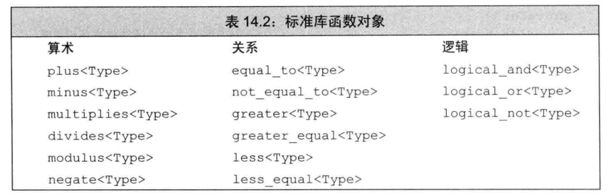

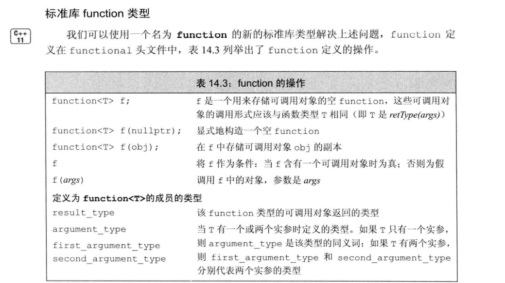

function是一个模板，和其他模板一样，当创建一个具体的function的时候，我们必须提供额外的信息，这里的额外信息就是T ： 调用形式。

比如：T 为 int(int,int)，表示接受两个int参数，返回为int类型的可调用对象。

```
function<int(int,int)> f = [](int i, int j){
					return i*j;
				};

```

### 函数

#### bind()

可以将biind函数看作是一个通用的函数适配器，它接受一个可调用对象，生成一个新的可调用对象来适应原对象的参数列表。

调用bind的一般形式：

auto newCallable  = bind(oldCallable, arg_list);

其中，newCallable本身是一个可调用 对象，arg_list是一个逗号分隔的参数列表，当我们调用newCallable时，newCallable会调用oldCallable，并传递给它arg_list中的参数。

官方例子：

```
// std__functional__bind.cpp
// compile with: /EHsc
#include <functional>
#include <algorithm>
#include <iostream>

using namespace std::placeholders;

void square(double x)
{
    std::cout << x << "^2 == " << x * x << std::endl;
}

void product(double x, double y)
{
    std::cout << x << "*" << y << " == " << x * y << std::endl;
}

int main()
{
    double arg[] = { 1, 2, 3 };

    std::for_each(&arg[0], arg + 3, square);
    std::cout << std::endl;

    std::for_each(&arg[0], arg + 3, std::bind(product, _1, 2));
    std::cout << std::endl;

    std::for_each(&arg[0], arg + 3, std::bind(square, _1));

    return (0);
}

------
1^2 == 1
2^2 == 4
3^2 == 9

1*2 == 2
2*2 == 4
3*2 == 6

1^2 == 1
2^2 == 4
3^2 == 9
```

它可以把原可调用对象callable的某些参数预先绑定到给定的变量中（也叫参数绑定），然后产生一个新的可调用对象newCallable。

网络编程中， 经常要使用到回调函数。 当底层的网络框架有数据过来时，往往通过回调函数来通知业务层。 这样可以使网络层只专注于 数据的收发， 而不必关心业务

在c语言中， 回调函数的实现往往通过函数指针来实现。 但是在c++中 ， 如果回调函数是一个类的成员函数。这时想把成员函数设置给一个回调函数指针往往是不行的

因为类的成员函数，多了一个隐含的参数this。 所以直接赋值给函数指针肯定会引起编译报错。

普通函数：

```
#include <iostream>
#include <memory>
#include <functional>

using namespace std::placeholders;
using namespace std;

void fun1(int n1, int n2, int n3)
{
    cout << n1 << " " << n2 << " " << n3 << endl;
}

int main()
{
    //原fun1接受三个参数，其中绑定了2个，第三个参数由新的可调用对象指定  
    auto f1 = bind(fun1, 11, 22, _1); 
    f1(33);                                                                            
}
```

普通函数+占位符

```
#include <iostream>
#include <memory>
#include <functional>

using namespace std::placeholders;
using namespace std;

void fun1(int n1, int n2, int n3)
{
    cout << n1 << " " << n2 << " " << n3 << endl;
}

int main()
{
    //_1表示这个位置是新的可调用对象的第一个参数的位置
    //_2表示这个位置是新的可调用对象的第二个参数的位置  
    auto f1 = bind(fun1, _2, 22, _1);
    f1(44,55);
}

---占位符理解
auto g = bind(f, a, b, _2, c, _1);
调用g(x,y);
映射到：f(a, b, y, c, x);

```

成员函数：

```
#include <iostream>
#include <memory>
#include <functional>

using namespace std::placeholders;
using namespace std;

class A
{
public:
    void print(int n1, int n2, int n3)
    {
        cout << n1 << " " << n2 << " " << n3 << endl;
    }
};


int main()                                                                             
{
    A a;
    //类成员函数需要绑定该类的this指针  
    auto f1 = bind(&A::print, &a, _2, 22, _1);
    f1(44,55);
}
```

## ratio

## tuple

## type_traits

## typeindex

# 数学和数字

## random

随机数文件.

命令空间:std

random 使用 #include <initializer_list>中的语句。

random里面的类绝大部分优于c函数rand()。

random类和random函数依赖于随机数生成器，也叫分布的统一随机数生成器URNG，所谓分布，即是可以确定随机数范围的。

可以根据是否为确定范围或者是否可以设定种子来实现:

1. 是否为安全加密的(编译器自己判断)
2. 是否为不可重复的(编译器自己判断)

最常用的地方：

1. 生成指定范围内的随机数
2. 使用随机序列重新排列容器 shullle() 函数

实例代码:

```C++
    std::random_device rd;
    std::mt19937 gen(rd());
    std::uniform_int_distribution<> dist(1, 100);
    for (int i = 0; i < ARRAY_SIZE; i++)
    {
        array[i] = dist(gen);
    }
```

# 语言支持

## codecvt

## initializer_list

## limits

## *typeinfo*

头文件：typeinfo

typeid操作符的返回结果是名为type_info的标准库类型的对象的引用（在头文件typeinfo中定义）

### 类

#### type_info 类

**Type_info**类描述编译器在程序内生成的类型信息。 此类的对象可以有效存储指向类型的名称的指针。 **Type_info**类还存储了一个适合用于比较两个类型是否相等或排序的编码值。 类型的编码规则和排列顺序是未指定的，并且可能因程序而异。

```
// 接口
class type_info {
public:
    type_info(const type_info& rhs) = delete; // cannot be copied
    virtual ~type_info();
    size_t hash_code() const;
    _CRTIMP_PURE bool operator==(const type_info& rhs) const;
    type_info& operator=(const type_info& rhs) = delete; // cannot be copied
    _CRTIMP_PURE bool operator!=(const type_info& rhs) const;
    _CRTIMP_PURE int before(const type_info& rhs) const; // before所采用的顺序关系是依赖于编译器的
    size_t hash_code() const noexcept;
    _CRTIMP_PURE const char* name() const;
    _CRTIMP_PURE const char* raw_name() const;
};
```

不能直接实例化 **type_info** 类的对象，因为该类只有一个私有复制构造函数。 构造 (临时) **type_info** 对象的唯一方法是使用 **typeid** 运算符。 由于赋值运算符也是私有的，因此不能复制或分配 **type_info**类的对象。typeid运算符的使用方法看上述关键字。

typeid运算符应该作用与对象。

```
#include <iostream>
#include <typeinfo>
using namespace std;

class Test
{
private:
public:
    Test(){}
    ~Test(){}
};

struct Test_st
{
};

int main()
{
    int a = 1;
    double b;
    char c;
    float d;
    cout << typeid(a).name() << endl;   // i
    cout << typeid(b).name() << endl;   // d
    cout << typeid(c).name() << endl;   // c
    cout << typeid(d).name() << endl;   // f
    Test test;
    cout << typeid(test).name() << endl;    // 4test
    struct Test_st st;
    cout << typeid(st).name() << endl;      // 7Test_st
    cout << typeid(st).before(typeid(test)) << endl;    // 如果st在test之前定义，返回true，否则返回false
    cout << typeid(st).hash_code() << endl;		// 不知道这个将类型映射称hash值有什么用
    system("pause");
    exit(0);
}

------结果----
i
d
c
f
4Test
7Test_st
0
17341030943280023270
```

### 异常

报的异常，只要用异常机制接受处理就可，异常类基本从类的名字就可以看出来表达的意思，所以不用专门细节异常。

#### bad_cast异常

#### bad_typeid异常

# 本地化

## cvt/wbuffer

## cvt/wstring

## locale

# 数学和数字

## complex

## valarray

# 多线程处理

## thread

C++11线程库。

### 类成员函数

#### .detach()

线程分离

### 函数

#### sleep_for()

sleep_for(const chrono::duration<_Rep, _Period>& __rtime)sleep_for(chrono::seconds(time))；

sleep_for()和sleep()、yield(),都是睡眠函数，都能实现线程阻塞。

调用方式：sleep_for(chrono::seconds(time));

线程阻塞time ms；

不会影响其他线程，作用域是当前线程。

#### sleep()

睡眠当前进程，是库函数；

老师说这个函数有些bug，一般不会在正式发布的程序中使用sleep；

可以用其他的函数替换，不持支c++11

#### yield()

std::this_thread::yield();

出让cpu，当前剩下的时间片留给其他线程，等其他线程时间片到，再与其他线程一起竞争cpu。

## mutex

C++11互斥量封装。

## shared_mutex

## atomic

C++11原子操作。

## condition_variable

C++11条件变量。

### 类成员变量

#### cv_status::timeout

### 类成员函数

#### .wait()

#### .notify_all()

#### .wait_for()

## future

# 内存管理

## allocators

定义多个模板,帮助基于节点的容器的内存的分配和释放内存块.

visual studio2019开始这个模块已经开始不推荐使用.

## memory

命名空间:std

这个是C++11的内存管理工具库，其中包含令人闻风丧胆的智能指针。

### 类

#### allocator类

#### allocator_traits类

#### pointer_traits类

#### raw_storage_iterator类

#### enabled_shared_from_this类

#### autp_ptr类

#### bad_weak_ptr类

#### shared_ptr类

共享指针，它是实现单例模式的重要捷径

##### 自定义智能指针的释放函数

#### unique_ptr类

#### weak_ptr类

### 函数

#### uninitiated_copy

将来自指定输入范围的对象复制到未初始化的目标范围.

这是一个拷贝操作，会产生临时变量，如果不想，请在确保安全的情况下使用移动类函数。

但是标准库中，并没有直接将对象移动到未构造的内存中的函数。

但是我们可以使用make_move_iterator函数来将普通迭代器变成移动迭代器，然后通过移动迭代器再来调用这个函数，便可以实现移动操作。当然，你必须有能力保证合法的移动操作。

## new

命名空间:std

这个头文件也包含在iostream中.

定义一些类型和函数，它们控制程序控件下存储空间的分配和释放。 它还定义了用于报告存储管理错误的组件。

new是禁用异常的 -- nothrow,是为了在申请空间失败的时候不抛出异常也不异常终止,而是正常返回nullptr.

new申请的空间无法再做更改,数据的动态变化被封装在容器中,所以new不再支持动态扩容.

C语言可以使用malloc申请内存,使用realloc或者calloc扩充内存或者缩减内存,但是在实际开发中,很多软件是不允许是用realloc重新扩展内存的,因为它的安全隐患更大.

对一些内容的拷贝,也可以用C语言的封装库实现,比如cstring中strcpy().

### 重载new和delete -- 亲自实现内存的极限控制

```
string *sp = new string("abc");
```

当我们执行这句new语句的时候，实际上，new的操作分成三步：

1. new表达式调用 operator new 或者 operator new[]的标准库函数，该函数分配一块足够大的、原始的、未命名的内存空间以便存储特定类型的对象（包括数组对象）。
2. 编译器运行相应的构造函数以构造这些对象，并为其传入初始值。
3. 对象被分配了空间并构造完成，返回一个指向该对象的指针。

```
delete sp;
```

delete操作分成两步：

1. 调用sp所指对象或者数组中保存对象的析构函数
2. 编译器调用名为 operator delete 或者 operator delete[] 的标准库函数释放内存空间。

new运算符和delete运算符是可以被重载，所谓的重载，就是我们自己实现operator new函数和operator delete函数，而通过重载这两个函数可以实现我们对内存的更精细的控制。

这两个函数可以定义为全局函数，也可以定义为成员函数，如果被分配的对象是类类型，则编译器会优先搜索类的成员函数，再搜索全局函数，最后再使用标准库。

这两个函数如果被定义为类成员函数，会隐式声明为static，因为一个负责构造，一个负责析构，显然不能是操作类的任何成员。

我们提供新的operator new 和 operator delete函数的目的在于改变内存分配的方式，但是不管怎样，我们都不能改变new运算符和delete运算符的基本含义。这两个函数底层毫无疑问也是封装了malloc和free。所以我们重写基本也是使用malloc和free进行重写。

#### 定位new

使用operator new 申请的内存我们无法直接使用，可以用 operator new (size_t, void *) 定位new来构造对象。该函数不分配内存，它只是简单的返回指针实参，然后由new表达式负责再指定的地址初始化对象以完成整个工作，事实上，定位new允许我们再一个特定的、预先分配的内存地址上构造对象。

### 异常

operator new 和operator delete有八个重载版本，前四个版本可能抛出bad_alloc异常，后四个不会抛出异常。

## scoped_allocator

C++11标准

未说明命名空间,很小的一个类。

# IO和格式设置

## cinttypes

## filesystem

## fstream

## iomanip

## ios

## iosfwd

## iostream

### 错误标示

可能是位图标示的。

#### failbit

#### eofbit

#### badbit

## istream

## ostream

## sstream

## streambuf

## strstream

# C库封装

## cstdlib

封装stdlib.h

### 随机数函数-低质量

#### rand()

#### rand_r()

#### srand()

### 内存控制

C语言支持void类型转换为任意类型,也允许void *类型转换为任意类型的指针.

但是C++不允许void 和 void*类型的自动转换,必须强制转换,或者使用强制转换类.

#### malloc()

void* malloc(size_t size);

申请大小为size的空间,返回void *指针.

C++需要显式强制转换void *指针,C可以隐式转换.

#### realloc().

void* realloc(type *p, size_t size);

分配新的一块内存,大小为size,并且将原本p指针所在内存的内容拷贝到新内存中,释放原本p指向的空间,p变量地址不变,返回一个新指针.

新分配的内存已经不是原本内存的连续,两块内存没有任何关系.

不可再对p指针的内存free.

#### calloc()

void* calloc(int num, size_t size);

在堆上申请一块连续的内存,num个size大小的内存,并且做初始化(需要时间);

calloc于malloc的区别类似,但是calloc默认做初始化,如果在初始化的时候free掉,可能会报段错误.

#### free()

void free(void *);

释放指定内存,重复释放报段错误

## cstring

### 内存拷贝

#### memset

void* memset(void *s, int c, size_t n);

把s指针的内存,全部设置为c,内存大小为n;

在C++中sizeof(ptr) 是计算指针的大小,而不是指针所指向的内存的实际大小.

## ctime

命名空间：std

时间操控函数。

宏定义了三个宏，其中有NULL，应该是为了迎合C标准库函数。

比较小的一个头文件，只提供了两个结构体，三种类型名称，和一系列时间函数。

提供clock和time两种计时器。

定义变量：

| 类型名          | 类型       | 描述                                         |
| --------------- | ---------- | -------------------------------------------- |
| size_t          | 无符号整型 | sizeof单目运算符的结果                       |
| clock_t         | long       | 处理器时间类型                               |
| time_t          |            | 适合存储日历时间                             |
| struct tm       | 结构体     | 保存时间和日期的结构体，从年到秒，还有夏令时 |
| struct timespec | 结构体     | 高精度时间，结构体成员有秒和纳秒             |

### clock()

clock_t clock();

### difftime()

double difftime(time_t time1, time_t time0);

### mktime()

time_t mktime(struct tm* timeptr);

### time()

time_t time(time_t* timer);

### timespec_get()

int timespec_get(timespec* ts, int base);

### asctime()

char* asctime(const struct tm* timeptr);

### ctime()

char* ctime(const time_t* timer);

### gmtime()

struct tm* gmtime(const time_t* timer);

### localtime()

struct tm* localtime(const time_t* timer);

### strftime()

size_t strftime(char* s, size_t maxsize, const char* format, const struct tm* timeptr);

## cstdio

C语言库的标准IO

这个IO中定义了一些宏,类似函数宏，可以直接打印使用：

| 宏名            | 含义             |
| --------------- | ---------------- |
| __ FILE __      | 当前文件路径     |
| __ LINE __      | 当前文件编译行数 |
| __ DATE __      | 编译日期         |
| __ TIME __      | 编译时间         |
| __ FUNCTION __  | 函数名称         |
| __ TIMESTAMP __ |                  |

## cassert

C++现有的标准中就有assert、#error两个方法是用来检查错误的，除此而外还有一些第三方的静态断言实现。

assert是运行期断言，它用来发现运行期间的错误，不能提前到编译期发现错误，也不具有强制性，也谈不上改善编译信息的可读性。

既然是运行期检查，对性能肯定是有影响的，所以经常在发行版本中，assert都会被关掉。

## ccomplex

## cctype

## cerrno

## cfenv

## cfloat

## cinttypes

## ciso646

## climits

## csetjmp

## cstdalign

## clocale

## cmath

## csignal

## cstdarg

## cstdbool

## cstddef

## cstdint

## ctgmath

## cuchar

## cwchar

## cwctype

# 数组

# *枚举*

C++11之后，包含两种枚举类型：

1. 不限定作用域的：枚举成员的作用域于枚举类型本身的作用域相同。
2. 限定作用域的：枚举成员的名字遵循常规的作用域准则，并且在枚举类型的作用于外是不可访问的。

枚举有匿名和命名两种，有默认类型和非默认类型。

C++11 还可以对枚举前置声明。

```
// 不限定作用域的
// 1.默认匿名,默认是int类型，默认从0开始，若有定义，从定义的开始算，A=1，B=2，C=3
enum {
	A = 1,
	B,
	C
};

// 2.默认命名
enum Color{
	YELLOW = 1,
	BLUE
};

// 3.long 类型命名
enum Color:long {
	YELLOW = 1
};

// 限定作用域的
enum class Color : long{
	YELLOW =1
};

// 前置声明
enum class Color : long;

```

# *联合：一种节省空间的类*

联合是一种特殊的类，一个union可以有多个数据成员，但是在任意时刻只有一个数据成员可以有值，它们使用同一块空间，所以空间一定是包含最大的那个类型。C++11规定了含有类类型的联合，但是这种联合对这个类类型的使用必须显式使用构造函数和析构函数，常用的方法是把union放在一个类中，这样显得比较麻烦，所以还是使用常用的功能。

```
union Color{
	char red;
	char blue;
};

Color color;
color.red = 'r';
```

# 类和面向对象

面向对象的三大特性：

1. 封装 -- 一个类要么对应一类事物，要么是一个接口
2. 继承 -- 子类可以继承父类的所有特性和功能
3. 多态 -- 虚函数是实现多态的基础，多态可以让一个动物既会猫叫，也会狗叫

## 类

类就是一类事物，类的实例化叫对象。

动物就是一个类，猫就是一个实例化对象。

C++Primer上明确说：struct和class之间的唯一差别就是默认成员访问说明符及默认派生访问说明符，除此之外，再无其他不同之处。

```
#include <iostream>
struct A
{
private:
    int a;
public:
    void fun()
    {
        std::cout << "this is A" << std::endl;
    }
};
struct B :public A
{
public:
    int b;
};
int main()
{
    struct A a;
    struct B b;
    a.fun();
    b.b = 10;
    system("pause");
}
```

### 类的定义

```
class Student
{
public:
	Student();
	~Student();
	Student(Student &);
	Student& operator=(Student &);
	Student(Student &&) noexcept;
	Student& operator=(Student &&) noexcept;
private:
	int num;
	string name;
	int age;
}
```

定义在类内部的函数是隐式内联的。

类内部都有一个指向自己的this指针。

### 类的初始化和赋值

```
class Test
{
public:
	Test(int);
private:
	int num;
}
```

对这个类的构造函数有两种实现方法：

```
void Test::Test(int a)
{
	this->num = a;
}

void Test::Test(int a):num(a){}

```

第一种为赋值，第二种会构造初始化。

这只是个小函数，如果类再庞大，构造函数再复杂，就会涉及到效率问题。

第一种为先初始化再赋值，第二种为直接初始化数据成员。

建议使用第二种构造函数初始化方式，虽然没有要求初始化的顺序，但是最好和类中声明的顺序一致。

## 访问控制和封装

### private

只能被类内部访问，继承的子类也无法访问。

但是私有部分会被继承，因为要构造一个完整的类。

子类的友元无法访问基类的私有，但是能访问子类的私有。

### public

定义在public的成员被整个程序可访问，继承给子类的访问控制仍然是public。

构造函数和析构函数应该是public。

### protect

只能被类内部访问，继承的子类可以访问。

至于友元和成员函数能不能访问要根据继承方式。

## 特殊成员函数

如果真需要使用编译器提供的默认特殊函数，请使用关键字显式声明。

以下函数以class Foo为例子；

### 默认构造函数

构造函数初始化类的所有非static数据成员，实例出一个对象。

构造函数可以重载，即可以有不同的带参数的构造函数；

当定义带参数的构造函数之后，默认构造函数不再被隐式提供。

大多数类的构造函数是public的，但是不是绝对的，如果不允许外部创建对象，就可以把构造函数声明称私有的，然后在静态函数里面进行初始化，来创建类的实例，这也是一些设计模式的要求。

构造函数是类实例化时必须调用的函数。

```
class Foo{
public:
	Foo();
}
```

#### 默认初始化

调用类的构造函数

### 委托构造函数

C++11拓展了构造函数初始值的功能，当一个类中有多个构造函数的时候，我们会在其他构造函数中调用最基本的构造函数，先完成最基本的初始化，而委托构造函数可以将调用最基本的构造函数的这个过程提升到构造函数初始化值上面。

```
class Test
{
private:
	int num;
	string name;
public:
	Test(int a):num(a){}
	Test(int a, string n):Test(a),name(n){}		// 委托构造函数
}
```

### 拷贝构造函数

```
class Foo{
public:
	Foo();
	Foo(const Foo&);	// 拷贝构造函数
}
```

拷贝构造函数的参数必须是引用，否则会出现拷贝嵌套拷贝的非法情况。

函数在值传参和返回的时候，是会构建临时变量或者临时类的，就会发生拷贝现象，引用可以避免这种情况。

而深浅拷贝，是根据拷贝构造函数的实现细节区分的，如果一个类内有在堆中动态申请内存，那么拷贝的时候就必须明确：要不要重新拷贝内存，还是使用共享内存。

#### 深拷贝

在拷贝构造函数内，重新new或者malloc一块内存，使得复制过来的指针指向不同的内存；

#### 浅拷贝

在拷贝构造函数内，直接复制指针，这样两个指针指向的实际是同一块内存，可以完成实例之间的通信。

#### 拷贝初始化

有一种特殊的初始化，叫做拷贝初始化。

发生拷贝初始化的几种情况：

1. 使用‘=’定义变量的时候
2. 将一个对象作为实参传递给一个非引用类型的形参的时候——值传递的时候
3. 返回非引用类型的时候——值返回
4. 用花括号列表初始化一个数组中的元素或一个聚合类的成员

拷贝构造函数会在特殊构造函数被explicit的时候阻断。

#### 编译器可以绕过拷贝构造函数

编译器是会进行代码优化的，所以它可以选择是否跳过拷贝或者移动构造函数，来直接创建一个对象。

即使编译器跳过拷贝/移动构造函数，但是在程序中，必须要有拷贝/移动构造函数。

### 析构函数

```
class Foo{
public:
	~Foo();
}
```

析构函数销毁对象的所有非static数据成员。

通常是回收对象资源。

析构函数本身并不会直接销毁成员，在析构函数函数体执行完之后有一个隐含的析构阶段，在这个阶段才会销毁各种成员。所以析构函数一般只负责回收程序员分配的动态资源。

析构函数被调用的几种情况：

1. 变量在离开作用域时被销毁
2. 当一个对象被销毁的时候，成员会被销毁
3. 容器被销毁时，其内元素被销毁
4. 动态分配的对象只有在被delete的时候才会被销毁
5. 临时对象在离开它的完整表达式的时候会被销毁

### 赋值运算符

```
class Foo{
public:
	Foo& operator=(const Foo&);	//赋值运算符
}
```

赋值运算符如果没有定义，编译器会合成一个默认的。

赋值运算符使得对象直接可以用‘=’链接。

赋值运算符应该返回一个指向左侧运算对象的引用。

赋值运算符的正常工作机理：

1. 拷贝右侧对象的内存到临时对象
2. 释放当前对象的旧内存
3. 临时对象内存指针赋值给当前对象
4. 返回当前对象的指针

看起来很麻烦，但这确实保证赋值运算符不出错的重要手段，也是后续引出移动赋值和移动构造的引子，拷贝构造函数的机理类似。

注意：这里说的销毁当前对象的资源，不是调用当前对象的析构函数，那样对象都没了，还赋值个球球，而是实现像析构函数一样的功能，释放动态内存，不做销毁，此外，析构函数也不负责销毁，真正负责销毁的是析构函数之后的析构阶段，所以说功能和析构函数一样也没有错。

赋值运算符的编写规则：

1. 如果将一个对象赋予它自身，赋值运算符必须保证正常工作
2. 大多数赋值运算符组合了析构函数和拷贝构造函数的工作

### 三/五法则

如果一个类需要自定义析构函数，几乎可以肯定它也需要自定义拷贝赋值运算符和拷贝构造函数以及移动构造和移动赋值运算符函数.

析构函数是判别三五法则的最直接的标准。

### 移动构造函数

为什么要有移动构造函数？

移动构造函数是C++11新标准出现的东西，它的功能如名字，它拥有移动对象的能力，而不是拷贝。

在旧标准中，没有移动函数，我们自己完成移动，通常就是交换指针。

在Linux下，构造函数会产生临时拷贝，如果需要动态内存，这个临时拷贝还会临时malloc，其消耗非常大，新标准移动构造，就是干掉中间拷贝过程，直接移动对象，提升系统性能。

移动构造依赖右值引用，请参考上述右值引用。

《C++ Primer》：至目前为止，移动操作的实现细节未公开。

但是可以假定是进行了指针的拷贝，而不是为字符分配内存空间。

新标准实现移动的有两种机制:

1. string的移动构造函数
2. 标准库move函数

使用移动而不是拷贝的原因之一还有：IO类和unique_ptr这样的类，都是单例的，都包含不能共享的资源，比如指针或IO缓冲，因为，这些类型的对象不能拷贝，只能移动。

标准库容器、string和shared_ptr类既支持移动，也支持拷贝，IO类和unique_ptr只支持移动，不支持拷贝。

当类中同时包含拷贝构造函数和移动构造函数时，如果使用临时对象初始化当前类的对象，编译器会优先调用移动构造函数来完成此操作。只有当类中没有合适的移动构造函数时，编译器才会退而求其次，调用拷贝构造函数。

在实际开发中，通常在类中自定义移动构造函数的同时，会再为其自定义一个适当的拷贝构造函数，由此当用户利用右值初始化类对象时，会调用移动构造函数；使用左值（非右值）初始化类对象时，会调用拷贝构造函数。

移动函数不允许抛出异常,所以声明noexcept

定义移动构造函数:

```
Foo::Foo(Foo &&s) noexcept{
	p = s.p;
	s.p = nullptr;	// 确保移动之后不再指向原来的内存.以安全的调用析构函数
}
// 右值引用s完成这个操作之后,就会被自动析构,彻底消失.
```

### 移动赋值运算符

```
Foo& Foo::operator=(Foo &&rrs) noexpect
{
	if(this == &rrs)
	{
		return *this;
	}
	free();		// 释放已有元素
	p = rrs.p;	// 从rrs接管资源
	rrs.p = nullptr;// 将rrs治愈可析构的状态
	return *this；
}
// 必须保证我们的程序不依赖移后源，也就是被移动之后的rrs
// 必须保证移后源可以正常析构，也就是被移动之后的rrs能被析构释放

```

只有当一个类没有定义自己任何版本的拷贝控制成员，且它的所有数据成员都能移动构造或移动赋值时，编译器才会为它合成移动构造函数或移动赋值运算符。

建议：小心使用move操作，在移动构造和移动赋值运算符之外，只有确信能使用move的时候才可以使用它，必须确保安全。

## 成员修饰符

### default

C++11，我们可以通过将拷贝控制成员定义为=default来显式的要求编译器生成默认的版本。

```
class Foo{
public:
	Foo() = default;
	Foo(const Foo&) = default;
	Foo& operator=(const Foo&) = default;
	~Foo() = default;
}
```

当使用default修饰的时候，合成的函数就会隐式的声明为内联函数。

就是告诉编译器，我么需要默认的控制函数。

default只能对默认构造函数和拷贝控制成员函数（拷贝构造，析构，赋值运算符）使用。

### delete

C++11，可以删除所有不想要的函数，包括默认版本。

```
class Foo{
public:
	Foo() = delete;
}
```

默认构造函数将不再提供支持。

在delete出现之前，都是把拷贝构造函数和拷贝运算符声明为private来阻止拷贝的。

### explicit

explicit显式声明，防止类的隐式自动转换。

explicit只能用于类的满足以下条件之一的构造函数的声明，不可用于定义。

1. 仅有一个参数
2. 除了第一个参数之外其余参数都有默认值，或者全有默认值

例子：

```
#include <iostream>
using namespace std;
class A
{
public:
    A(int i = 5)
    {
        m_a = i;
     }
private:
    int m_a;
};
 
int main()
{
    A s;
    //我们会发现,我们没有重载'='运算符,但是却可以把内置的int类型赋值给了对象A.
    s = 10;
    //实际上,10被隐式转换成了下面的形式,所以才能这样.
    //s = A temp(10);
 
    system("pause");
    return 0;
}


#include <iostream>
using namespace std;
class A
{
public:
    //这里用explicit关键词来修饰类构造函数.
    explicit A(int i = 5, int j = 10)
    {
        m_a = i;
        m_b = j;
    }
private:
    int m_a;
    int m_b;
};
 
int main()
{
    A s;
    //这样直接赋值,会被提示错误,因为explicit抑制隐式转换的进行
    s = 10;//这样会报错!!!
    //当然显示转换还是可以的.
    s = A(20);

    system("pause");
    return 0;
}
```

归根结底，explicit可能在某些情况下绕过实例化对象，直接给对象赋值，这样既绕过了构造函数，也绕过了拷贝构造函数，有些情况下是不允许的，所以一般在定义上述构造函数的时候，用explicit显式声明，禁止隐式转换。

```
void func(vector<int> a);
// 调用
func(10);	// 错误，vector的构造函数是explicit的
func(vector<int>(10));	// 正确，临时构造一个对象
```

### static

上面讲述过static的作用。

但是类内成员使用static修饰有别的作用：

#### 类内数据成员

被static修饰的类成员，属于类，不属于对象，所有对象共享一份内存。

这个成员在对象没有被创建的时候就被初始化，并且存储在静态常量区。

#### 类内函数成员

类成员函数被static修饰，函数不属于对象，只属于类，函数没有this指针。

不能访问对象成员，只能访问static修饰的类内成员。

### const

常量声明，表示该成员函数不会改变任何成员变量。

```
class Foo{
 Foo Func() const;
}
```

### override

重载符，表明该函数重写基类函数。

派生类可以在继承来的虚函数前面声明vritual关键字，也可以不加。

C++11之后，子类可以显式注明它将使用哪个成员函数改写基类的虚函数，具体的措施就在该函数的 形参列表之后增加一个override关键字。

这个关键字只是为了帮助程序员调试，以免覆盖函数的时候写错。

如果标记了override，但是该函数并没有覆盖掉已存在的虚函数，此时编译器将会报错。

### &，&&

引用限定符可以作为重载的依据。

引用限定符，当引用限定符和const限定符一起使用的时候，const限定符必须在前面。

```
class Foo
{
	Foo Func1() & const;	// 错误
	Foo Func2() const &;	// 正确，只能用作左值
	Foo Func3() &&;		// 只能用作右值
}
```

### final

C++11新标准

将类标记为final，表示不能被继承。

```
class Test final{};
class T : public Test{};	// 错误
```

将成员函数标记为final，表示不能被重写。

```
class Test{
public:
	void Func(int) final; // 该函数不允许被重写。
};
```

## 友元

类可以允许其他类或者函数成员访问它的非共有成员，方法就是类亲自声明其他类或者函数为它的友元。

友元只在声明，定义仍然是普通的函数。

```
class Student
{
frient void GetName(const Student &);
private:
	string name;
public:

}

void GetName(const Student& s)
{
	cout << s.name << endl; 	// 可以直接访问类的私有成员
}
int main()
{
}
```

友元看似是破坏了类的封装性，但是是不是友元只有类声明才对，你是我的朋友，只有我承认了才行。

友元一般多用于运算符重载，因为运算符经常会需要访问类内部成员，但它又不能是类的成员函数，所以就会声明为友元。

友元在类中声明的位置没有限制，好规范是类定义的最开始或者最末尾，集中声明友元。

友元的关系不具有传递性，父子的友元跟子类没有任何关系。

## RTTI机制

RTTI:运行时类型识别

运行时类型识别由两个运算符实现：

1. typeid运算符，用于返回表达式的类型
2. dynamic_cast运算符，用于将基类的指针或引用安全的转换成派生类的指针或引用

### 自动的动态类型识别：

自动的动态类型识别就是虚函数机制，基类指针指向子类对象，并且调用虚函数，会自动进行动态绑定，这是安全的，由编译器自己寻找。

### 非自动的动态类型识别：

RTTI，我们使用上述两种运算符，接管运行时动态类型识别机制，这是很危险的行为。

这两个运算符适合下列情况：

**我们想使用某个基类的指针或引用执行某个派生类的非虚函数**

详细请看dynamic_cast和typeid运算符的描述。

## 字面值常量类

数据成员都是字面值类型的聚合类叫字面值常量类，如果一个类不是聚合类，但它符合下述要求，则它也是一个字面值常量类：

* 数据成员都必须是字面值类型
* 类必须至少有一个constexpr构造函数
* 如果一个数据成员含有类内初始值，则内置类型成员的初始值必须是一条常量表达式；或者如果成员属于某种类型，则初始值必须使用成员自己的constexpr构造函数。
* 类必须使用析构函数的默认定义。

constexpr构造函数：

尽管构造函数不能是const的（因为构造函数要完成初始化操作），但是字面值常量类的构造函数可以是constexpr函数，事实上，一个字面值常量类必须至少提供一个constexpr构造函数。

既然是constexpr函数，说明它的函数体有且只能有一条返回语句，同时，既然它是构造函数，它就不能有返回语句，综上两点，它的函数体只能为空。

```
class Debug{
public:
	constexpr Debug(bool b = true):hw(b){}
};
```

注意：constexpr构造函数必须初始化所有数据成员，初始值或者用constexpr构造函数，或者是一条常量表达式。

## 面向对象的设计

面向对象的程序设计OOP的核心思想是数据抽象，继承和动态绑定，通过使用数据抽象，我们可以将类型的接口与实现分离，使用继承可以定义相似的类型并对其相似关系建模，使用动态绑定，可以在一定程度上忽略相似类型的区别，而以统一的方式使用它们的对象。

## 继承

通过继承联系在一起的类构成一种层次关系，基类是共同点，子类是特殊点。

基类将类型相关的函数和派生类不做改变直接继承的函数区分对待，对于某些函数，基类希望它的派生类各自定义适合自己的版本，此时基类就将这些函数声明为虚函数，使用vritual关键字。

## 动态绑定

也叫运行时绑定，是众多设计模式出现的基础，是面向对象最牛的地方。

在C++中，当使用基类指针或引用 调用 一个虚函数时将自动发生动态绑定。

换句话说，基类的指针或引用可以指向子类的对象。

## 基类和派生类

### 基类

基类的析构函数应该是虚函数，因为大部分基类不会实例化，只有子类会实例化，所以具体析构的时候要使用子类的析构函数。

构造函数不能是虚函数。

静态函数不能是虚函数。因为静态函数属于类，不属于对象。

友元函数不能是虚函数。

### 派生类

派生类继承基类，重写基类的虚函数，不一定全部重写。

C++标准没有明确规定派生类的对象在内存中如何分布，可以想想父类继承过来的和子类特有的部分可能是分开存放的。

派生类的构造函数需要先初始化基类，再初始化子类特有的内容：

```
class TestChild : public Test{
public:
	TestChild(int a, int b, int c):Test(a,b), this.c(c){ }
};
```

静态成员不会被继承，无论是在父类还是继承它的子类，都只有唯一的实例化。

静态成员遵循访问控制规则。

### 类型转换与继承

理解基类和派生类之间的类型转换是理解C++面向对象编程的关键所在。

关键就一句话：基类的指针和引用可以指向或绑定子类对象。

#### 静态类型和动态类型

表达式的静态类型就是在编译阶段可知的，而动态类型要等运行起来才知道。

#### 不存在从基类到派生类的隐式类型转换

如题，但是存在显式类型转换，当然安全性由程序员保证。

从派生类转换到基类，称为向上转型，是安全的，隐式的，因为每个子类都包含基类的一部分，基类指针可以指向子类中的基类部分，并通过虚函数的动态绑定，完成从基类虚函数到实际子类类型的虚函数的动态映射。而且，也只是对指针和引用才有效，真实的对象之间是不存在类型转换关系的。

但是从基类转换到派生来，是向下转型，是不安全，显式的，可以强转，这意味着对象可能会被切割。

如果我们确定是安全的，可以使用static_cast来强制覆盖编译器的检查工作。

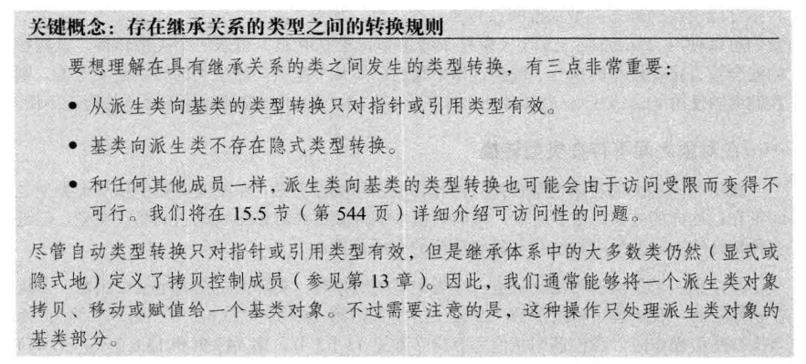

## 虚函数

基类的析构函数应该是虚函数；

基类的构造函数不能是虚函数。

静态函数和友元不能是虚函数。

也不推荐将其他拷贝控制成员函数声明为虚函数。

总归依据，不能继承的函数绝对不能是虚函数，除了析构函数。不能寻址的内联函数不能声明为虚函数，因为虚函数依赖于虚函数表。

虚函数只是提供一个动态绑定机制，虚函数不一定被重写，有虚函数的类也可以被实例化，但是纯虚函数必须被重写，虚基类必须不可以实例化。

如果一个虚函数承诺了它不会抛出异常，则后续派生出来的虚函数也必须做同样的承诺。

虚函数是实现多态的基础。

当基类指针指向子类时，基类中的虚函数，到底是调用谁的不确定，只有到运行期间才能确定.

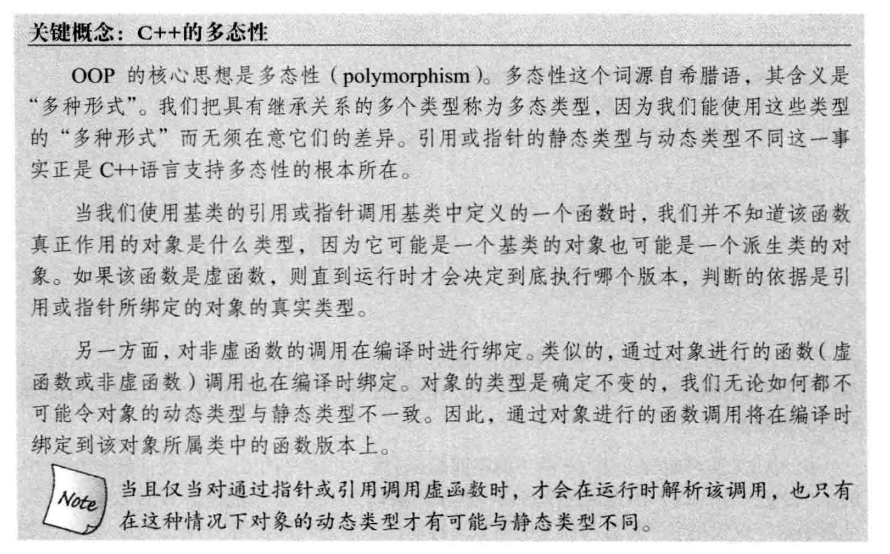

只有虚函数才能被覆盖，其他的是隐藏。

覆盖指的是子类覆盖父类函数（被覆盖,不存在），特征是：

1.分别位于子类和父类中

2.函数名字与参数都相同

3.父类的函数是虚函数（virtual）

隐藏指的是子类隐藏了父类的函数（还存在），具有以下特征：

子类的函数与父类的名称相同，但是参数不同，父类函数被隐藏

子类函数与父类函数的名称相同，参数也相同，但是父类函数没有virtual，父类函数被隐藏

在某些情况下，我们需要对虚函数的调用特定的版本，而不是去动态调用，就需要使用 :: 表明，用哪个类中的虚函数。一般来讲，只有成员函数或者友元中的代码才需要使用作用域运算符来回避虚函数的机制。

## 抽象基类

含有纯虚函数的类叫抽象基类，也叫抽象类，抽象类不能实例化。

抽象基类负责定义接口，后续的其他类可以覆盖该接口。

### 纯虚函数

虚函数在函数体的位置 = 0 就是纯虚函数。

```
vritual void func(void) = 0;	// 纯虚函数
```

纯虚函数和抽象类出现的意义？

纯虚函数必须在派生类里被定义。

有些事物不适合实例化，比如说动物里面有小狗，狗可以实例化，但是动物这个基类不能实例化，所以就定义出来了抽象类，抽象类在定义接口上和设计模式上有很大的作用。

### 继承方式与访问控制

| 基类权限                           | 继承方式  | 子类权限                           |
| ---------------------------------- | --------- | ---------------------------------- |
| public<br />protected<br />private | public    | public<br />protected<br />无权    |
| public<br />protected<br />private | protected | protected<br />protected<br />无权 |
| public<br />protected<br />private | private   | private<br />private<br />无权     |

这是继承过来的基类的成员，在子类中的访问权限，而不是子类访问基类的权限，子类只能访问基类的保护和公有成员。

### 派生类向基类的转换的可访问性

什么时候派生类向基类的转换是有效的？

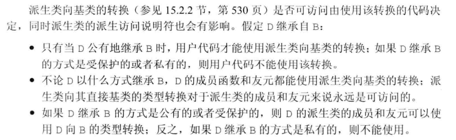

综合来讲，有过在代码中给定的节点来说，基类的公有成员是可访问的，那么派生类向基类的类型转换也是可访问的，反之不行。

## 继承中的类作用域

定义在内层作用域的名字将隐藏定义在外层作用的名字。

作用域运算符可以直接指定使用哪个类的成员。

除了覆盖继承而来的虚函数之外，派生类最好不要重用其他定义在基类中的名字。

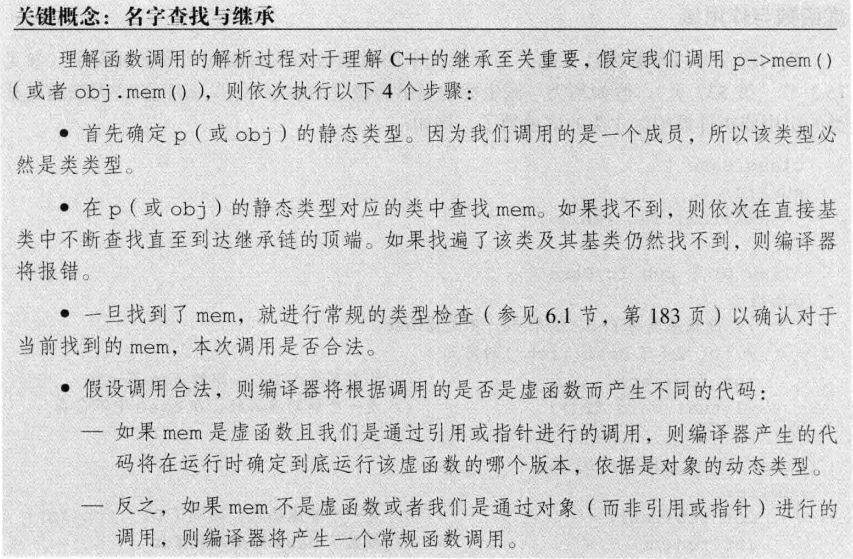

由于名字查找优于类型检查，所以子类的函数不会重载父类的函数，只会隐藏或覆盖（虚函数）。

所以这就为什么基类和派生类的虚函数必须有相同的形参列表，如果不同，就无法通过基类的引用或指针调用派生类的虚函数。因为这样就是隐藏效果，不是覆盖效果。

## 构造函数与拷贝控制

### 为什么构造函数不能是虚函数？

1. 从存储空间角度，虚函数对应一个指向vtable虚函数表的指针，这大家都知道，可是这个指向vtable的指针其实是存储在对象的内存空间的。问题出来了，如果构造函数是虚的，就需要通过 vtable来调用，可是对象还没有实例化，也就是内存空间还没有，怎么找vtable呢？所以构造函数不能是虚函数。
2. 从使用角度，虚函数主要用于在信息不全的情况下，能使重载的函数得到对应的调用。构造函数本身就是要初始化实例，那使用虚函数也没有实际意义呀。所以构造函数没有必要是虚函数。虚函数的作用在于通过父类的指针或者引用来调用它的时候能够变成调用子类的那个成员函数。而构造函数是在创建对象时自动调用的，不可能通过父类的指针或者引用去调用，因此也就规定构造函数不能是虚函数。
3. 构造函数不需要是虚函数，也不允许是虚函数，因为创建一个对象时我们总是要明确指定对象的类型，尽管我们可能通过实验室的基类的指针或引用去访问它但析构却不一定，我们往往通过基类的指针来销毁对象。这时候如果析构函数不是虚函数，就不能正确识别对象类型从而不能正确调用析构函数。
4. 从实现上看，vbtl在构造函数调用后才建立，因而构造函数不可能成为虚函数从实际含义上看，在调用构造函数时还不能确定对象的真实类型（因为子类会调父类的构造函数）；而且构造函数的作用是提供初始化，在对象生命期只执行一次，不是对象的动态行为，也没有必要成为虚函数。
5. 当一个构造函数被调用时，它做的首要的事情之一是初始化它的VPTR。因此，它只能知道它是“当前”类的，而完全忽视这个对象后面是否还有继承者。当编译器为这个构造函数产生代码时，它是为这个类的构造函数产生代码——既不是为基类，也不是为它的派生类（因为类不知道谁继承它）。所以它使用的VPTR必须是对于这个类的VTABLE。而且，只要它是最后的构造函数调用，那么在这个对象的生命期内，VPTR将保持被初始化为指向这个VTABLE, 但如果接着还有一个更晚派生的构造函数被调用，这个构造函数又将设置VPTR指向它的 VTABLE，等.直到最后的构造函数结束。VPTR的状态是由被最后调用的构造函数确定的。这就是为什么构造函数调用是从基类到更加派生类顺序的另一个理由。但是，当这一系列构造函数调用正发生时，每个构造函数都已经设置VPTR指向它自己的VTABLE。如果函数调用使用虚机制，它将只产生通过它自己的VTABLE的调用，而不是最后的VTABLE（所有构造函数被调用后才会有最后的VTABLE）。

### 虚析构函数

基类的析构函数应该是虚函数，以确保该函数拥有动态绑定功能，可以析构正确的对象。

无论基类是否需要拷贝和构造函数，都需要一个虚析构函数。

编译器不会为有虚析构函数的基类定义移动操作。

当要释放子类的空间时候，调用子类的析构函数，编译器会在调用完子类析构函数之后调用基类的析构函数。

### 合成拷贝控制与继承

拷贝构造函数不能是虚函数，构造函数不能是虚函数。

构造一个对象，需要先调用基类的构造函数，再调用子类的构造函数，而且一般是显式调用基类的构造函数，这一顺序和析构函数的执行相反.

派生类中删除的拷贝控制与基类的关系：

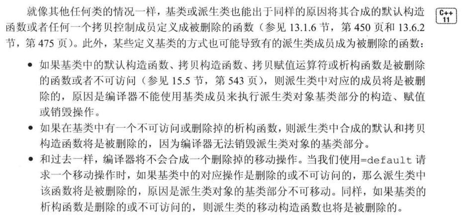

### 移动操作与继承

不能是虚函数。

因为基类都会定义一个虚析构函数，所以基类没有合成的移动操作，自然而然子类也就没有合成的移动操作。

所以如果需要移动操作，就需要现在基类中定义，再从子类中定义。

### 派生类的拷贝控制成员

不可以是虚函数。

派生类的拷贝和移动控制成员，必须连通基类的部分一起初始化，这和析构函数不同，子类的析构函数只需要析构掉子类的部分就可以，它会链式调用父类的析构函数，从而析构基类的部分。

当派生类定义了拷贝或移动操作时，该操作负责拷贝或移动包括基类部分成员在内的整个对象。

```
class Base{};
class D : public Base{
public:

	// 拷贝构造函数
	D(const D &d):Base(d){ /*子类成员的拷贝操作*/ }

	// 移动构造函数
	D(const D &&d):Base(std::move(d)){/*子类的移动拷贝操作*/}

};
一般而言，Base(d)会调用Base的拷贝构造函数，Base(std::move(d))会调用Base的移动构造函数。

```

所以，如果想要在子类中完成拷贝构造或者移动构造，必须显式调用基类的拷贝构造或移动构造。

如果不显式声明，可能会默认调用基类的默认构造函数，这样会导致子类的成员被拷贝，而基类成员则是被初始化赋予默认值。

### 派生类赋值运算符

不建议是虚函数。

和拷贝控制成员同理，需要显式调用基类的赋值运算符。

```
D& D::operator=(const D &d)
{
	Base::operator=(&d);	//显式调用基类的赋值运算符

	/*子类自己的赋值操作，释放空间操作*/

	return *this;
}
```

### 继承的构造函数

在C++11标准中，派生类能够重用其直接基类定义的构造函数。

类不能继承默认、拷贝、移动构造函数，不能继承赋值运算符。

C++11新标准，增加了一条子类继承基类构造函数的方法:使用using声明。

通常情况下，using声明语句只是令某个名字在当前作用域内可见。而当作用域构造函数时，using声明语句将令编译器产生代码。对于基类的每个构造函数，编译器都生成一个与之对应的派生类构造函数。注意，using声明不会继承默认构造函数。

## 多重继承与虚继承

多重继承和单继承类似，唯一不同的就是二义性问题，钻石模型。

### 虚继承与虚基类

虚基类的出现就是为了重复继承的问题。

继承虚基类叫做虚继承。

虚基类应该是被共享的那个基类。在这种机制下，无论虚基类在继承体系中出现了多少次，在派生类中都只包含唯一一个共享的虚基类子对象。

```
// 虚继承的声明是在直接继承的那里声明的
class B : public vritual A{};	// 虚继承
class C : varitual public A{};	// 虚继承

class D : public B, public C{};
```

### 构造顺序

虚继承的构造顺序跟以前的有些不同，如果B继承A，C继承B，则C只需要执行B的构造函数和自己的构造函数，构造A的职责交给B做。

虚继承不同：

```
class B : public vritual A{};
class C : public vritual A{};
class D : public B, public C {};
// 当实例化D的时候，由D执行A的构造函数，再执行B，C的构造函数，再执行自己的。
D::D(int a, int b, int c, int d) : A(a),B(b),C(c),this.d(d){}

```

其他控制成员类似，析构函数相反。也就是说构造虚基类的职责被划分到最底层派生来身上。

## 类成员指针

**声明：** 指向类的成员函数的指针需要在指针前面加上类的类型，格式为：

typedef 返回值 (类名::*指针类型名)(参数列表);

**赋值：** 需要用类的成员函数地址赋值，格式为：

指针类型名  指针名 = &类名::成员函数名;

**调用：** 针对调用的对象是对象还是指针，分别用.*和->*进行调用，格式为：

(类对象.*指针名)(参数列表);

(类指针->*指针名)(参数列表);

还可以使用function绑定，或者bind绑定调用对象。

## 嵌套类

嵌套类就是在一个类内部再定义一个类。

## 局部类

定义在函数内部的类，叫做局部类。局部类定义的类型只在定义它的作用域可见。

局部类的所有成员包括函数在内都必须完整的定义在类的内部。

# 聚合

C++本身并没有聚合类这个概念，确有数组和联合的概念。

出现聚合类单纯就是因为很多场景，不需要特殊成员函数，也不需要复杂的关系，而只是简单的组合，必须数据库表的关系，如果一张表就是一个类，那么这个类就可以是聚合类。

同样也因此诞生了贫血模式和充血模式。

聚合定义为：

1. 数组
2. 没有以下内容的类、结构、联合
   1. 没有用户定义的构造函数
   2. 没有私有成员和保护成员
   3. 没有基类
   4. 没有虚函数
   5. 没有类内初始值

聚合必须提供一个花括号括起来的成员列表进行初始化，并且是顺序严格的。

# 重载运算与类型转换

## 基本概念

重载的运算符是具有特殊名字的函数：它们的名字由关键字operator和其后要定义的运算符号共同组成。

重载运算符函数的参数数量与该运算符作用的运算对象一样多，对于普通函数，左侧为第一个参数，右侧为第二个参数；是类成员函数，则this指针是隐式的第一个参数。

对于运算符函数来说，它要么是类成员，要么至少含有一个类类型的参数。也就是说，你不能对基础类型再重载运算符。

可以重载的运算符表:

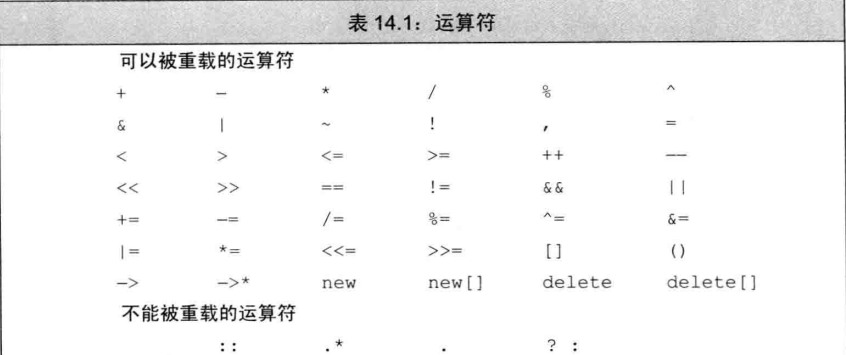

尽量明智的选择重载运算符：

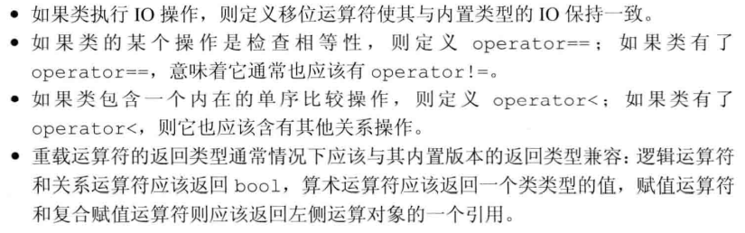

是将运算符作为成员函数，还是非成员函数？

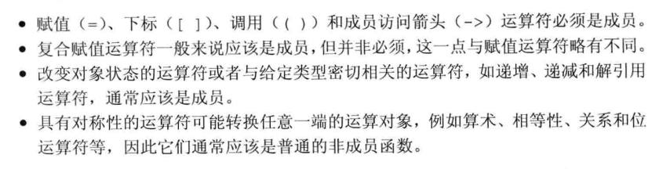

## 输入输出运算符重载

输入输出运算符必须是非成员函数，而且很有可能是类的友元。因为输入输出操作符的第一个对象是流对象的引用，所以不能用作成员函数，而且流对象绝对不能是const的，因为输入输出会改变流的内容，此外，一般而言，输出不会有错误，输入可能有错误，必须要在函数中处理错误，并且最好是设置输入流的状态，最好的方式是由IO标准库自己来标示这些错误。也不建议在输出流重载运算符函数中，让输出流处理格式化操作，比如说'\n'。

```
// 重载输出流
ostream& operator<< (ostream &os, const Test &st)
{
	os << st.name()<<" ";
	return os;
}

// 重载输入流
istream& operator>> (istream &is,const Test &st)
{
	string name;
	is >> name;
	if(is){
	st.name = name;
	}
	else{
	st.name = nullptr;	// 输入错误，此时is流已经被标准库标示为错误的流，我们无需再处理，这些标示，可能是failbit、eofbit、badbit等等
	}
	return is;
}
```

流错误标示请查看iostream头文件。

## 算术和关系运算符

通常情况下，算术和关系运算符应该是非成员函数，因为它们允许对左侧和右侧的对象进行转换。

```
// 加法重载
Test operator+ (const Test &t1, cosnt Test &t2)
{
	Test t3;
	t3.num = t1.num + t2.num;
	return t3;
}

// == 重载
bool operator== (const Test &t1, const Test &t2)
{
	return t1.name == t2.name;
}
// != 重载
bool operator!= (const Test &t1, const Test &t2)
{
	return !(t1==t2);
}

```

## 赋值运算符

前面已经讲过，赋值运算符必须定义为类成员函数，复合赋值运算符建议定义为类成员函数，它们都返回左侧运算对象的引用。

```
// 复合赋值运算符
Test& operator+=(const Test &t1)
{
	this->num += t1.num;
	return *this;
}
```

## 下标运算符

下标运算符必须是成员函数。

下标运算符一般是返回引用，一般要定义两种，一个是非常量，一个是常量。

```
class Test{
private:
	string *elem;
public:
	string& operator[](int n)
	{
		return elem[n];
	}
	const string& operator[](int n) const
	{
		return elem[n];
	}
};

```

## 递增递减运算符

C++并不要求把递增和递减运算符声明为类的成员函数，但是它一般是操作的类的对象，所以一般也设定为成员函数。

要同时定义前置版本和后置版本。由于符号是一样，所以编译器用来区分前置和后置的方法是，是否有int型参数，这个参数的值是0，没有意义，只是为了区分，有参数为后置版本，无参数为前置版本。

```
// 前置版本
Test& operator++()
{
	++this->num;
	return *this;
}

// 后置版本
Test& operator--(int)
{
	this->num--;
	return *this;
}
```

## 成员访问运算符

箭头运算符必须是类的成员，解引用运算符通常也是类的成员，但不是必须的。

搞不懂为什么要重载成员访问符。

```
string& operator* () const
{
	return *(this->nameptr);
}
string* operator-> ()const
{
	return &(this->operator*());
}
```

## 函数调用运算符

如果类重载了函数调用运算符，则我们可以像使用函数一样使用该类的对象，并且该类的对象称为：函数对象。

函数调用运算符必须是成员函数，可以定义多个版本，必须要在参数数量或者类别上有所区分。

```
class PrintString{
private:
	ostream &os;
	char sep;
public:
	PrintString(ostream &o = cout, char c= " "):os(o),sep(c){}

	void operator() (const string &s) const
	{
		os << s << sep;
	}

};
```

函数对象常常作为泛型算法的实参。

### lambda表达式

lambda表达式就是一个匿名类的匿名对象。

所以lambda表达式包括 普通的和重载函数的函数对象。

C++ 11 中的 Lambda 表达式用于定义并创建匿名的函数对象，以简化编程工作。

语法:

[函数对象参数] (操作符重载函数参数) mutable 或 exception 声明 -> 返回值类型 {函数体}

可以看到，Lambda 主要分为五个部分：[函数对象参数]、(操作符重载函数参数)、mutable 或 exception 声明、-> 返回值类型、{函数体}.

```
// 使用lambda的函数对象

// even_lambda.cpp
// compile with: cl /EHsc /nologo /W4 /MTd
#include <algorithm>
#include <iostream>
#include <vector>
using namespace std;

int main() 
{
   // Create a vector object that contains 10 elements.
   vector<int> v;
   for (int i = 0; i < 10; ++i) {
      v.push_back(i);
   }

   // Count the number of even numbers in the vector by 
   // using the for_each function and a lambda.
   int evenCount = 0;
   for_each(v.begin(), v.end(), [&evenCount] (int n) {
      cout << n;

      if (n % 2 == 0) {
         cout << " is even " << endl;
         ++evenCount;
      } else {
         cout << " is odd " << endl;
      }
   });

   // Print the count of even numbers to the console.
   cout << "There are " << evenCount 
        << " even numbers in the vector." << endl;
}

0 is even
1 is odd
2 is even
3 is odd
4 is even
5 is odd
6 is even
7 is odd
8 is even
9 is odd
There are 5 even numbers in the vector.

```

```
// 使用函数对象

// even_functor.cpp
// compile with: /EHsc
#include <algorithm>
#include <iostream>
#include <vector>
using namespace std;

class FunctorClass
{
public:
    // The required constructor for this example.
    explicit FunctorClass(int& evenCount) 
        : m_evenCount(evenCount)
    {
    }

    // The function-call operator prints whether the number is
    // even or odd. If the number is even, this method updates
    // the counter.
    void operator()(int n) const
    {
        cout << n;

        if (n % 2 == 0) {
            cout << " is even " << endl;
            ++m_evenCount;
        } else {
            cout << " is odd " << endl;
        }
    }

private:
    // Default assignment operator to silence warning C4512.
    FunctorClass& operator=(const FunctorClass&);

    int& m_evenCount; // the number of even variables in the vector.
};


int main() 
{
    // Create a vector object that contains 10 elements.
    vector<int> v;
    for (int i = 0; i < 10; ++i) {
        v.push_back(i);
    }

    // Count the number of even numbers in the vector by 
    // using the for_each function and a function object.
    int evenCount = 0;
    for_each(v.begin(), v.end(), FunctorClass(evenCount));

    // Print the count of even numbers to the console.
    cout << "There are " << evenCount 
        << " even numbers in the vector." << endl;
}
```

#### 函数对象参数

标识一个 Lambda 表达式的开始，这部分必须存在，不能省略。函数对象参数是传递给编译器自动生成的函数对象类的构造
函数的。函数对象参数只能使用那些到定义 Lambda 为止时 Lambda 所在作用范围内可见的局部变量(包括 Lambda 所在类
的 this)。函数对象参数有以下形式：

* 空。没有任何函数对象参数。
* =。函数体内可以使用 Lambda 所在范围内所有可见的局部变量（包括 Lambda 所在类的 this），并且是值传递方式（相
  当于编译器自动为我们按值传递了所有局部变量）。
* &。函数体内可以使用 Lambda 所在范围内所有可见的局部变量（包括 Lambda 所在类的 this），并且是引用传递方式
  （相当于是编译器自动为我们按引用传递了所有局部变量）。
* this。函数体内可以使用 Lambda 所在类中的成员变量。
* a。将 a 按值进行传递。按值进行传递时，函数体内不能修改传递进来的 a 的拷贝，因为默认情况下函数是 const 的，要
  修改传递进来的拷贝，可以添加 mutable 修饰符。
* &a。将 a 按引用进行传递。
* a，&b。将 a 按值传递，b 按引用进行传递。
* =，&a，&b。除 a 和 b 按引用进行传递外，其他参数都按值进行传递。
* &，a，b。除 a 和 b 按值进行传递外，其他参数都按引用进行传递。

#### 操作符重载函数参数

标识重载的 () 操作符的参数，没有参数时，这部分可以省略。参数可以通过按值（如: (a, b)）和按引用 (如: (&a, &b)) 两种
方式进行传递。

#### mutable或exception

这部分可以省略。按值传递函数对象参数时，加上 mutable 修饰符后，可以修改传递进来的拷贝（注意是能修改拷贝，而不是
值本身）。exception 声明用于指定函数抛出的异常，如抛出整数类型的异常，可以使用 throw(int)。

#### 返回类型

标识函数返回值的类型，当返回值为 void，或者函数体中只有一处 return 的地方（此时编译器可以自动推断出返回值类型）
时，这部分可以省略。可以使用类型推导，比如dcltype

#### 函数体

函数体。

### 标准库中的函数对象

就是标准库中已经写好了的一些函数对象，可以完成一些特定的功能。

这些线程的函数对象基本都在functional头文件中。


在算法中使用标准库函数对象，可以用来替换默认的算子。具体要看functional头文件。

## 类型转换运算符

上面介绍过类的隐式类型转换，这个类必须有 只有一个参数的构造函数或者只有第一个参数没有默认值的构造函数，而且不能被explicit显式声明。

这里的是将类类型，转换成其他类型。

类型转换运算符是类的一种特殊成员函数，它负责将一个类类型转换成其他类型。

语法：operator type() const;

void类型不可以转，数组和函数类型不可以转。

```
class Test{
private:
	int val;
public:
	Test(int n):val(n){}
	operator int() const {return val;}
};

int main()
{
	Test t = 2;	// 隐式转换
	int b = t + 3;	// 先将t进行类型转换，再执行加法。
}

```

类型转换在转换为bool类型的居多，一般其他类型的较少，没有什么作用。

为了防止隐式转换。

C++11引入了新标准，显式的类型转换运算符。

```
class Test
{
public:
	explicit operator int() const { return val;}
};
-----
Test s;
s = 3;	// 隐式错误，
static_cast<int>(si) + 3;	// 正确，显式调用，static_cast用于安全的类型转换。

```

# 固有的不可移植特性

## 位域

类可以将其数据成员定义成位域，在一个位域中含有一定数量的二进制位。当一个程序需要向其他程序或硬件设备传递二进制数据时，通常会用位域。

# 模板与泛型
