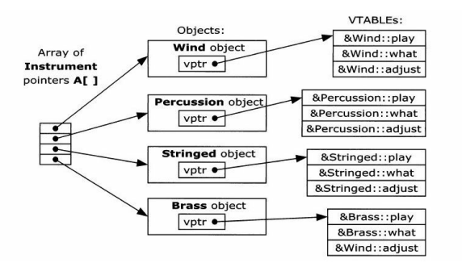

# （1）、实现一个循环队列。

```
/**
 * 循环队列：与普通的队列相比，尾指针到达最后之后要重新返回队列头，以此循环，形成一个圆形的队列
 */
#include <iostream>
using namespace std;
#define QUEUE_MAX_SIZE  5
class LoopQueue
{
private:
    int *queue;
    int queue_size;
    int front;
    int rear;

public:
    int getFront(); //出队
    int pushBack(int value);// 入队
    int getNum();   // 返回队列的元素个数
    LoopQueue();
    ~LoopQueue();
};

int LoopQueue::getFront()
{
    // 判断队列是否为空
    if(queue_size == 0)
    {
        return -1;
    }
    int value = queue[front];
    queue_size--;
    if(front == QUEUE_MAX_SIZE - 1)
    {
        // front指针已经在队列的最尾部
        front = 0;
    }
    else
    {
        front++;
    }
    return value;
}

int LoopQueue::pushBack(int value)
{
    // 判断队列是否以满
    if(queue_size == QUEUE_MAX_SIZE)
    {
        return -1;
    }
    queue[rear] = value;
    if(rear == QUEUE_MAX_SIZE -1)
    {
        rear = 0;
    }
    else
    {
        rear++;
    }
    queue_size++;
    return 0;
}

int LoopQueue::getNum()
{
    return queue_size;
}

LoopQueue::LoopQueue()
{
    queue_size = 0;
    queue = new int[QUEUE_MAX_SIZE];
    front = 0;
    rear = 0;
}

LoopQueue::~LoopQueue()
{
    delete[] queue;
}

int main()
{
    LoopQueue q;
    cout << q.getNum() << endl;
    q.pushBack(1);
    q.pushBack(2);
    q.pushBack(3);
    q.pushBack(4);
    q.pushBack(5);
    cout << q.getNum() << endl;
    q.pushBack(6);
    cout << q.getNum() << endl;
    cout << q.getFront() << endl;
    cout << q.getNum() << endl;
    q.pushBack(7);
    cout << q.getNum() << endl;
    cout << q.getFront() << endl;
    system("pause");
    exit(0);
}

```

# （2）、STL 的unordered_map 和 map 的区别

两个结构都是保存键值对，key-value;

unordered_map是无序存放的，内部用哈希表实现，效率高；查找的时间效率是O1；

map是有序存放的，默认会按照key的值排序，内部用红黑树实现，效率没有那么高；查找和删除的时间效率都是操作红黑树的级别；

一般而言，查找多的用unordered_map，有排序要求的用map。

# （3）、C和C++的特点与区别

C语言是面向过程的编程语言，不支持类，但是有结构体，

C++是既面向过程也面向对象的编程语言，支持类，许多功能是靠对C的再次封装，C++相比C语言，在保证效率的基础上增加了各种标准库，使得无论是算法操作还是内存管理都相对简单，更有标准异常机制，线程库，并增加了流的概念，使得对IO的操作封装成对流的操作。

它们的内存模型基本相同。

# （4）、C++的多态

虚函数是实现多态的基础，指针是实现多态的工具；在继承上，父类定义了虚函数，子类在继承父类的同时，得到这些虚函数，选择性重写；而我们通过指向父类的指针或引用，通过运行时绑定的子类不同，而调用相对应的已经被实现的虚函数，这就实现了多态；它让静态绑定变成动态绑定，它让一个动物既可以是狗也可以是猫。在封装上，这可以使我们的顶层代码，也就是基类部分代码不做修改，新增功能，只需要新增一个虚函数，新继承一个相应的子类，新重写一个对应的虚函数就可以完成代码的重用性。

# （5）、虚函数的实现

C++虚函数使用vritual关键字声明，虚函数只有声明，没有定义，可以在子类进行override重写，如果使用了override关键字，而没有达到重写的效果，编译器会报错。

虚函数的底层依赖于虚函数表，虚函数表保存的位置依赖编译器，但是类中会隐藏一个虚函数表指针，一般它在实例的地址起始处，也就是说，直接对对象取地址，得到的一般就是虚函数表指针。虚函数表本质是一个指针数组。

《C++Primer》和《C++编程思想》中都明确指出：每当创建一个包含有虚函数的类或从包含有虚函数的类派生一个类时，编译器就为这个类创建一个惟一的VTABLE；类之间继承的时候，也会把隐藏的虚函数表指针继承过去，当使用简单继承时，对于每个对象只有一个VPTR。VPTR必须被初始化为指向相应的VTABLE的起始地址。一旦VPTR被初始化为指向相应的VTABLE，对象就“知道”它自己是什么类型。但只有当虚函数被调用时这种自我认知才有用。

**也就是，每一个类都有一个唯一的虚函数表，每个类的所有实例公用这个类的虚函数表。**

继承的时候，如果对虚函数进行了覆盖，那么该类的虚函数表上对应的虚函数的偏移的位置记录的就是已经被重写的函数，而不再是基类的虚函数。

下图中第一个数组，是基类Instrument的数组，保存了所有它的派生类。



# （6）、C++内存分配

C++的内存分配有三种方式：堆上分配，栈上分配，全局静态区分配。

全局静态区分配全局变量，静态变量。

栈分配临时变量，系统自动分配回收，没有空间碎片，效率高，但是栈区一般比较小。

堆区需要程序员分配和回收，会有空间碎片，使用malloc free ，new 和 delete分配和释放，new和delete是封装了malloc和free，并且new和delete（数组同理）是封装了三步：1.调用operator new 运算符申请空间 2.在空间上初始化对象 3.返回指针。

其中如果我们想自定义内存申请和释放的规则，可以重载operator new 和delete运算符。

如果深入malloc源码，其实malloc细节可以分为十五步，具体到对堆加锁，判断大小，申请，初始化，解锁等等操作。

在C语言中，返回的指针类型是void*，void可以转换成任意类型，所以void* 类型往往成为类型转换的桥梁。但是在C++中，对void*的转换非法，必须强制类型转换，或者使用类型转换运算符。

# （7）、几大存储区

堆区：动态内存

栈区：系统自动管理

代码区:存放代码

常量区:存放常量字符串，一般的const常量，会在符号表里直接被替换成值，而不会保存常量名。

全局静态区：全局变量和static静态变量。

Linux的内存分区，32位机器4GB空间，自上往下分别是：1GB的内核空间，argv命令行参数，栈区（往下增长），空闲区，堆区（往上增长），全局静态区。

# （8）、Python的特点

# （9）、Python有哪些实现

# （10）、CPython的解释执行过程

# （11）、Python里面垃圾回收是怎样的

# （12）、Python多线程介绍

# （13）、多线程可以使用多核吗

进程是资源管理的最小单位，线程是cpu调度的基本单位，所以理论上线程是可以使用到多核的。通过Windows资源监视器也是可以看到多核的并行工作，但是线程有三种：内核线程，轻量级线程，用户线程；

1. 内核线程是内核的分身，一个内核线程负责做一件事情，它只工作在内核态，不涉及用户态，它是肯定要使用多核的。
2. 轻量级线程：
3. 用户线程就是我们常用的线程库，网站说，对于这种线程，cpu调度仍然是进程，cpu看不到线程的存在，该种线程的创建销毁运行全在用户态的进程空间内。
4. 内核级线程:切换由内核控制，当线程进行切换的时候，由用户态转化为内核态。切换完毕要从内核态返回用户态；可以很好的利用smp，即利用多核cpu。windows线程就是这样的。
5. 用户级线程内核的切换由用户态程序自己控制内核切换,不需要内核干涉，少了进出内核态的消耗，但不能很好的利用多核Cpu,目前Linux pthread大体是这么做的

在多线程操作系统中，各个系统的实现方式并不相同，在有的系统中实现了用户级线程，有的系统中实 现了内核级线程。**用户线程**指不需要内核支持而在用户程序中实现的线程，其不依赖于操作系统核心，应 用进程利用线程库提供创建、同步、调度和管理线程的函数来控制用户线程。不需要用户态/核心态切换，速度快，操作系统内核不知道多线程的存在，**因此一个线 程阻塞将使得整个进程（包括它的所有线程）阻塞**。由于这里的处理器时间片分配是以进程为基本单位，所以每个线程执行的时间相对减少。

**以下是用户级线程和内核级线程的区别：**

 **（1）** 内核支持线程是OS内核可感知的，而用户级线程是OS内核不可感知的。

 **（2）** 用户级线程的创建、撤消和调度不需要OS内核的支持，是在语言（如Java）这一级处理的；而内核支持线程的创建、撤消和调度都需OS内核提供支持，而且与进程的创建、撤消和调度大体是相同的。

 **（3）** 用户级线程执行系统调用指令时将导致其所属进程被中断，而内核支持线程执行系统调用指令时，只导致该线程被中断。

 **（4）** 在只有用户级线程的系统内，CPU调度还是以进程为单位，处于运行状态的进程中的多个线程，由用户程序控制线程的轮换运行；在有内核支持线程的系统内，CPU调度则以线程为单位，由OS的线程调度程序负责线程的调度。

 **（5）** 用户级线程的程序实体是运行在用户态下的程序，而内核支持线程的程序实体则是可以运行在任何状态下的程序。

**内核线程的优点：**

（1）当有多个处理机时，一个进程的多个线程可以同时执行。

**缺点：**

（1）由内核进行调度。

**用户进程的优点：**

（1） 线程的调度不需要内核直接参与，控制简单。

（2） 可以在不支持线程的操作系统中实现。

（3） 创建和销毁线程、线程切换代价等线程管理的代价比内核线程少得多。

（4） 允许每个进程定制自己的调度算法，线程管理比较灵活。

（5） 线程能够利用的表空间和堆栈空间比内核级线程多。

（6） 同一进程中只能同时有一个线程在运行，如果有一个线程使用了系统调用而阻塞，那么整个进程都会被挂起。另外，页面失效也会产生同样的问题。

**缺点：**

（1）资源调度按照进程进行，多个处理机下，同一个进程中的线程只能在同一个处理机下分时复用

**pthread即Posix线程在Linux是实现在内核级别的，所以可以利用到多核。**

# （14）、协程的了解

进程之下运行着线程，线程之中运行着协程，这个协程可以解决多线程占用内存大和cpu上下文切换的问题。

协程刚好可以解决上述2个问题。协程运行在线程之上，当一个协程执行完成后，可以选择主动让出，让另一个协程运行在当前线程之上。 **协程并没有增加线程数量，只是在线程的基础之上通过分时复用的方式运行多个协程** ，而且协程的切换在用户态完成，切换的代价比线程从用户态到内核态的代价小很多。

**所以可以开10个线程，每个线程开10个协程，达到100个作业数量。**

实际上协程并不是什么银弹，协程只有在等待IO的过程中才能重复利用线程，上面我们已经讲过了，线程在等待IO的过程中会陷入阻塞状态，意识到问题没有？

假设协程运行在线程之上，并且协程调用了一个阻塞IO操作，这时候会发生什么？实际上**操作系统并不知道协程的存在**，它只知道线程，**因此在协程调用阻塞IO操作的时候，操作系统会让线程进入阻塞状态，当前的协程和其它绑定在该线程之上的协程都会陷入阻塞而得不到调度，这往往是不能接受的。**

因此在协程中不能调用导致线程阻塞的操作。也就是说，协程只有和异步IO结合起来，才能发挥最大的威力。

那么如何处理在协程中调用阻塞IO的操作呢？一般有2种处理方式：

1. **在调用阻塞IO操作的时候，重新启动一个线程去执行这个操作，等执行完成后，协程再去读取结果。这其实和多线程没有太大区别。**
2. **对系统的IO进行封装，改成异步调用的方式，这需要大量的工作，最好寄希望于编程语言原生支持。**

协程对计算密集型的任务也没有太大的好处，计算密集型的任务本身不需要大量的线程切换，因此协程的作用也十分有限，反而还增加了协程切换的开销。


在**有大量IO操作业务的情况下，我们采用协程替换线程，可以到达很好的效果**，一是降低了系统内存，二是减少了系统切换开销，因此系统的性能也会提升。

在协程中尽量不要调用阻塞IO的方法，比如打印，读取文件，Socket接口等，除非改为异步调用的方式，并且协程只有在IO密集型的任务中才会发挥作用。

**协程只有和异步IO结合起来才能发挥出最大的威力。**


另外，C++20支持协程，c++正式进入协程时代。

# （15）、cgi的了解

# （16）、http协议get和post的区别

# （17）、进程间通信方式

# （18）、建立TCP服务器的各个系统调用

# （19）、处理多个套接字的I/O复用介绍

# （20）、epoll为什么更快

# （21）、虚拟内存的概念与介绍

# （22）、单链表的倒置

# （23）、红黑树的了解与其查找复杂度

# （24）、快速排序的优化

# （25）、字符串匹配算法

# （26）、TCP的三次握手与四次挥手的详细介绍

# （27）、TCP的超时等待的介绍

# （28）、流量控制的介绍

# （29）、数字证书的了解

# （30）、http和https的区别

# （31）、对数据库包括其引擎的区别与了解

# （32）、数据库索引的作用

# （33）、C++内存模型

# （34）、程序编译链接的过程和函数找不到在哪个阶段报错

# （35）、线程间通信

# （36）、游戏中打怪时已经各个小怪的坐标，你放一个技能是圆形范围，快速求能打到的小怪

# （37）、无锁编程解决单生产者多消费者问题和多生产者多消费者问题

# （38）、魔兽世界10人房间，现在组队规模有3人，有5人，如何让每个人等待的时间尽可能少，即将时间线上哪些队伍组合在一起开始一个游戏

# （39）、快速排序的稳定化算法

# （40）、隔一个删除一个map中的元素

# （41）、文件系统

# （42）、进程线程区别

进程是资源分配的基本单位，线程是调度的基本单位，在Linux里，pthread是使用内核态线程，进程就好比一个容器，里面有一个主线程，和诸多子线程，实际运行的是线程，32位机器下，一个进程占用4g空间，内核态占1g，留下3g给用户，其中，每建立一个线程，就会多占用一块进程空间中的栈资源（堆资源和其他资源是共享的），ulimit可以查看栈块的大小，一般是8m或者10m，这就说明，一个32位机器，创建三百个左右的线程就是极限了。


# （43）、详细说明管道、共享内存、信号量

# （44）、在共享内存中如何使用mutex

# （45）、1G共享内存，切割为很多记录，每个大小1K，多个进程访问，如何对每个记录进程保护

# （46）、select和epoll实现区别

# （47）、nginx和apache对比

# （48）、ACID

# （49）、数据库引擎

# （50）、访问一个web页面的流程

# （51）、有哪些地方可以做分流

# （52）、100万个ip，找出最多的100个

# （53）、c++的static关键字的作用

# （54）、内联函数跟普通函数区别

# （55）、STL中的迭代器失效问题

# （56）、指针,引用区别

# （57）、Linux相关cpu内存网络相关指令

# （58）、父子进程fork时,打开的文件的偏移量是否是相同的

# （59）、Linux虚拟地址空间

# （60）、vector跟list区别,还有map的底层实现

# （61）、extern关键字

# （62）、一个数组传递到函数,蜕变成指针,求字节数

# （63）、定义在全局的对象,定义在堆中对象,定义在静态局部变量对象,定义在栈中的对象,析构函数的析构顺序

# （64）、new int[10]跟new int[10]  ()区别

# （65）、求二叉树的翻转

# （66）、.编写c语言程序判断该大小端

# （67）、linux内核解决惊群问题

# （68）、hash碰撞,Trie
