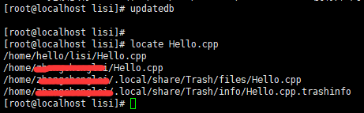
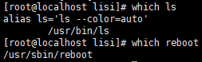
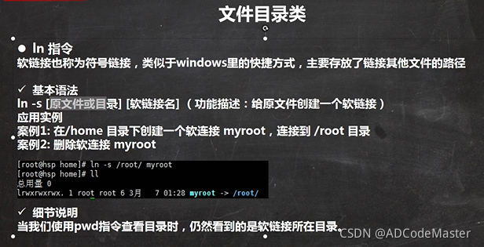

# 系统调用

stat()
fstat()
lstat()

opendir()
readdir()

# 查看和设置运行级别

0：关机
1：单用户【能帮助找回丢失密码】
2：多用户状态没有网络服务【用的非常少】
3：多用户状态有网络服务【用的最多】
4：系统未使用保留给用户
5：图形界面
6：系统重启
常用运行级别时3和5，也可以指定默认运行级别

init [0123456]

systemctl get-default ：查看当前的默认运行级别
systemctl set-default multi-user.target：将默认运行级别设置成多用户级别

# 关机

sync 把内存的数据同步到磁盘
reboot 现在重新启动计算机
halt 关机
shutdown -r now 现在重新启动计算机
shutdown -h 1 一分钟后关机
shutdown -h now 立刻关机

在关机前，最好是先执行sync命令

# 组和权限


# 文件目录

/bin (/usr/bin, /usr/local/bin)
是Binary的缩写，这个目录存放着最经常使用的命令

/sbin (/usr/sbin, /usr/local/sbin)
s是Super User的意思，这里存放着系统管理员使用的系统管理程序

/home
存放普通用户的主目录，在Linux中每个用户都有一个自己的目录，一般该目录名是用户的账号名

/root
该目录为系统管理员，也称作超级权限者的用户主目录

/etc
所有系统管理所需要的配置文件和子目录，比如安装mysql数据库 my.conf

/usr
这是一个非常重要的目录，用户的很多应用程序和文件都放在这个目录下，类似与windows下的program files目录

/boot
存放启动Linux时使用的一些核心文件，包括一些连接文件以及镜像文件

/media
Linux系统会自动识别一些设备，例如U盘光驱等，会把识别到的设备挂载到这个目录下

/mnt
让用户临时挂载别的文件系统到这个文件，我们可以将外部的存储挂载在/mnt/上

/usr/local
这是另一个给主机额外安装软件的目录，一般是通过编译源码方式安装的程序

/var
这个目录存放着不断扩展的东西，习惯将经常被修改的目录放在这个目录下，包括各种日志文件

/

其他:
/opt
给主机额外安装软件所摆放的目录

/lib
系统开机所需要最基本的动态链接共享库，其作用类似于Windows里的dll文件。几乎所有的应用程序都需要用到这些共享库

/lost+found
这个目录一般情况下是空的，当系统非法关机后，这里就存放了一些文件。但这个目录你找不到，因为他隐藏起来了，在控制台 使用 ls命令可以看到。

/proc
这个目录是一个虚拟的目录，他是系统内存的映射，访问这个目录来获取系统的信息，这个文件不能动

/srv
service缩写，存放服务启动之后需要提取的数据，与内核相关，这个文件不能动

/sys
安装2.6内核中新出现的一个文件系统sysfs，这个文件不能动

/tmp
这个目录时用来存放一些临时文件的

/dev
类似Windows的设备管理器

/selinux
SELinux是一种安全子系统，它能控制程序只能访问特定文件，有三种工作模式，可以自行设置

/run
保存系统运行时需要的内容，系统下次启动时重新生成

# 查找

find


locate



which
可以查看某个指令在哪个目录下


grep 和 管道符号 |


# 压缩和解压

最常用的是tar


# 网络管理-NetworkManager service

NetworkManager(NetworManager)是检测网络、自动连接网络的程序。无论是无线还是有线连接，它都可以令您轻松管理。对于无线网络,网络管理器可以自动切换到最可靠的无线网络。利用网络管理器的程序可以自由切换在线和离线模式。网络管理器可以优先选择有线网络，支持 VPN。网络管理器最初由 Redhat 公司开发，现在由 GNOME 管理。

1.查看NetworkManager状态，右上角出没有网卡图标

service NetworkManager status

2.临时启动service NetworkManager start，右上角出现了网卡图标 重启后失效

service NetworkManager start

3.每次开机自动启动chkconfig NetworkManager on

chkconfig NetworkManager on

4.电脑右上角的电脑图标编辑一定要选自动链接，否则网卡不会自动启动。

# 网卡接入托管

虚拟机在挂起的状态下关机，再开机发现ens33网卡无了，找了重新托管网卡的命令

nmcli n

显示disabled

nmcli n on

显示success

# 防火墙命令

**一、防火墙相关命令**

　　1、查看防火墙状态 ： systemctl status firewalld.service

　　　　注：active是绿的running表示防火墙开启

　　2、关闭防火墙 ：systemctl stop firewalld.service

　　3、开机禁用防火墙自启命令 ：systemctl disable firewalld.service

　　4、启动防火墙 ：systemctl start firewalld.service

　　5、防火墙随系统开启启动 ： systemctl enable firewalld.service

　　6、重启防火墙 ： firewall-cmd --reload

**二、端口开放相关命令**

　　1、查询已经开放的端口 ：firewall-cmd --list-port

　　2、查询某个端口是否开放 ：firewall-cmd --query-port=80/tcp

　　3、开启端口 ：firewall-cmd --zone=public --add-port=80/tcp --permanent

　　　　注：可以是一个端口范围，如1000-2000/tcp

　　4、移除端口 ：firewall-cmd --zone=public --remove-port=80/tcp --permanent

　　5、命令含义：

　　　　--zone #作用域

　　　　--add-port=80/tcp #添加端口，格式为：端口/通讯协议

　　　　--remove-port=80/tcp #移除端口，格式为：端口/通讯协议

　　　　--permanent #永久生效，没有此参数重启后失效

# 软连接

ln -s 原文件绝对路径 软连接地址


# 文件查看和重定向

echo
echo输出内容到控制台
语法：echo [选 项 ] 【输出内容】
echo “要显示在终端的内容” 可以将内容显示在终端

head
head用于显示文件的开头部分内容，默认情况下head指令显示文件的前10行内容
基本语法：
head 文件
head -n 5 文件 ：查看文件头5行内容ls

tail
tail用于输出文件中尾部的内容，默认情况下tail指令显示文件的前10行内容

tail -f 文件 :实时追踪该文档的所有更新，这个指令可以监控文件，很有用

">" 和 ">>"


“>” 是覆盖
“>>"是追加

# 网络拓扑

netstat -i 提供网络接口的信息

netstat -r 展示路由表

ifocnfig 展示每个网络接口的详细信息

ping -b 广播地址 可以找出本地网络中众多主机的IP

# 查看Linux内核版本

uname -a

cat /proc/version

# 查看IPC

System V：

ipcs -a 命令

Posix：

进入/dev/xxx文件夹查看，比如：/dev/mqueue；/dev/shm；里面就是现有的ipc

# Linux遇到SIGUSR1 和 SIGUSR2信号中断

1. 在Linux终端输入命令: vim ~/.gdbinit
2. 输入: handle SIGUSR1 nostop
3. 保存输入内容.重新调试就不会遇到中断

# tcpdump抓包

主要语法
过滤主机/IP：
tcpdump -i eth1 host 172.16.7.206
抓取所有经过网卡1，目的IP为172.16.7.206的网络数据

过滤端口：
tcpdump -i eth1 dst port 1234
抓取所有经过网卡1，目的端口为1234的网络数据

过滤特定协议：
tcpdump -i eth1 udp
抓取所有经过网卡1，协议类型为UDP的网络数据

抓取本地环路数据包
tcpdump -i lo udp 抓取UDP数据
tcpdump -i lo udp port 1234 抓取端口1234的UDP数据
tcpdump -i lo port 1234 抓取端口1234的数据

特定协议特定端口：
tcpdump udp port 1234
抓取所有经过1234端口的UDP网络数据

抓取特定类型的数据包：
tcpdump -i eth1 ‘tcp[tcpflags] = tcp-syn’
抓取所有经过网卡1的SYN类型数据包
tcpdump -i eth1 udp dst port 53
抓取经过网卡1的所有DNS数据包（默认端口）

逻辑语句过滤：
tcpdump -i eth1 ‘((tcp) and ((dst net 172.16) and (not dst host 192.168.1.200)))’
抓取所有经过网卡1，目的网络是172.16，但目的主机不是192.168.1.200的TCP数据

抓包存取：
tcpdump -i eth1 host 172.16.7.206 and port 80 -w /tmp/xxx.cap
抓取所有经过网卡1，目的主机为172.16.7.206的端口80的网络数据并存储

# git命令

设置用户名，密码，邮箱：

```
全局设置，一次就行
git config --global user.name "adce"
git config --global user.email "adce@qq.com"
```

```

新建仓库

mkdir test
cd test
git init 
touch README.md
git add README.md
git commit -m "first commit"
git remote add origin https://gitee.com/adce9/test.git
git push -u origin "master"
```

```

已有仓库

cd existing_git_repo
git remote add origin https://gitee.com/adce9/test.git
git push -u origin "master"
```

git回滚

git reflog 查看回滚的版本

git reset --hard 93c7150 回滚到具体的版本号


vscode发布到GitHub超时，使用全局代理：

```
git config --global https.proxy [http://127.0.0.1:1080](http://127.0.0.1:1080/)
 
git config --global https.proxy [https://127.0.0.1:1080](https://127.0.0.1:1080/)
```


取消代理：

```
git config --global --unset http.proxy
 
git config --global --unset https.proxy
```


# shell脚本

## 执行方式

有一个shell脚本，.sh文件，三种执行方式有什么区别?

1. ./test.sh 需要可执行权限，新开辟一个进程，拥有新的环境变量
2. sh test.sh 不需要执行权限，新开辟一个进程，拥有新的环境变量
3. source test.sh  不需要执行权限，直接由当前进程执行这个shell脚本，使用当前的进程变量。

## 循环运行一个程序

while true; do ./5.1.1memory_order_seq_cst;  sleep 1; done;

for((i=0;i<100;i++))
do
{
	./program;
}
done;
