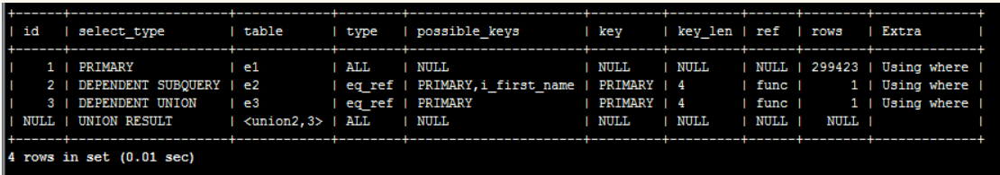

# 读写分离

# 分库分表

# 水平分表，垂直分表

# 多级缓存

# UUID

拒绝使用UUID作为唯一标识的主键。因为UUID是无序的

# 雪花算法

适合分布式且可以作为主键，不会引起大量索引重排的ID生成算法。

不会引起索引重排，说明它是基本有序的。

它要结合时间戳和机器ID，所以不要时间回调，也就是不要手动调动服务器时间。

# 缓存穿透

# 布隆过滤器

预防缓存穿透。

布隆过滤器存在误判的情况。

本质是一个n位的二进制数组，使用前先对数据库的数据进行初始化，通过多次hash确定数据是否存在。

不命中二进制数组的数据一定不存在，命中的可能存在。

如果数据被删除，也是不允许直接修改布隆的数组的，可以定时重建布隆也可以使用计数布隆过滤器。

# IP直连

不建议IP直连，不建议直接使用IP地址访问数据库，而是使用域名访问或者注册中心。

因为如果数据库的服务器网址换了，需要大量更改源代码去更换IP地址，风险极高。

所以用域名，或者内部域名，重新建立域名与iP地址的映射关系。

但是内部域名没有故障转移，所以使用注册中心。

# 注册中心

解决IP直连的浅耦合问题。

通过心跳包机制保持注册。

支持负载均衡和故障转移。

# CAP定理

分布式中，不同主机上的数据库数据很难瞬间同步。

C：一致性，更新操作之后，所有节点在同一时间的数据一致。

A：可用性，客户访问数据，系统在正常访问时间内返回预期结果

P：分区容错性，分布式某一节点分区故障后，仍能对外正常提供一致性和可用性。

三者不可能同时满足，只能同时满足任意两者。

如果只有一个数据库，就是AC，没有分区，没有分布式。

# 负载均衡器

## 硬件负载均衡器

## 软件负载均衡器

### 四层代理（TCP）

工作在第四层

### 七层代理（HTTP）

工作在第七层，Nginx

# Nginx

轻量级的web反向代理服务器，目前使用最多的软件负载均衡器。

## 负载均衡策略

### 轮询策略（默认）

按顺序处理请求，你一个，我一个。

### 权重策略

八核的和四核的不一样，权重多的多做事情。

### IP_HASH

一个IP一个坑，以IP地址为单位发送给节点，不建议使用，无法保证后台的负载均衡。

### URL_HASH（需要安装 第三方模块）

以请求地址为单位，相同的请求地址会被相同的后台处理。

### FAIR(需要安装第三方模块)

采用心跳包，谁闲置谁处理请求。平时使用也不多。

# 拒绝自增主键

阿里是这样。

不适合分布式，有严重的尾热现象，局部机器压力大。

使用雪花算法产生唯一标识为主键，很适合索引。

# 拒绝外键约束

不得使用外键与级联，一切外键概念必须在应用层解决。

主要的问题是：并发问题

外键约束会启用行级锁，主表在写入时会进入阻塞的状态。

级联删除会使得数据不可控。

而且不会启用触发器。

不适合数据迁移。

# 前后端半分离架构

确保数据与应用解耦，目前最常用的半分离架构。

后端只负责提供数据，前端只负责展示，展示与数据的结合使用中间件，比如Ajax

# 异构数据

结构不同的数据，比如后台mysql存储的数据，和前台使用全文检索的数据。

这个两个数据的连接就需要一些特定的接口。

但是自定义的接口不适合团队开发。

Canal是阿里巴巴的开源项目，Java开发，可以完成异构数据的同步操作。

只靠它，还不能完全解耦，还需要一个MQ

# 消息队列MQ

mysql 配置 canal,来对MySQL进行监听，是否有增删改操作；

如有，canal将会向消息队列发送消息；

需要数据的团队订阅MQ；

MQ向订阅的用户传送消息。

真正解耦，就算再来一个团队需要数据，他只需要订阅MQ就可。

# 禁止三表join连接

MySQL本身的性能，在join三表之后性能比较差。

就算用视图，本质也是查询那些表，无法解决效率低下的问题。

就算是两表，也要慎用。

解决方案之一就是反范式表，数据集市。

# 反范式表

 放弃第三范式，接受数据冗余。

# 数据集市

银行业务常见，银行的数据命脉所在。

# 空间换时间-倒排表（倒排索引）

# 不建议使用存储过程

难以调试和拓展。

银行常使用，互联网基本不适用。

存储过程是和数据库产品绑定的，不好迁移。

存储过程只能面向当前机器的数据的局部信息的检索，不适合分布式。

# 脏读、不可重复读、幻读

脏读：读取了其他事务还没有提交的数据。

不可重复读：同一次事务中前后查询的数据是不一致的。

幻读：一次事务中前后数据量发生变化，比如在删除数据的过程中，被另一个事务添加数据，导致事务读以为读空表能读出数据。

唯一的一个特例，innodb不会发生幻读。

# 事务隔离级别

就是一个设置项，不同的隔离级别可以避免不同的并发错误，但是并发效率就会越低，因为要使用更多的锁。

默认的MySQL就是RR级别 - 可重复读级别，可以解决脏读和不可重复读，而MySQL5以后的默认存储引擎是innoDB，又可以解决幻读，所以基本不用设置。靠的MVCC的策略。

# MVCC（多版本并发控制）

MySQL在innoDB引擎下，默认就能解决不可重复读和幻读的问题。

就是靠MVCC机制。

MVCC是基于数据版本对并发事务进行访问的。

MVCC是用在RC,RR两个级别。

MVCC依靠回滚日志版本链。

版本链只有在确保不会被引用之后才会被删除。

快照读：select语句

当前读：insert,update,Delete,会先查询，再更改。

只有快照读才会使用MVCC，当前读会使用锁机制。

原则是判断出已经提交的数据才会被select出去。

RC的时候每次select都会产生一个新的readview，这回导致不可重复读，而RR级别的时候，只有第一次select会产生readview，后面的复用以前的，所以就不会产生不可重复读。但是在两次快照读之间如果发生了当前读，readview就会重新生成，就可能会产生幻读。

# 蓝绿红黑部署，灰色发布

# MySQL索引选择性陷阱

页面搜索严禁做模糊或者全模糊，如果需要请走搜索引擎来解决。

索引文件具有B-Tree的最左前缀匹配特性，如果左边的值未确定，那么无法使用索引。

就是禁用LIKE关键字。

# MySQL中InnoDB的索引

InnoDB中的索引是基于B+Tree的。

InnoDB是强制要求每个表都有主键的，并且每个表都有主键索引也叫聚簇索引（索引的位置和数据排列的位置是一样的，这样搜索就会很快）。聚簇索引的索引值一定是有序的，这样在追加索引的时候只需要追加，不需要大量的改动索引。

非主键的B+Tree，会建立对应的索引，只不过这些索引没有数据，只保存主键，在根据主键会找数据。而主键索引下面就是原始数据。

非主键的B+Tree是按照头匹配的顺序进行排列的。

查询优化器：根据选择，如果大量数据都符合查询，也就是索引选择性太差，它就会自动走全盘扫描。

经验：

如果命中的索引值超过25%，就可能会产生索引选择性陷阱，导致全盘扫描，PS：一切以Explain执行计划为准。

解决办法：

1. 从业务层面，通过组合索引提高选择性，比如从其他方面强制增加限制。
2. 业务上无法解决，就引入搜索引擎，如Es或者Solr，专用的索引检索系统。
3. 强制使用索引，有时候会有奇效，在from表名后面加：force index(索引列)
4. 增加缓存，提高全表扫描的速度（钞能力）

# 聚簇索引

什么是聚簇索引？

很简单记住一句话：找到了索引就找到了需要的数据，那么这个索引就是聚簇索引，所以主键就是聚簇索引，修改聚簇索引其实就是修改主键。

正确来讲应该是，主键索引是对主键构建B+Tree,而树的主键就回应的数据的顺序，那么这个数据就是满足聚簇索引的。

什么是非聚簇索引？

索引的存储和数据的存储是分离的，也就是说找到了索引但没找到数据，需要根据索引上的值(主键)再次回表查询,非聚簇索引也叫做辅助索引。

# explain执行计划

使用执行计划，可以查看sql语句执行的时候是否命中索引。

explain显示了MySQL如何使用索引来处理select语句以及连接表。可以帮助选择更好的索引和写出更优化的查询语句。简单讲，它的作用就是分析查询性能。

　　explain关键字的使用方法很简单，就是把它放在select查询语句的前面。

　　mysql查看是否使用索引，简单的看type类型就可以。如果它是all，那说明这条查询语句遍历了所有的行，并没有使用到索引。

1）、id列数字越大越先执行，如果说数字一样大，那么就从上往下依次执行，id列为null的就表是这是一个结果集，不需要使用它来进行查询。

2）、select_type列常见的有：
A：simple：表示不需要union操作或者不包含子查询的简单select查询。有连接查询时，外层的查询为simple，且只有一个
B：primary：一个需要union操作或者含有子查询的select，位于最外层的单位查询的select_type即为primary。且只有一个
C：union：union连接的两个select查询，第一个查询是dervied派生表，除了第一个表外，第二个以后的表select_type都是union
D：dependent union：与union一样，出现在union 或union all语句中，但是这个查询要受到外部查询的影响
E：union result：包含union的结果集，在union和union all语句中,因为它不需要参与查询，所以id字段为null
F：subquery：除了from字句中包含的子查询外，其他地方出现的子查询都可能是subquery
G：dependent subquery：与dependent union类似，表示这个subquery的查询要受到外部表查询的影响
H：derived：from字句中出现的子查询，也叫做派生表，其他数据库中可能叫做内联视图或嵌套select

3）、table
显示的查询表名，如果查询使用了别名，那么这里显示的是别名，如果不涉及对数据表的操作，那么这显示为null，如果显示为尖括号括起来的 `<derived N>`就表示这个是临时表，后边的N就是执行计划中的id，表示结果来自于这个查询产生。如果是尖括号括起来的<union M,N>，与 `<derived N>`类似，也是一个临时表，表示这个结果来自于union查询的id为M,N的结果集。

4）、type
依次从好到差：system，const，eq_ref，ref，fulltext，ref_or_null，unique_subquery，index_subquery，range，index_merge，index，ALL，除了all之外，其他的type都可以使用到索引，除了index_merge之外，其他的type只可以用到一个索引
A：system：表中只有一行数据或者是空表，且只能用于myisam和memory表。如果是Innodb引擎表，type列在这个情况通常都是all或者index
B：const：使用唯一索引或者主键，返回记录一定是1行记录的等值where条件时，通常type是const。其他数据库也叫做唯一索引扫描
C：eq_ref：出现在要连接过个表的查询计划中，驱动表只返回一行数据，且这行数据是第二个表的主键或者唯一索引，且必须为not null，唯一索引和主键是多列时，只有所有的列都用作比较时才会出现eq_ref
D：ref：不像eq_ref那样要求连接顺序，也没有主键和唯一索引的要求，只要使用相等条件检索时就可能出现，常见与辅助索引的等值查找。或者多列主键、唯一索引中，使用第一个列之外的列作为等值查找也会出现，总之，返回数据不唯一的等值查找就可能出现。
E：fulltext：全文索引检索，要注意，全文索引的优先级很高，若全文索引和普通索引同时存在时，mysql不管代价，优先选择使用全文索引
F：ref_or_null：与ref方法类似，只是增加了null值的比较。实际用的不多。
G：unique_subquery：用于where中的in形式子查询，子查询返回不重复值唯一值
H：index_subquery：用于in形式子查询使用到了辅助索引或者in常数列表，子查询可能返回重复值，可以使用索引将子查询去重。
I：range：索引范围扫描，常见于使用>,<,is null,between ,in ,like等运算符的查询中。
J：index_merge：表示查询使用了两个以上的索引，最后取交集或者并集，常见and ，or的条件使用了不同的索引，官方排序这个在ref_or_null之后，但是实际上由于要读取所个索引，性能可能大部分时间都不如range
K：index：索引全表扫描，把索引从头到尾扫一遍，常见于使用索引列就可以处理不需要读取数据文件的查询、可以使用索引排序或者分组的查询。
L：all：这个就是全表扫描数据文件，然后再在server层进行过滤返回符合要求的记录。

5）、possible_keys
查询可能使用到的索引都会在这里列出来

6）、key
查询真正使用到的索引，select_type为index_merge时，这里可能出现两个以上的索引，其他的select_type这里只会出现一个。

7）、key_len
用于处理查询的索引长度，如果是单列索引，那就整个索引长度算进去，如果是多列索引，那么查询不一定都能使用到所有的列，具体使用到了多少个列的索引，这里就会计算进去，没有使用到的列，这里不会计算进去。留意下这个列的值，算一下你的多列索引总长度就知道有没有使用到所有的列了。要注意，mysql的ICP特性使用到的索引不会计入其中。另外，key_len只计算where条件用到的索引长度，而排序和分组就算用到了索引，也不会计算到key_len中。

8）、ref
如果是使用的常数等值查询，这里会显示const，如果是连接查询，被驱动表的执行计划这里会显示驱动表的关联字段，如果是条件使用了表达式或者函数，或者条件列发生了内部隐式转换，这里可能显示为func

9）、rows
这里是执行计划中估算的扫描行数，不是精确值

10）、extra
这个列可以显示的信息非常多，有几十种，常用的有
A：distinct：在select部分使用了distinc关键字
B：no tables used：不带from字句的查询或者From dual查询
C：使用not in()形式子查询或not exists运算符的连接查询，这种叫做反连接。即，一般连接查询是先查询内表，再查询外表，反连接就是先查询外表，再查询内表。
D：using filesort：排序时无法使用到索引时，就会出现这个。常见于order by和group by语句中
E：using index：查询时不需要回表查询，直接通过索引就可以获取查询的数据。
F：using join buffer（block nested loop），using join buffer（batched key accss）：5.6.x之后的版本优化关联查询的BNL，BKA特性。主要是减少内表的循环数量以及比较顺序地扫描查询。
G：using sort_union，using_union，using intersect，using sort_intersection：
using intersect：表示使用and的各个索引的条件时，该信息表示是从处理结果获取交集
using union：表示使用or连接各个使用索引的条件时，该信息表示从处理结果获取并集
using sort_union和using sort_intersection：与前面两个对应的类似，只是他们是出现在用and和or查询信息量大时，先查询主键，然后进行排序合并后，才能读取记录并返回。
H：using temporary：表示使用了临时表存储中间结果。临时表可以是内存临时表和磁盘临时表，执行计划中看不出来，需要查看status变量，used_tmp_table，used_tmp_disk_table才能看出来。
I：using where：表示存储引擎返回的记录并不是所有的都满足查询条件，需要在server层进行过滤。查询条件中分为限制条件和检查条件，5.6之前，存储引擎只能根据限制条件扫描数据并返回，然后server层根据检查条件进行过滤再返回真正符合查询的数据。5.6.x之后支持ICP特性，可以把检查条件也下推到存储引擎层，不符合检查条件和限制条件的数据，直接不读取，这样就大大减少了存储引擎扫描的记录数量。extra列显示using index condition
J：firstmatch(tb_name)：5.6.x开始引入的优化子查询的新特性之一，常见于where字句含有in()类型的子查询。如果内表的数据量比较大，就可能出现这个
K：loosescan(m..n)：5.6.x之后引入的优化子查询的新特性之一，在in()类型的子查询中，子查询返回的可能有重复记录时，就可能出现这个

除了这些之外，还有很多查询数据字典库，执行计划过程中就发现不可能存在结果的一些提示信息

11）、filtered
使用explain extended时会出现这个列，5.7之后的版本默认就有这个字段，不需要使用explain extended了。这个字段表示存储引擎返回的数据在server层过滤后，剩下多少满足查询的记录数量的比例，注意是百分比，不是具体记录数。

# 为什么表的主键建议使用代理主键，不使用业务主键？

主键，在任何一个表中都要存在。

业务主键（自然主键）：有意义的属性，比如身份证

代理主键（无意义自动编号）：uid

为什么？

1. 业务主键没有顺序，可能要花大量时间组织索引
2. 如果主键是字符串，在分库分表的时候，无法直接取模运算。（因为主键是分库分表的依据）
3. 在分布式系统上，如果主键更新，其他所有系统都要更新，而且业务主键更浪费空间。而代理主键没有意义，所以一般不会更改它。
4. 业务上，如果以身份证为主键，这个人离职又回来，就会导致主键冲突，因为业务上不会重新启用已经离职的人的数据，只会为他重新建立一个档案。就算是联合主键，也难以避免。

# 页分裂

InnoDB保存数据是以页为单位的，一页默认是16K，当已经满的页中间再被插入数据，就会产生页分裂，移动大量数据。

在索引中，必须保证后一页的id比前一页的大。

# 禁止使用LIKE关键字进行模糊查询

MySQL提供了MySQL Ngram全文检索技术。

LIKE很大的概率，不会使用到索引。

MySQL内置的ngram全文解析器，允许对短文本进行全问检索查询，以替代LIKE关键字，对于复杂的业务场景的全文检索查询，还是要用ES。

# 多表关联的执行计划与优化

## NLJ嵌套循环连接

非常像sql中的二层嵌套循环，有外表和内表，外表就是驱动表。

在查看多表关联的执行计划的时候，最上面的那个表就是驱动表，从上往下就是驱动顺序，上面的驱动下面的，驱动表直接关联了我们的执行效率。

超多表关联，可能会导致MySQL自动选择索引的机制出问题，所以一般不建议三张表关联。

通过建立索引，就可以解决基本的多表查询优化。

但有一个例外：在select字段中的查询，也就是依赖子查询，它的效率比关联查询要低，要慎用。

## 优化

1. 如果在多表关联的时候只在筛选条件上加创建索引字段，没有什么用，要么连接的条件也建立索引。
2. 只有正确的在外键上建立索引，在关联表的索引才能生效，查询优化器才能正确决定用哪个表作为驱动表是最优解。
3. 将多表查询改为where in 子查询，在查询优化器的驱使执行计划不会改变，仍然使用NLJ进行高效查询。
4. 将多表关联改为from子句筛选在查询优化器的驱使执行计划不会改变，仍然使用NLJ进行高效查询。
5. 如果select包含子查询，会出现DEPENDENT SUBQUERY代表依赖子查询，也属于NLJ的范畴，只不过依赖子查询的效率比关联查询效率要低。
6. 子查询中出现多结果集运算，会出现Derived，要能看懂它的执行计划。
7. 少用UNION，多用UNION ALL，UNION去重是基于临时表的，Extra字段会显式：Using temporary, 临时表特性是如果缓存够，则使用内存，如果缓存不够，则自动创建Myisam引擎表（MYisam是在磁盘上的），IO效率变差。

这个执行计划是先执行3，4，拿3-4的结果作为驱动表，去驱动h和blog_member。

# 为什么MySQL在执行计划中显示用到了索引，SQL执行却还是很慢？

MySQL用到了索引和执行时间没有必然关系。

确定查询执行效率的是 扫描行数 与 回表次数。

建议：

# MySQL读写分离后，先写后查的场景怎么保证数据一直性？

1. 延迟查询，为主从同步留出足够时间。不推荐：无法预估预留的时间，也不知道哪些数据该预留时间
2. 利用读写分离框架特性，要求下一条select强制走主库。推荐。但是主库的压力会增大
3. 采用全同步复制，强制数据同步，没完成主从同步之前，插入数据操作不会返回结果。

# 引擎、索引、调优

## 局部性原理

时间局部性，空间局部性。

## 磁盘预读

页是存储器的逻辑块，操作系统往往将主存和磁盘分割成大小相等的块，也叫页，页是主存和磁盘交换数据的单位。

## 引擎

MySQL有很多存储引擎，其中InnoDB和Myisam用的最多。

## B+Tree

盲流子不会区分B树和B-Tree，B-Tree就是B树。

B树非叶子节点也会存储数据，这会使得一个页内，既有指针，也有数据，那么存指针的空间就没有那么多，这个树就会比较深，这会增加IO的次数，减少效率，而且，数据块的大小是不确定的，不适合把数据直接放在非叶子节点上。

B+Tree只有叶子节点存储数据，这样所有非叶子节点都存储指针，树就会很矮，IO次数就会比较少。

InnoDB和MyISAM都是B+Tree索引，InnoDB的索引低下是聚簇索引，是直接的数据，而MyISAM的索引低下存储的表中数据的地址。

## InnoDB和MyISAM

1. InnoDB支持事务，MyISAM不支持，对于InnoDB每一条SQL语言都默认封装成事务，自动提交，这样会影响速度，所以最好把多条SQL语言放在begin和commit之间，组成一个事务；
2. InnoDB支持外键，而MyISAM不支持。对一个包含外键的InnoDB表转为MYISAM会失败；
3. InnoDB是聚集索引，使用B+Tree作为索引结构，数据文件是和（主键）索引绑在一起的（表数据文件本身就是按B+Tree组织的一个索引结构），必须要有主键，通过主键索引效率很高。但是辅助索引需要两次查询，先查询到主键，然后再通过主键查询到数据。因此，主键不应该过大，因为主键太大，其他索引也都会很大。

   MyISAM是非聚集索引，也是使用B+Tree作为索引结构，索引和数据文件是分离的，索引保存的是数据文件的指针。主键索引和辅助索引是独立的。

   也就是说：InnoDB的B+树主键索引的叶子节点就是数据文件，辅助索引的叶子节点是主键的值；而MyISAM的B+树主键索引和辅助索引的叶子节点都是数据文件的地址指针。
4. InnoDB不保存表的具体行数，执行select count() from table时需要全表扫描。而MyISAM用一个变量保存了整个表的行数，执行上述语句时只需要读出该变量即可，速度很快（注意不能加有任何WHERE条件

   那么为什么InnoDB没有了这个变量呢？

   因为InnoDB的事务特性，在同一时刻表中的行数对于不同的事务而言是不一样的，因此count统计会计算对于当前事务而言可以统计到的行数，而不是将总行数储存起来方便快速查询。InnoDB会尝试遍历一个尽可能小的索引除非优化器提示使用别的索引。如果二级索引不存在，InnoDB还会尝试去遍历其他聚簇索引。
   如果索引并没有完全处于InnoDB维护的缓冲区（Buffer Pool）中，count操作会比较费时。可以建立一个记录总行数的表并让你的程序在INSERT/DELETE时更新对应的数据。和上面提到的问题一样，如果此时存在多个事务的话这种方案也不太好用。如果得到大致的行数值已经足够满足需求可以尝试SHOW TABLE STATUS
5. MyISAM表格可以被压缩后进行查询操作
6. InnoDB支持表、行(默认)级锁，而MyISAM支持表级锁
   InnoDB的行锁是实现在索引上的，而不是锁在物理行记录上。潜台词是，如果访问没有命中索引，也无法使用行锁，将要退化为表锁。
7. InnoDB表必须有唯一索引（如主键）（用户没有指定的话会自己找/生产一个隐藏列Row_id来充当默认主键），而Myisam可以没有
8. Innodb存储文件有frm、ibd，而Myisam是frm、MYD、MYI
   Innodb：frm是表定义文件，ibd是数据文件
   Myisam：frm是表定义文件，myd是数据文件，myi是索引文件

怎么选择？

    1. 是否要支持事务，如果要请选择innodb，如果不需要可以考虑MyISAM；

    2. 如果表中绝大多数都只是读查询，可以考虑MyISAM，如果既有读也有写，请使用InnoDB。

    3. 系统奔溃后，MyISAM恢复起来更困难，能否接受；

    4. MySQL5.5版本开始Innodb已经成为Mysql的默认引擎(之前是MyISAM)，明其优势是有目共睹的，如果你不知道用什么，那就用InnoDB，至少不会差。

InnoDB的四大特性:

## 索引

1. 主键索引：主键是一种唯一的索引，InnoDB自己创建，每个表必须有。
2. 唯一索引：索引列的所有值都只能出现一次，即必须唯一，值可以为空。
3. 普通索引：没有值唯一的性质
4. 全文索引：一般放文本，varchar什么的，不用，效率太低，如果真需要用全文索引，可以用专门的索引工具：ES
5. 组合索引：专门用于组合搜索。
6. 聚簇索引：主键索引底下保存的数据就是按照聚簇索引，即数据是按照表的顺序排放的，一个表同样只能有一个聚簇索引。

 索引是存储在磁盘上的。

专业名词：

1. 回表：非主键索引在检索到ID值之后，根据ID值回表找数据，需要多做一次IO
2. 索引覆盖：就是在非主键索引的时候，我们只查询主键，就不需要回表，这就是索引覆盖
3. 最左匹配：组合索引中，比如，索引是（name,age)，那么 where中：
   name = ？，age = ？会用；
   name = ？ 会用；
   age = ？ 不会用；
   age = ？ ，name = ？会用，MySQL内部会优化。
4. 索引下推：在组合索引的时候（name，age），直接从存储引擎拉取数据的时候直接按照name和age做判断，让符合的结果返回。

## 优化

set profiling=1;

slq语句执行；

show profile for query 1;

以上操作可以查看sql语句每一步骤执行的时间。

优化细节：

1. 当使用索引列进行查询的时候尽量不要使用表达式，把计算放到业务层，而不是数据库层
2. 尽量使用主键索引，而不用其他查询，这样可以减少回表。
3. 使用前缀索引。
4. 使用索引扫描来排序。
5. 范维列可以用到索引。
6. 强制类型转换会全表扫描
7. 更新十分频繁的，数据区分度不高的字段不建议使用索引
8. 创建索引的列，最好不为null
9. 表连接最好不要超过三张
10. 单表索引控制在五个以内
11. 组合索引字段不超过五个
12. 能使用limit的时候尽量使用limit

LIMIT 子句可以被用于强制 SELECT 语句返回指定的记录数。LIMIT 接受一个或两个数字参数。参数必须是一个整数常量。如果给定两个参数，第一个参数指定第一个返回记录行的偏移量，第二个参数指定返回记录行的最大数目。初始记录行的偏移量是 0(而不是 1)： 为了与 PostgreSQL 兼容，MySQL 也支持句法： LIMIT # OFFSET #。

mysql> SELECT * FROM table LIMIT 5,10;  // 检索记录行 6-15

//为了检索从某一个偏移量到记录集的结束所有的记录行，可以指定第二个参数为 -1

mysql> SELECT * FROM table LIMIT 95,-1; // 检索记录行 96-last.

//如果只给定一个参数，它表示返回最大的记录行数目：

mysql> SELECT * FROM table LIMIT 5;     //检索前 5 个记录行

//换句话说，LIMIT n 等价于 LIMIT 0,n。

# 王牌SQL语句

## 查询在一张表中存在，但在另一张表中不存在的数据

select * from A where key **not in** (select key from B);

select * from A where **not exists** (select * from B where A.key = B.key);

select * from A **left outer join** B **on** (A.key = B.key) where B.key is null;

## 添加远程登陆

GRANT ALL PRIVILEGES ON空格*.*空格TO 'root'@'%' IDENTIFIED BY '123456' ;

也可以用来修改远程登陆的密码

## 主从同步

数据库配置主从 在 /etc/my.cnf   的mysqld里面配置

**主机:**

server-id=1

log-bin="path/mysql-bin"

log-error="path/mysql-error"

binlog-ignore=mysql	// 忽略同步的数据库

binlog-do-db=test		// 选择同步的数据库（可选）

主机授权那个计算机的数据库是自己的从数据库

GRANT REPLICATION slave,reload,super ON * . * TO 'root'@'ip' IDENTIFIED BY 'password';

flush privileges;	// 更新系统

**查看主数据库的状态**

show master status;

**从机：**

#server-id 跟主机不一样
server-id=2

log-bin=mysql-bin

replicate-do-db=test

计算机授权，授权哪台计算的哪个数据库是自己的主数据库

CHANGE MASTER TO
MASTER_HOST='主机IP'
MASTER_USER='主机用户名'
MASTER_PASSWORD='password'
MASTER_PORT=3306
master_log_file='mysql-bin.000001'
master_log_pos=107

注意最后两个是随时变化的，要保证是最新的才有同步的效果

**开启主从同步：**

在从机里执行：

start slave;

stop slave;

**检查工作状态：**

show slave status \G

主要确保Slave_IO_Running 和 Slave_SQL_Running 都是yes

**查看server_id:**

show variables like 'server_id';

**主动提交**

commit；（一般是自动提交的）

## 修改某一个用户的密码

update user set authentication_string=PASSWORD('zcl001201') where user='root' and host='localhost';

PASSWORD字段可能会有变化 mariadb 5.5 还是password

## 更新系统表

flush privileges;

## 外连接

编写一个 SQL 查询，满足条件：无论 person 是否有地址信息，都需要基于上述两表提供 person 的信息，所以person是满表，所以是person左外连接。

select FirstName,LastName,City,State

from Person left outer join Address

on Person.PersonId=Address.PersonId;

## 查找第二高的成绩 -- limit offset ifnull

从salary表中查询第二工资高的工资数，没有返回null；

使用 limit 和 offset

在《猴子 从零学会sql》中讲过：

limit n子句表示查询结果返回前n条数据

offset n表示跳过x条语句

limit y offset x 分句表示查询结果跳过 x 条数据，读取前 y 条数据

使用limit和offset，降序排列再返回第二条记录可以得到第二大的值

ifnull(a,b)函数解释：

如果value1不是空，结果返回a

如果value1是空，结果返回b

select ifnull(

    (select distinct salary

    from Employee

    order by salary desc

    limit 1 offset 1),

    null

)as SecondHighestSalary;
