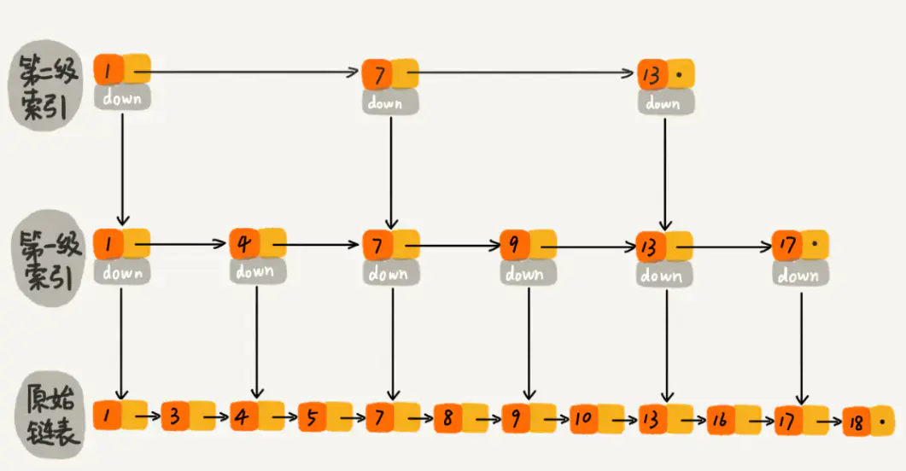
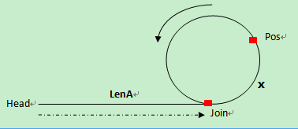
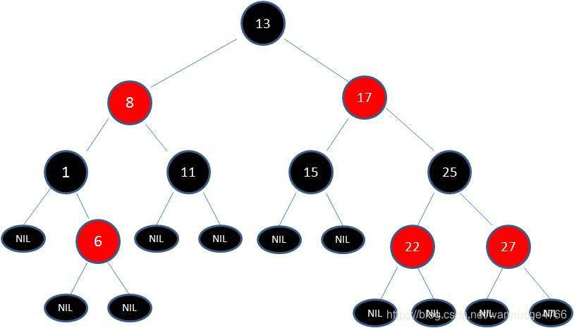
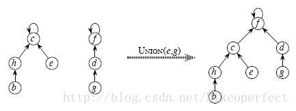

# 数组

数组是一系列同类型的元素的集合，可以申请在栈中，也可以申请在堆中，内存是连续的。

可以在常数时间完成访问和遍历。

但是删除和插入需要移动大量元素。

## 静态数组

    大小固定的数组，支持增删查改；

```
/**
 * @file staticArray.cpp
 * @author adce
 * @brief 静态数组，增删查改
 * @version 0.1
 * @date 2022-03-03
 * @copyright Copyright (c) 2022    adce
 */
#include <iostream>
#include <random>
#define ARRAY_SIZE_MAX 100
#define ARRAY_SIZE 10
typedef uint32_t ElementType;

// 初始化静态数组
static int arrayInit(ElementType *array) 
{
    if(array == nullptr)
    {
        return -1;
    }
    for (int i = 0; i < ARRAY_SIZE_MAX; i++)
    {
        array[i] = 0;
    }
    return 0;
}

// 插入元素
static int arrayInsert(ElementType *array, int size, ElementType value)
{
    using std::cout, std::endl;
    if(size == ARRAY_SIZE)
    {
        cout << "Array had full." << endl;
        return -1;
    }
    if(array == nullptr)
    {
        return -2;
    }
    array[size++] = value;
    return size;
}

// 删除指定元素
static int arrayDelete(ElementType *array, int size, ElementType value)
{
    if(size <= 0 || array == nullptr)
    {
        return -1;
    }
    int index = -1;
    for (int i = 0; i < size-1; i++)
    {
        if(array[i] == value)
        {
            // 从i开始，后面的元素覆盖前面的元素
            index = i;
        }
        if(index != -1)
        {
            array[i] = array[i + 1];
        }
    }
    array[size-- - 1] = 0;
    // size--;
    return size;
}

// 打印数组
static int arrayPrint(ElementType *array, int size)
{
    using std::cout, std::endl;
    if(size <= 0 || array == nullptr)
    {
        return -1;
    }
    for (int i = 0; i < size; i++)
    {
        cout << array[i] << ", ";
    }
    cout << endl;
    return 0;
}


int main()
{
    ElementType array[ARRAY_SIZE_MAX];
    arrayInit(array);
    std::random_device rd;
    std::mt19937 gen(rd());
    std::uniform_int_distribution<> dist(1, 100);
    for (int i = 0; i < ARRAY_SIZE; i++)
    {
        array[i] = dist(gen);
    }
    arrayPrint(array, ARRAY_SIZE);

    int size1 = arrayDelete(array, ARRAY_SIZE, array[1]);
    arrayPrint(array, size1);

    int size = arrayInsert(array, size1, 999);
    arrayPrint(array, size);

    system("pause");
    exit(0);
}


```

## 动态数组

支持动态扩容的数组.

```
/**
 * @file dynamicArray.cpp
 * @author adce
 * @brief 动态数组,内存不够时候可以扩容,内存多余时可以缩小
 * @version 0.1
 * @date 2022-03-03
 * @copyright Copyright (c) 2022
 * 
 */
#include <iostream>
#include <cstdlib>
#include <cstring>
#define ARRAY_DEFAULT_SIZE 10

using namespace std;
typedef int ElementType;

// 初始化动态数组
static ElementType* arrayInit(size_t size) 
{
    if(size <= 0)
    {
        return nullptr;
    }
    ElementType *array = nullptr;
    array = (ElementType *)malloc(sizeof(ElementType) * size);
    if(array == nullptr)
    {
        return nullptr;
    }
    // 另一种方式
    memset(array, 0, sizeof(ElementType) * size);
    return array;
}

// 插入数据
static int arrayInsert(ElementType *array,size_t *size,ElementType value)
{
    if(array == nullptr || *size >= ARRAY_DEFAULT_SIZE)
    {
        // 需要申请多的内存
        return -1;
    }
    array[(*size)++] = value;
    return 0;
}

// 删除指定数据
static int arrayDelete(ElementType *array, size_t *size, ElementType value)
{
    if(array == nullptr || *size <= 0)
    {
        return -1;
    }
    int index = -1;
    for (int i = 0; i < *size-1; i++)
    {
        if(array[i] == value)
        {
            index = i;
        }
        if(index != -1)
        {
            array[i] = array[i + 1];
        }
    }
    array[*size] = 0;
    return --(*size);
}

// 缩小内存
static ElementType* arrayCat(ElementType *array, size_t *size)
{
    int i = 0;
    for (i = 0; i < *size; i++)
    {
        if(array[i] == 0)
        {
            break;
        }
    }
    // i 以及 i之后的空间可以删除
    ElementType *newptr = (ElementType *)realloc(array, sizeof(ElementType) * (*size - i));
    if(newptr == nullptr)
    {
        return nullptr;
    }
    return newptr;
}

// 遍历数组
static void arrayPrint(ElementType *array, size_t size)
{
    if(size <= 0 || array == nullptr)
    {
        cout << "数组为空" << endl;
    }
    for (int i = 0; i < size; i++)
    {
        cout << array[i] << " ,";
    }
    cout << endl;
}

int main()
{
    size_t size = 0;
    ElementType *array = arrayInit(ARRAY_DEFAULT_SIZE);
    if(array == nullptr)
    {
        cout << "array == nullptr" << endl;
        exit(1);
    }
    arrayPrint(array, size);
    arrayInsert(array, &size, 999);
    arrayInsert(array, &size, 888);
    arrayInsert(array, &size, 777);
    arrayInsert(array, &size, 666);
    arrayPrint(array, size);
    arrayDelete(array, &size, array[1]);
    arrayPrint(array, size);
    cout << size << endl;
    arrayDelete(array, &size, array[1]);
    arrayDelete(array, &size, array[1]);
    arrayCat(array, &size);
    cout << size << endl;

    system("pause");
    exit(0);
}

```

## 数组实现一元多项式操作

数组存放：

不需要记录幂，下标就是。

比如1，2，3，5表示1+2x+3x^2+5x^3

可以实现两个多项式的加减乘除。

利用数组存放虽然简单，但是当幂相差很大时，会造成空间上的严重浪费（包括时间也是），所以我们考虑采用链表存储。

我们肯定要再用一个变量记录幂了。每个节点记录系数和指数。

# 链表

链表，链式存储结构。

由相同的结构体链接而成，每一个节点都是动态分配内存，全部申请在堆中。

可以随意的删除和添加，并且在O1时间内完成。

只能通过链表指针去遍历，所以遍历时间On。

## 带头节点的单向链表

带头节点，单向。

```
// 带头指针的最基本的单链表
#include <iostream>
using namespace std;
typedef int ElementType;

struct ListNode
{
    ElementType data;
    struct ListNode *next;
};
typedef struct ListNode ListNode;
typedef struct ListNode *ListPtr;

// 插入元素
static int listInsert(ListPtr *head, ElementType value)
{
    if(*head == nullptr)
    {
        *head = (ListPtr)malloc(sizeof(ListNode));
        (*head)->data = value;
        (*head)->next = nullptr;
        return 0;
    }
    ListPtr p = *head;
    while (1)
    {
        if(p->next != nullptr)
        {
            p = p->next;
            continue;
        }
        else
        {
            p->next = (ListPtr)malloc(sizeof(ListNode));
            if(p->next == nullptr)
            {
                return -1;
            }
            p->next->data = value;
            p->next->next = nullptr;
            break;
        }
    }
    return 0;
}

// 删除元素
static int listDelete(ListPtr *head, ElementType value)
{
    if (*head == nullptr)
    {
        return -1;
    }
    if((*head)->data == value)
    {
        free(*head);
        *head = nullptr;
        return 0;
    }
    ListPtr right = (*head)->next;
    ListPtr left = *head;
    while (1)
    {
        if(right == nullptr)
        {
            break;
        }
        if(right->data == value)
        {
            left->next = right->next;
            right->next = nullptr;
            free(right);
            return 0;
        }
        left = right;
        right = right->next;
    }
    return -1;
}

// 遍历链表
static void listPrint(ListPtr head)
{
    if(head == nullptr)
    {
        cout << "head = nullptr." << endl;
    }
    while (1)
    {
        if(head == nullptr)
        {
            break;
        }
        cout << head->data << " -- ";
        head = head->next;
    }
    cout << endl;
}

int main()
{
    ListPtr head = nullptr;
    listPrint(head);
    listInsert(&head, 111);
    listInsert(&head, 222);
    listInsert(&head, 333);
    listPrint(head);
    listDelete(&head, 222);
    listPrint(head);
    system("pause");
    exit(0);
}

```

## 带头节点的循环链表

带头节点，单项循环链表，链表末尾指向head.

```
// 循环链表
#include <iostream>
using namespace std;
typedef int ElementType;

struct ListNode
{
    ElementType data;
    struct ListNode *next;
};
typedef struct ListNode ListNode;
typedef struct ListNode *ListPtr;

// 插入元素
static int listInsert(ListPtr *head, ElementType value)
{
    if(*head == nullptr)
    {
        *head = (ListPtr)malloc(sizeof(ListNode));
        (*head)->data = value;
        (*head)->next = (*head);
        return 0;
    }
    ListPtr p;
    p = (ListPtr)malloc(sizeof(ListNode));
    if(p == nullptr)
    {
        return -1;
    }
    p->data = value;
    ListPtr right = (*head)->next;
    (*head)->next = p;
    p->next = right;
    return 0;
}

// 删除元素
static int listDelete(ListPtr *head, ElementType value)
{
    if (*head == nullptr)
    {
        return -1;
    }
    ListPtr right = (*head)->next;
    ListPtr left = *head;
    while (1)
    {
        if(right == *head)  // 就只有一个元素
        {
            if(right->data == value)
            {
                free(right);
                *head = nullptr;
            }
            break;
        }
        if(right->data == value)
        {
            left->next = right->next;
            right->next = right->next->next;
            free(right);
            return 0;
        }
        left = right;
        right = right->next;
    }
    return -1;
}

// 遍历链表
static void listPrint(ListPtr head)
{
    if(head == nullptr)
    {
        cout << "list is null." << endl;
        return;
    }
    ListPtr p = head;
    do
    {
        cout << p->data << " -- ";
        p = p->next;
    } while (p != head);
    cout << endl;
}

int main()
{
    ListPtr head = nullptr;
    listPrint(head);
    listInsert(&head, 111);
    listInsert(&head, 222);
    listInsert(&head, 333);
    listPrint(head);
    listDelete(&head, 222);
    listPrint(head);
    system("pause");
    exit(0);
}

```

## 跳跃表

跳跃表就是在原本单向链表的基础上添加多层索引。

跳跃表比较适合排序，redis 的zset结构的底层的排序的功能就是使用跳跃表实现的。

其效率堪比红黑树，但是实现远比红黑树简单。

时间复杂度lgN



## 约瑟夫环

约瑟夫环（[约瑟夫问题](https://baike.baidu.com/item/%E7%BA%A6%E7%91%9F%E5%A4%AB%E9%97%AE%E9%A2%98/3857719)）是一个数学的应用问题：已知n个人（以编号1，2，3...n分别表示）围坐在一张圆桌周围。从编号为k的人开始报数，数到m的那个人出列；他的下一个人又从1开始报数，数到m的那个人又出列；依[此](https://baike.baidu.com/item/%E6%AD%A4)规律重复下去，直到圆桌周围的人全部出列。

使用单项循环链表可轻松解决。

## 链表环问题

### 判断链表是否有环

链表是否有环，应该是看单链表，比较简单，一个指针走两步，一个指针走一步，使用追击相遇手段就可以使得两个指针相遇。

### 求单链表环的长度

从第一次相遇开始，到第二次相遇，做两个指针的步数差即可。

### 求单链表环的位置

第一次碰撞点Pos到连接点Join的距离=头指针到连接点Join的距离，因此，分别从第一次碰撞点Pos、头指针head开始走，相遇的那个点就是连接点。



　　在环上相遇后，记录第一次相遇点为Pos，连接点为Join，假设头结点到连接点的长度为LenA，连接点到第一次相遇点的长度为x，环长为R。

　　　　第一次相遇时，slow走的长度 S = LenA + x;

　　　　第一次相遇时，fast走的长度 2S = LenA + n*R + x;

　　　　所以可以知道，LenA + x =  n*R;　　LenA = n*R -x;

### 求有环单链表的表长

上述2中求出了环的长度；3中求出了连接点的位置，就可以求出头结点到连接点的长度。两者相加就是链表的长度。

### 代码实现

```
#include <iostream>
using namespace std;
struct List
{
    int data;
    struct List *next;
};

class ListRing
{
private:
    int index;
    int length;
    struct List *head = nullptr;
public:
    ListRing();
    bool ishadRing();   // 判断是否有环
    int ringLength();   // 求环的长度
    int ringIndex();    // 求环的位置
    int listLength();   // 求链表的长度
    void prirnt();      // 打印测试
};

ListRing::ListRing()
{
    struct List *temp, *index3;
    temp = new struct List;
    temp->data = 0;
    temp->next = nullptr;
    head = temp;
    for (int i = 1; i < 6; i++)
    {
        struct List *t = new struct List;
        t->data = i;
        t->next = nullptr;
        temp->next = t;
        temp = t; 
        if(i == 3)
        {
            index3 = temp;
        }
    }
    temp->next = index3;
}
bool ListRing::ishadRing()
{
    struct List *fast = head, *slow = head;
    do
    {
        fast = fast->next->next;
        slow = slow->next;
        if(fast == nullptr)
        {
            return false;
        }
    } while (fast != slow);
    return true;
}

int ListRing::ringLength()
{
    int flg = 0, fastStep = 0, slowStep = 0;
    struct List *fast = head, *slow = head;
    while (true)
    {
        fast = fast->next->next;
        slow = slow->next;
        fastStep += 2;
        slowStep += 1;
        if(fast == slow)
        {
            if(flg == 0)
            {
                fastStep = 0;
                slowStep = 0;
                flg = 1;
                continue;
            }
            if(flg == 1)
            {
                length = fastStep - slowStep;
                return length;
            }
        }
    }
}

int ListRing::ringIndex()
{
    int flg = 0, fastStep = 2, slowStep = 1;
    int fastleng = 0, slowlength = 0;
    struct List *fast = head, *slow = head;
    while (true)
    {
        index++;
        fast = fast->next->next;
        slow = slow->next;
        fastleng += fastStep;
        slowlength += slowStep;
        if(fast == slow)
        {
            if(flg == 0)
            {
                fastStep = 1;
                fast = head;
                flg = 1;
                index = 0;
                continue;
            }
            if(flg == 1)
            {
                return index;
            }
        }
    }
}

int ListRing::listLength()
{
    return length + index;
}

void ListRing::prirnt()
{

    struct List *p = head;
    for (int i = 0; i < 7; i++)
    {
        cout << p->data << endl;
        p = p->next;
    }
}
int main()
{
    ListRing lr;
    // lr.prirnt();
    cout << "is have ring? " << lr.ishadRing() << endl;
    cout << "ring length = " << lr.ringLength() << endl;
    cout << "ring index = " << lr.ringIndex() << endl;
    cout << "list length = " << lr.listLength() << endl;
    system("pause");
    exit(0);
}
```

## 链表反转（倒置）

反转从位置 m 到 n 的链表。请使用一趟扫描完成反转。

说明:
1 ≤ m ≤ n ≤ 链表长度。

示例:

输入: 1->2->3->4->5->NULL, m = 2, n = 4
输出: 1->4->3->2->5->NULL

思路：反转链表，只不过是反转一部分，注意这一部分逆序之前做好记录，方便逆序完后可以链接上链表的其他部分。

```
// 单链表倒置
#include <iostream>
#include <functional>
#include <thread>
using namespace std;

struct Node
{
    int data;
    struct Node *next;
};

class ListInversion
{
private:
    struct Node *head;
    void Func(struct Node *p);

public:
    ListInversion();    // 构造函数
    void recursion();   // 递归
    void headInsert();  // 头插法
    void print();
};

ListInversion::ListInversion()
{
    struct Node *temp, *p;
    p = new struct Node;
    p->data = 0;
    p->next = nullptr;
    head = p;
    for (int i = 1; i < 6; i++)
    {
        temp = new struct Node;
        temp->data = i;
        temp->next = nullptr;
        p->next = temp;
        p = temp;
    }
}
void ListInversion::print()
{
    struct Node *temp = head;
    while (temp != nullptr)
    {
        cout << temp->data << " ,";
        temp = temp->next;
    }
}
void ListInversion::Func(struct Node *p)
{
    static int flg = 0;
    if(p->next->next != nullptr)  
    {
        Func(p->next);
    }
    // 标记新的头节点
    if(flg == 0)
    {
        head = p->next;
        flg = 1;
    }
    p->next->next = p;
    p->next = nullptr;
}
void ListInversion::recursion()
{
    struct Node *temp = head;
    Func(temp);
}

void ListInversion::headInsert()
{
    // 维护头节点
    struct Node *p1 = head->next, *p2 = p1;
    int flg = 0; // 标记头节点
    while (p1 != nullptr)
    {
        if(flg == 0)
        {
            head->next = nullptr;
            flg = 1;
        }
        p1 = p1->next;
        p2->next = head;
        head = p2;
        p2 = p1;
    }
}

int main()
{
    ListInversion l;
    l.print();
    cout << endl;
    l.recursion();
    l.print();
    cout << endl;
    l.headInsert();
    l.print();
    system("pause");
    exit(0);
}
```

# 栈

栈是一种数据结构，是一种先入后出的数据结构，对括号匹配问题有奇效。

栈的实现可以使用数组或者链表。

栈需要有基本的，出栈，入栈，查数量等操作。

## 数组实现栈

```
// 数组实现栈数据结构，实现栈的入栈，出栈操作。
#include <iostream>
#define DATA_SIZE 1024
using namespace std;
typedef struct Stack
{
    int data[DATA_SIZE];
    int index;
}Stack;

// 定义栈
static Stack* stackInit(void)
{
    Stack *stack = (Stack *)malloc(sizeof(Stack));
    if(stack == nullptr)
    {
        return nullptr;
    }
    stack->index = 0;
    return stack;
}

// 返回数量
static int stackNum(Stack *stack)
{
    if (stack == nullptr)
    {
        return -1;
    }
    return stack->index;
}

// 入栈
static int stackPush(Stack *stack, int num)
{
    if(stack == nullptr)
    {
        return -1;
    }
    stack->data[stack->index] = num;
    stack->index++;
    return 0;
}

// 出栈
static int stackPop(Stack *stack)
{
    if(stack->index == 0)
    {
        cout << "stack is null" << endl;
    }
    int value = stack->data[(stack->index) - 1];
    stack->data[(stack->index) - 1] = 0;
    stack->index--;
    return value;
}

int main()
{
    Stack *stack = stackInit();
    cout << stackNum(stack) << endl;
    stackPush(stack, 1);
    stackPush(stack, 2);
    stackPush(stack, 820);
    cout << stackNum(stack) << endl;
    cout << stackPop(stack) << endl;
    cout << stackNum(stack) << endl;
    system("pause");
    exit(0);
}
```

## 链表实现栈

```
// 链式结构实现栈
#include <iostream>
using namespace std;
static int size;
typedef struct Stack
{
    int data;
    struct Stack *next;
}Stack;

// 入栈
static int stackPush(Stack **stack, int num)
{
    Stack *p = (Stack *)malloc(sizeof(Stack));
    if(p == nullptr)
    {
        return -1;
    }
    p->data = num;
    size++;
    if(*stack == nullptr)
    {
        *stack = p;
    }
    else
    {
        p->next = *stack;
        *stack = p;
    }
    return 0;
}

// 出栈
static int stackPop(Stack **stack)
{
    if(*stack == nullptr)
    {
        return -1;
    }
    int value = (*stack)->data;
    size--;
    Stack *p = (*stack);
    (*stack) = p->next;
    free(p);
    return value;
}


int main()
{
    Stack *stack = nullptr;   // 尾指针
    stackPush(&stack, 111);
    stackPush(&stack, 222);
    stackPush(&stack, 333);
    cout << size << endl;
    cout << stackPop(&stack) << endl;
    cout << size << endl;
    system("pause");
    exit(0);
}

```

## 双栈

栈底分别设在数组的头和尾。进栈往中间进就可以了。这样，整个数组存满了才会真的栈满。

没有压力，不实现了。

## 栈排序

 一个栈中元素的类型为整型，现在想将该栈从顶到底按从大到小的顺序排序，只许申请一个栈。除此之外，可以申请新的变量，但是不能申请额外的数据结构，如何完成排序？

思路：

    将要排序的栈记为stack,申请的辅助栈记为help.在stack上执行pop操作，弹出的元素记为cru.

    如果cru小于或等于help的栈顶元素，则将cru直接压入help.

    如果cru大于help的栈顶元素，则将help的元素逐一弹出，逐一压入stack,直到cru小于或等于help的栈顶元素，再将cru压入help.

一直执行以上操作，直到stack中的全部元素压入到help，最后将heip中的所有元素逐一压入stack,完成排序。

其实和维持单调栈的思路挺像的，只是弹出后没有丢弃，接着放。

```
#include <stack>
#include <iostream>
#include <algorithm>
using namespace std;
class StackSort
{
private:
    stack<int> help;    // 辅助栈

public:
    void sort(stack<int> &s);
};

void StackSort::sort(stack<int> &s)
{
    int temp;   // 临时变量
    if(s.empty())
    {
        return;
    }
    while (!s.empty())
    {
        temp = s.top();
        s.pop();
        if(help.empty())
        {
            help.push(temp);
            continue;
        }
        if (temp <= help.top())
        {
            help.push(temp);
            continue;
        }
        else
        {
            while (temp > help.top())
            {
                s.push(help.top());
                help.pop();
                if(help.empty())
                {
                    break;
                }
            }
            help.push(temp);
            continue;
        }
    }
    s = help;
}

int main()
{
    StackSort ss;
    stack<int> st;
    st.push(3);
    st.push(2);
    st.push(1);
    st.push(4);
    st.push(6);
    ss.sort(st);
    while (!st.empty())
    {
        cout << st.top() << " ";
        st.pop();
    }
    system("pause");
    exit(0);
}
```

## 括号匹配

```
// 栈实现括号匹配
#include <stack>
#include <iostream>
#include <string>
using namespace std;
class StackMatch
{
private:
    stack<char> help;

public:
    bool match(string &str);
};
bool StackMatch::match(string &str)
{
    char ch;
    while (!str.empty())
    {
        ch = *str.begin();
        if(ch == '(')
        {
            help.push(ch);
        }
        else if (ch == ')')
        {
            if((!help.empty()) && help.top() == '(')
            {
                help.pop();
            }
            else
            {
                return false;
            }
        }
        str.erase(str.begin());
    }
    if(help.empty())
    {
        return true;
    }
    else
    {
        return false;
    }
}

int main()
{
    StackMatch sm;
    string str = "(()(())sd)sd((sdsd(sd)a))a(aa(a)aa)a";
    cout << sm.match(str) << endl;
    system("pause");
    exit(0);
}
```

## 表达式求值

要利用二叉树先做一次转换，可以正常的表达式应该是一个中缀表达式，要转换成后缀表达式，然后通过入栈出栈求值。

# 队列

## 循环队列

```
/**
 * 循环队列：与普通的队列相比，尾指针到达最后之后要重新返回队列头，以此循环，形成一个圆形的队列
 */
#include <iostream>
using namespace std;
#define QUEUE_MAX_SIZE  5
class LoopQueue
{
private:
    int *queue;
    int queue_size;
    int front;
    int rear;

public:
    int getFront(); //出队
    int pushBack(int value);// 入队
    int getNum();   // 返回队列的元素个数
    LoopQueue();
    ~LoopQueue();
};

int LoopQueue::getFront()
{
    // 判断队列是否为空
    if(queue_size == 0)
    {
        return -1;
    }
    int value = queue[front];
    queue_size--;
    if(front == QUEUE_MAX_SIZE - 1)
    {
        // front指针已经在队列的最尾部
        front = 0;
    }
    else
    {
        front++;
    }
    return value;
}

int LoopQueue::pushBack(int value)
{
    // 判断队列是否以满
    if(queue_size == QUEUE_MAX_SIZE)
    {
        return -1;
    }
    queue[rear] = value;
    if(rear == QUEUE_MAX_SIZE -1)
    {
        rear = 0;
    }
    else
    {
        rear++;
    }
    queue_size++;
    return 0;
}

int LoopQueue::getNum()
{
    return queue_size;
}

LoopQueue::LoopQueue()
{
    queue_size = 0;
    queue = new int[QUEUE_MAX_SIZE];
    front = 0;
    rear = 0;
}

LoopQueue::~LoopQueue()
{
    delete[] queue;
}

int main()
{
    LoopQueue q;
    cout << q.getNum() << endl;
    q.pushBack(1);
    q.pushBack(2);
    q.pushBack(3);
    q.pushBack(4);
    q.pushBack(5);
    cout << q.getNum() << endl;
    q.pushBack(6);
    cout << q.getNum() << endl;
    cout << q.getFront() << endl;
    cout << q.getNum() << endl;
    q.pushBack(7);
    cout << q.getNum() << endl;
    cout << q.getFront() << endl;
    system("pause");
    exit(0);
}

```

# 树

* 结点的度：一个结点含有的子树的个数称为该结点的度；
* 叶结点：度为0的结点称为叶结点，也可以叫做终端结点；
* 分支结点：度不为0的结点称为分支结点，也可以叫做非终端结点；
* 结点的层次：从根结点开始，根结点的层次为1，根的直接后继层次为2，以此类推；
* 结点的层序编号：将树中的结点，按照从上层到下层，同层从左到右的次序排成一个线性序列，把他们编成连续的自然数；
* 树的度：树中所有结点的度的最大值；
* 树的高度(深度)：树中结点的最大层次；
* 森林：m（m>=0）个互不相交的树的集合，将一颗非空树的根结点删去，树就变成一个森林；给森林增加一个统一的根结点，森林就变成一棵树；
* 孩子结点：一个结点的直接后继结点称为该结点的孩子结点；
* 双亲结点(父结点)：一个结点的直接前驱称为该结点的双亲结点；
* 兄弟结点：同一双亲结点的孩子结点间互称兄弟结点。

## 二叉树

二叉树就是度不超过2的树(每个结点最多有两个子结点).

**性质1：** 二叉树的第i层上至多有2 ^(i-1) （i≥1）个节点.

**性质2：** 深度为h的二叉树中至多含有(2 ^h) -1个节点

**性质3：** 若在任意一棵二叉树中，有n0个叶子节点，有n2个度为2的节点，则必有n0 =n2 +1

**性质4：** 具有n个节点的满二叉树深为log2n+1

**性质5：** 若对一棵有n个节点的**完全二叉树**进行顺序编号（**1≤i≤n**），那么，对于编号为i（i≥1）的节点：

当i=1时，该节点为根，它无双亲节点.

当i>1时，该节点的**双亲节点**的编号为i/2

若2i≤n，则有编号为2i的左节点，否则没有左节点(**即i节点有左孩子**)

若2i+1≤n，则有编号为2i+1的右节点，否则没有右节点（**即i节点有有孩子**）


### 完全二叉树

完全二叉树：若设二叉树的深度为h，除第 h 层外，其它各层 (1～(h-1)层) 的结点数都达到最大个数，第h层所有的结点都连续集中在最左边，这就是完全二叉树。

### 满二叉树

满二叉树：除最后一层无任何子节点外，每一层上的所有结点都有两个子结点。也可以这样理解，除叶子结点外的所有结点均有两个子结点。节点数达到最大值，所有叶子结点必须在同一层上

## 动态查找树

### 二叉查找树

二叉查找树是二叉树的衍生概念：

二叉查找树（英语：Binary Search Tree），也称为**二叉搜索树**、有序二叉树（ordered binary tree）或排序二叉树（sorted binary tree），是指一棵空树或者具有下列性质的二叉树：

    1.若任意节点的左子树不空，则左子树上所有节点的值均小于它的根节点的值；
    2. 若任意节点的右子树不空，则右子树上所有节点的值均大于它的根节点的值；
    3.任意节点的左、右子树也分别为二叉查找树；
    4.没有键值相等的节点。

二叉查找树相比于其他数据结构的优势在于**查找、插入的时间复杂度较低为 O ( log ⁡ n )** 。二叉查找树是基础性数据结构，用于构建更为抽象的数据结构，如集合、多重集、关联数组等。


### 平衡二叉树（AVL树）

平衡二叉搜索树：当且仅当任何节点的两棵子树的**高度差不大于1的二搜索叉树**；

其中AVL树是最先发明的自平衡二叉查找树，是最原始典型的平衡二叉树。

平衡二叉树是基于二叉查找树的改进。由于在某些极端的情况下（如在插入的序列是有序的时），二叉查找树将退化成近似链或链，此时，其操作的时间复杂度将退化成线性的，即O(n)。所以我们通过自平衡操作（即旋转）构建两个子树高度差不超过1的平衡二叉树。

**C++中map、set、multimap，multiset的底层实现都是平衡二叉搜索树（红黑树）** ，所以map、set的增删操作时间时间复杂度是logn，注意我这里没有说unordered_map、unordered_set，unordered_map、unordered_map底层实现是哈希表。

### 红黑树

红黑树也是**一种自平衡的平衡二叉查找树**。

    1.每个结点要么是红的要么是黑的。（红或黑）
    2.根结点是黑的。  （根黑）
    3.每个叶结点（叶结点即指树尾端NIL指针或NULL结点）都是黑的。  （叶黑）
    4.如果一个结点是红的，那么它的两个儿子都是黑的。  （红子黑）
    5.对于任意结点而言，其到叶结点树尾端NIL指针的每条路径都包含相同数目的黑结点。（路径下黑相同）

如图就是一棵典型的红黑树。保证红黑树满足它的基本性质，就是在调整数据结构自平衡。

而红黑树自平衡的调整操作方式就有旋转和变色两种。

红黑树是一种应用很广的数据结构，如在Java集合类中TreeSet和TreeMap的底层，C++STL中set与map，以及linux中虚拟内存的管理。

### 哈夫曼树

哈夫曼树是一种带权路径长度最短的二叉树，也称为最优二叉树。

一般可以按下面步骤构建：

1，将所有左，右子树都为空的作为根节点。
2，在森林中选出两棵根节点的权值最小的树作为一棵新树的左，右子树，且置新树的附加根节点的权值为其左，右子树上根节点的权值之和。注意，左子树的权值应小于右子树的权值。
3，从森林中删除这两棵树，同时把新树加入到森林中。
4，重复2，3步骤，直到森林中只有一棵树为止，此树便是哈夫曼树。

大家可能更多听说的是哈夫曼编码，其实就是哈夫曼树的应用。即如何让电文中出现较多的字符采用尽可能短的编码且保证在译码时不出现歧义。

### 二叉索引树（树状数组）

## 多路查找树

### B树

### B+树

### B*树

### R树

## 字典树

# 堆（优先级队列）

## 大顶堆

## 小顶堆

# 并查集

并查集：(union-find sets)
一种简单的用途广泛的集合. 并查集是若干个不相交集合，能够实现较快的合并和判断元素所在集合的操作，应用很多，如其求无向图的连通分量个数等。最完美的应用当属：**实现Kruskar算法求最小生成树**。

并查集的精髓（即它的三种操作，结合实现代码模板进行理解）：
1、Make_Set(x) 把每一个元素初始化为一个集合
初始化后每一个元素的父亲节点是它本身，每一个元素的祖先节点也是它本身（也可以根据情况而变）。

2、Find_Set(x) 查找一个元素所在的集合
查找一个元素所在的集合，其精髓是找到这个元素所在集合的祖先！这个才是并查集判断和合并的最终依据。判断两个元素是否属于同一集合，只要看他们所在集合的祖先是否相同即可。
合并两个集合，也是使一个集合的祖先成为另一个集合的祖先，具体见示意图

3、Union(x,y) 合并x,y所在的两个集合
合并两个不相交集合操作很简单：
利用Find_Set找到其中两个集合的祖先，将一个集合的祖先指向另一个集合的祖先。



# 查找算法

# 排序算法

# 贪婪算法

## Prim算法

## Kruskal算法

## Dijkstra算法

# 动态规划

## 01背包问题

## 完全背包问题

## 多重背包问题

# 递归算法

# 全排列算法

# 哈希算法

# 字符串

## KMP字符串匹配算法

# 图（树）遍历算法

## 广度优先搜索

## 深度优先搜索

# 回溯算法

超越算法能力的极限
