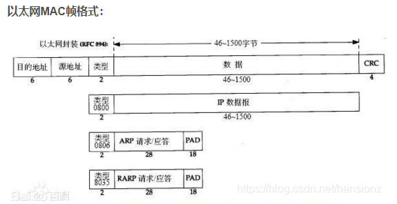

# IP直连

直接使用IP网址。

# 公网IP，内网IP

## 私网分类：

# NAT网络地址转换

当内网访问公网的时候，需要进行NAT网络地址转换，这个时候，源IP地址会变成对应路由器的IP地址，目标IP地址不变。

1.宽带分享：这是 NAT 主机的最大功能。

2.安全防护：NAT 之内的 PC 联机到 Internet 上面时，他所显示的 IP 是 NAT 主机的公共 IP，所以 Client 端的 PC 当然就具有一定程度的安全了，外界在进行 portscan（端口扫描） 的时候，就侦测不到源Client 端的 PC 。

维护一张IP地址的映射表。

# 七层模型，五层模型

## 链路层

* 由上图可以看出帧协议类型字段有三种值,分别对应 `IP、ARP、RARP(现在已经弃用)`
* 源地址和目的地址是指网卡的 `硬件地址`(也叫MAC地址), 长度是 `48`位,是在网卡出厂时固化的。

# TCP/IP协议栈

# HTTP1.0，HTTP1.1

# 三次握手

# 四次挥手

# 局域网

# 广播域

# TCP/IP协议簇

有流套接字，数据报套接字，IP套接字，icmp套接字，原始套接字，sock_packet套接字，
